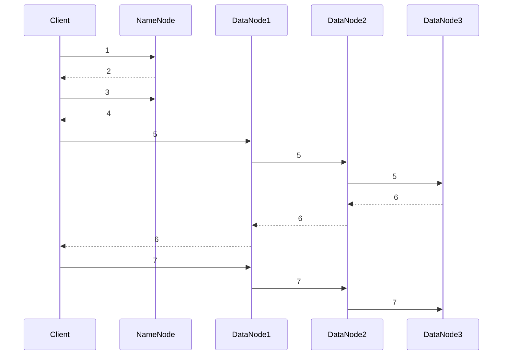
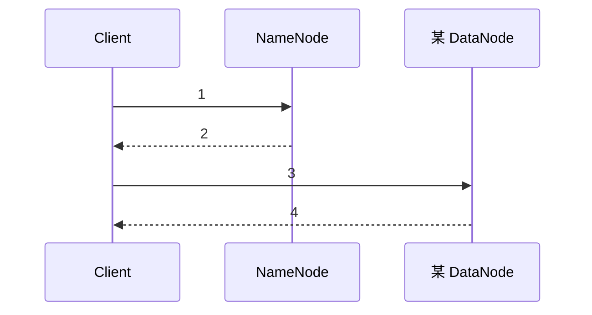

HDFS 的读写流程和工作机制

<!--more-->

在 HDFS 中，数据是分块（Block）存储的。相当于你一个人分割在了多个社交平台上。

存储位置配置在 `dfs.datanode.data.dir`

在 Hadoop2.x 和 3.x 中，数据块大小默认是 128MB。

如果数据分块太小，分割数量会变多，寻址时间会增加。就是你切换 APP 的时间增加。

如果数据块太大，磁盘传输时间占比增加。就是你花在这一个 APP 上的时间增加。且分割数量变少，MR 的并行任务数变少。

当寻址时间是传输时间的 1% 时，状态最佳。

## hdfs-default.xml

`$HADOOP_HOME/share/hadoop/hdfs/hadoop-hdfs-3.3.6.jar` 里的 `hdfs-default.xml`。其参数可以被 `$HADOOP_HOME/etc/hadoop/hdfs-site.xml` 里设置的同名参数覆盖。

## 写数据的流程

创建一个文件，将数据写入文件，关闭文件。

```sh
hadoop fs -put ./voice.wav /app
```

如果是一个 200MB 的文件，会被分为 128MB 的一块和 72MB 的一块。

distributed：分布式



把 Client 看成你，NameNode 看成手机，DataNode 看成 APP。（类比不恰当，但是好记）

1. Client 通过[DistributedFileSystem](https://github.com/apache/hadoop/blob/branch-3.3.6/hadoop-hdfs-project/hadoop-hdfs-Client/src/main/java/org/apache/hadoop/hdfs/DistributedFileSystem.java)模块向 NameNode 发请求：上传文件
2. NameNode 给 Client 响应：是/否允许上传

前两步是你和你的手机建立连接，看手机能不能用。

3. Client 再给 NameNode 发请求：上传第一个块/可用的 DataNode 列表
4. NameNode 返回 DataNode 的服务器地址

这两步是你想发动态了，看目前装了哪些 APP。

5. Client 通过[FSDataOutputStream](https://github.com/apache/hadoop/blob/branch-3.3.6/hadoop-common-project/hadoop-common/src/main/java/org/apache/hadoop/fs/FSDataOutputStream.java)模块向 DataNode1 请求上传数据，DataNode1 收到请求之后向 DataNode2 请求……这叫建立通信管道。
6. 通信管道建立之后，DataNode 向前面的 DataNode 逐级应答到 Client

你想发一条动态，打开了 NeteaseCloudMusic，但是 APP 们都是有灵性的，一个接连唤醒一个。

7. Client 向 DataNode1 发送第一个数据块的多个数据包（Packet），DataNode1 收到之后发给 DataNode2……类似路由器分组转发，但是保存了数据。
8. 重复步骤 3 到 7，上传第二、第三……个数据块直到传输完成，Client 关闭连接。

总结：Client 和 NameNode 问答两次（是否可以上传，DN 的地址），和 DataNode 问答一次（建立通信管道），之后开始分包传数据。传完一个块后从 Client 和 NameNode 的第二次问答处开始循环。

## 读数据的流程



1. C 问 NN，请求下载文件。
2. NN 回答数据块所在的 DN，按与客户端的网络拓扑距离排序。
3. C 选一台最近的 DN 请求读数据。
4. DN 给 C 分包传数据。
5. C 接收。接收完一个块后，看情况再向 NN 请求下一个块所在的 DN 地址（重复 1 到 4 步）。

总结：C 和 NN 问答一次，开始分包传数据，传完一个块后重复前面的操作。

散落在各个服务器上的碎片，构成了一个赛博你。一个块也可能存有多个副本，副本的数量叫冗余度，所以可能构成多个赛博你。

## 副本放置策略、机架感知、网络拓扑距离、PineLine

机架（rack）是放机器的架子，是连接到同一个交换机的物理存储节点的集合。

Hadoop 集群由多个机架组成。

副本放置策略，就是策划把数据块分别放置到哪个机架的哪个机器上。

机架感知（RackAware）

## NN 和 2NN 的工作机制

[HDFS 的 EditLog 和 FsImage 文件](/blog/HD/09/)

- NN：记录 EditLog，滚动正在写的（inprogress）EditLog
- 2NN：向 NN 请求（是否/执行）创建 CheckPoint，当 CheckPoint 触发时，合并 EditLog 为 FsImage

1. 启动 NN，加载 EditLog 和 FsImage 到内存里（第一次格式化 HDFS 并启动 NN 时会创建），同时 2NN 加载 FsImage 到内存里。
2. C 向 NN 发写请求。
3. NN 写日志。
4. 2NN 请求创建 CheckPoint。
5. NN 滚动日志。
6. NN 把日志复制到 2NN，2NN 加载日志到内存里。
7. 当检查点到时，2NN 合并日志和镜像文件为新的镜像文件 fsimage.chkpoint。
8. 2NN 把新的镜像文件复制到 NN，NN 对其重命名为 fsimage。

## DN 的工作机制

- DN 启动后向 NN 注册。
- DN 每隔一个 `dfs.blockreport.intervalMsec` 时间向 NN 上报所有数据块信息。
- DN 每隔一个 `dfs.datanode.directoryscan.interval` 时间扫描本地的数据块信息。
- DN 每隔一个 `dfs.heartbeat.interval` 时间向 NN 发送心跳信息。

NN 判定 DN 死亡的超时时长 = 2 × `dfs.heartbeat.recheck-interval` + 10 × `dfs.heartbeat.interval`
