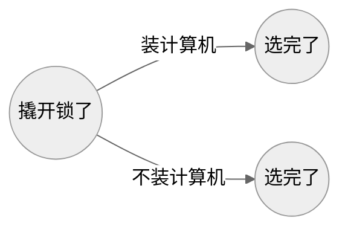
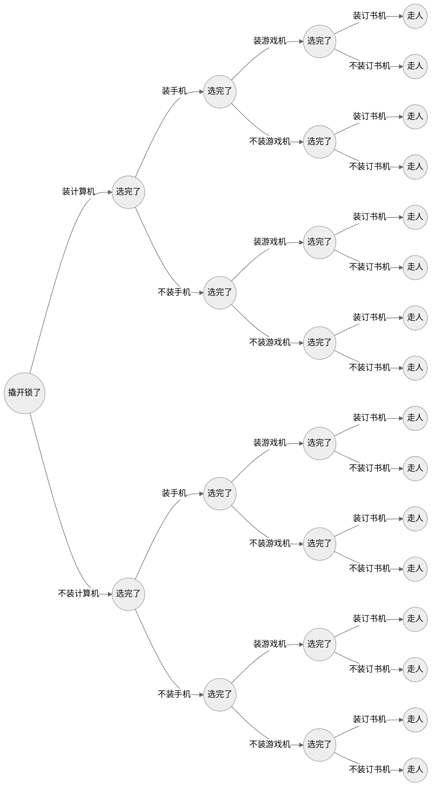

您得上手写。

<!--more-->

## 动态规划

```py
"""
笔者看了一些网上的文章，发现他们都是先从一个简单的问题入手，比如求斐波那契数列的第 n 项。
"""


def fib0(n):
    if n == 1 or n == 2:
        return 1
    else:
        return fib(n - 1) + fib(n - 2)


"""
这种方法存在重复的计算
F10 = F9 + F8
    F9 = F8 + F7
    F8 = F7 + F6
    ...
动态规划就是“带着备忘录计算”，由于计算后项只需要前两项，那我们先计算1+1=2，再1+2=3，再计算2+3=5……
然后发现一件非常离谱的事：这种方法笔者之前居然自己想出来过，而且也是正常人计算的方法
"""


def fib(n):
    if n == 1 or n == 2:
        return 1
    dp = [None for _ in range(n)]  # 备忘录
    dp[0] = dp[1] = 1
    for i in range(2, n):
        dp[i] = dp[i - 1] + dp[i - 2]  # 状态转移方程
    return dp[n - 1]


for i in range(1, 11):
    print(fib(i), end=",")
```

现在的问题是：背包问题的状态转移方程还是没彻底搞明白，主要是二维数组的第二维，以及怎么变成一维数组

## 背包问题的定义

你是一个小偷，现在有四样东西（且每样只有一个）：

- 计算机 20 元 130 克
- 手机 200 元 87 克
- 游戏机 600 元 170 克
- 订书机 8 元 208 克

你的背包只能装 400 克的东西，问你选哪几样装，使得你偷的东西价值最大。

- 聪明的你肯定会选前三样，记作 1110
- 一个比较笨的小偷可能会选后两样，记作 0011
- 更笨的小偷会只选最后一样，记作 0001

这个最终的选择序列里只有 0 和 1，就叫 0-1 背包问题。它是一颗横向的完美二叉树（perfect binary tree），横轴是时间轴，每一层是一个时间断面（宙）。根节点为第 0 层，这是你刚撬开锁的时候，然后你看到一台计算机了，你琢磨：我是装它还是不装它？不管你装还是不装它，对于这台计算机，你只有两种选择，当你做出任意一个选择的时候，你的宇宙就会被分裂出来一条支路。类似这样：


现在你做出第一个选择了，二叉树会变成这样：



这颗二叉树就是多重宇宙。横轴为宙，纵轴为宇。当你做出所有选择之后，它会变成这样：



其中每一个节点都是一个背包。有两个属性：【当前重量】和【当前价格】。解决背包问题，就是找到这样一个背包：

1. 它在最后一个时间断面里
2. 它的【当前重量】小于等于 400 克
3. 它是在所有满足前两条的背包里【当前价格】最大的
