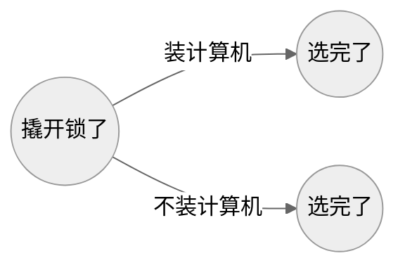
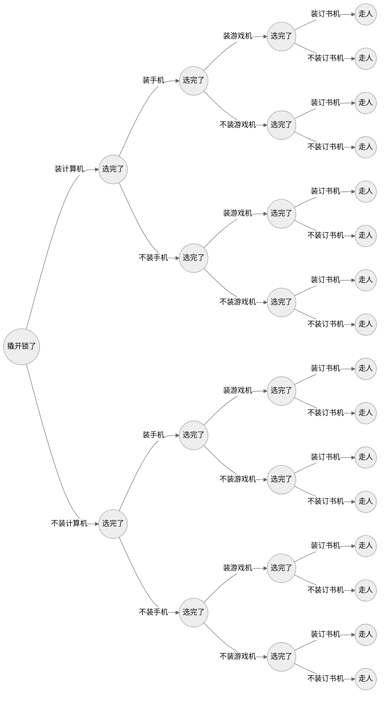

您得上手写。

<!--more-->

## 滚动数组怎么滚

以三个数为例：

1. 先处理前两个，直接返回
2. 声明三个变量，只给前两个赋值
3. 循环[下标看具体情况]在每次循环里：
   1. 先作用
   2. 把第二个数赋值给第一个
   3. 把第三个数赋值给第二个
4. 返回第三个

笔者认为这种写法符合人的直觉。

## 70.爬楼梯

> 假设你正在爬楼梯。需要 n 阶你才能到达楼顶。每次你可以爬 1 或 2 个台阶。你有多少种不同的方法可以爬到楼顶呢？

换一种问题描述方式：把一个正整数 n 拆分成一系列 1 和 2 有顺序地相加，共有几种拆分方式 f(n)？

从它的尾巴向前看，有这两种：

- n = (n-1) + 1
- n = (n-2) + 2

其中(n-1)和(n-2)有它们各自被拆分的种类数，于是 f(n)=f(n-1)+f(n-2)

边界：f(1)=1,f(2)=2（2=1+1=2+0）

```c
int climbStairs(int n) {
    if (n <= 2) {
        return n;
    }
    int a = 1, b = 2, c;
    for (int i = 3; i <= n; i++) {
        c = a + b;
        a = b;
        b = c;
    }
    return c;
}
```

## 746.使用最小花费爬楼梯

我们把问题描述改写一下：

给你一个非负整数数组，长度大于等于 2，让你在数组里选一些数求和，要求选的这些数：

- 0 号和 1 号元素必须二选其一
- 最后两个元素必须二选其一
- 选的相邻两数之间至多间隔一个数
- 要求和最小，输出和

状态转移就是从过去转移到现在。现在虚空设一个数叫 dp[i]表示爬到下标为 i 的台阶时的花费

（注意：此时的 dp[i]是不包含本级台阶的花费的，往后跨了之后才加）

有两种转移的情况：从 i-1 爬一层、从 i-2 爬两层

从 i-1 爬一层之后、转移到现在，现在的花费等于跨上一步之前的花费+跨上一步之后的花费

即 dp[i] = dp[i-1] + cost[i-1]

总的状态转移方程为 dp[i] = min(dp[i-1] + cost[i-1], dp[i-2] + cost[i-2])

边界为 dp[0]=dp[1]=0，返回值为 dp[n]，下标 n 在楼梯的顶层，cost 数组右边一个位置，等于 cost 数组长。用滚动数组，循环 [2, cost 长]

```c
int minCostClimbingStairs(int* cost, int costSize) {
    int a = 0, b = 0, c;
    for (int i = 2; i <= costSize; i++) {
        c = fmin(a + cost[i - 2], b + cost[i - 1]);
        a = b;
        b = c;
    }
    return c;
}
```

## 背包问题的定义

你是一个小偷，现在有四样东西（且每样只有一个）：

- 计算机 20 元 130 克
- 手机 200 元 87 克
- 游戏机 600 元 170 克
- 订书机 8 元 208 克

你的背包只能装 400 克的东西，问你选哪几样装，使得你偷的东西价值最大。

- 聪明的你肯定会选前三样，记作 1110
- 一个比较笨的小偷可能会选后两样，记作 0011
- 更笨的小偷会只选最后一样，记作 0001

这个最终的选择序列里只有 0 和 1，就叫 0-1 背包问题。它是一颗横向的完美二叉树（perfect binary tree），横轴是时间轴，每一层是一个时间断面（宙）。根节点为第 0 层，这是你刚撬开锁的时候，然后你看到一台计算机了，你琢磨：我是装它还是不装它？不管你装还是不装它，对于这台计算机，你只有两种选择，当你做出任意一个选择的时候，你的宇宙就会被分裂出来一条支路。类似这样：


现在你做出第一个选择了，二叉树会变成这样：



这颗二叉树就是多重宇宙。横轴为宙，纵轴为宇。当你做出所有选择之后，它会变成这样：



其中每一个节点都是一个背包。有两个属性：【当前重量】和【当前价格】。解决背包问题，就是找到这样一个背包：

1. 它在最后一个时间断面里
2. 它的【当前重量】小于等于 400 克
3. 它是在所有满足前两条的背包里【当前价格】最大的
