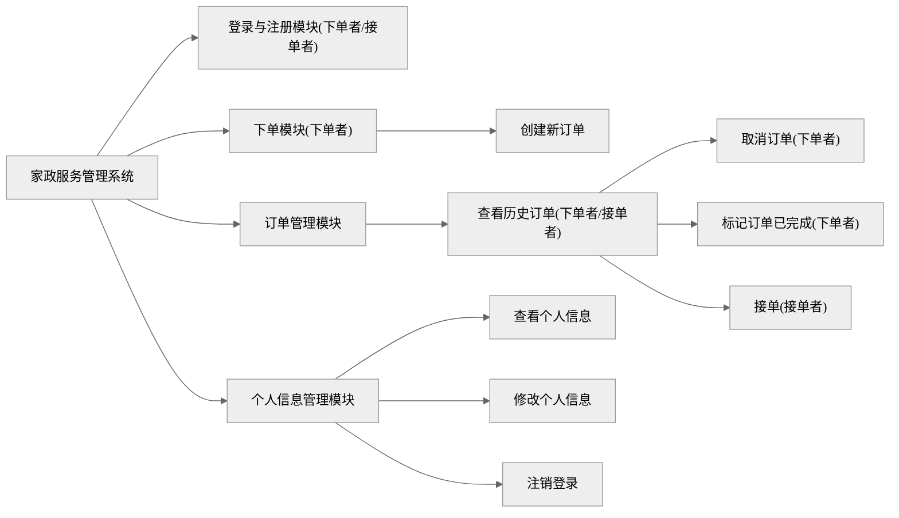

1. 不要把目标定得太高，不要高估自己的能力。
2. 在这一个问题没解决之前，不要问大模型下一个问题。
3. 不要追求完美，先完成。
4. 干任何事都不是简单的，干了之后才知道有多难。

<!--more-->

<style>
    .main{
        width:100%
    }
</style>


## 需求分析

真正的需求其实是：想做一个自己之前没做出来过，或者做失败了的东西：就是前后端交互的问题。

Vue 3.4.21 + Vue Router 3.4.0 + ElementPlus 2.7.4 + Axios 1.7.2

JDK 8 + Spring Boot Starter 2.7.18（Tomcat 9.0.83 + JUnit 5.8.2 + SLF4J 1.7.36）+ HBase 2.5.8

搞一个家政服务管理系统出来。我们的最终目的是搞出来一个能看的东西，搞一个“原型”。所以简单一点，不要在意样式，也不要在意能不能真的拿来用，因为百分之百是没人会拿来用的。

### 用例图


### 系统层次图



### 工程目录

后端：

- controller：负责处理 HTTP 请求，返回响应，调用 Service 类的方法
- service：负责调用 DAO 类的方法
- dao：负责读写数据库

### 关键问题

RESTful API（Representational State Transfer -ful Application Programming Interface），即表述性状态转移风格的应用程序编程接口。

HTTP 状态码：1 开头的是请求正在被处理，2 开头的是请求成功，3 开头的是重定向，4 开头的是客户端错误，5 开头的是服务器错误。

**已解决**：

- 火狐上可以正常注册、登录、查询个人信息、注销登录。
- 修改个人信息
- 创建订单

**未解决**：

- 跨域的问题：Edge 和 Chrome 在登录之后，照样向 localStorage 里写 token 了，但是之后的操作它们发了两个请求，一个带 Authorization 字段，一个不带（火狐只发了一个带 Authorization 字段的请求），且报错：

```log
userinfo:1 Access to XMLHttpRequest at 'http://localhost:8080/api/user/info' from origin 'http://localhost:54322' has been blocked by CORS policy: Response to preflight request doesn't pass access control check: No 'Access-Control-Allow-Origin' header is present on the requested resource.
```

- 取消订单
- 接单
- 标记订单完成

### 注册登录注销逻辑

1. 浏览器访问某个页面/点击某一个组件
2. 全局前置守卫判断该页面是否需要认证，如果需要认证，判断 localStorage 里有没有 token。如果不需要认证或者 localStorage 里有 token，放行。如果需要认证且 localStorage 里没有 token，清除 token 和 axios 请求头的 Authorization 字段，并导航到 /login
3. 某个组件挂载之后发请求，或点击组件发请求之后，axios 请求拦截器检查 localStorage 里有没有 token，如果有，设置为请求头的 Authorization 字段。如果没有，导航到 /login
4. 前端在 /api/auth 下的请求都不带 token，其他路径下的都会被后端拦截，验证 token。
5. 后端放行 /api/auth/signup 下的请求。注册时用正则表达式验证手机号正确性，查 User 表里有没有手机号，如果有，返回手机号已被注册。如果没有，写 User 表，返回注册成功。如果格式错误，返回格式错误。前端在发送之前也检查格式。
6. 后端放行 /api/auth/login 下的请求。查 User 表是否有该手机号，密码是否匹配。如果密码匹配，生成一个 token，向 Token 表里和 UserContext 类里写手机号和 token，返回登录成功。如果不匹配，返回用户名或密码错误。
7. 其他 /api 下的请求都会被后端拦截，验证 Token 表里有没有该 token 与其对应的手机号。如果没有，返回认证失败。如果有，向 UserContext 类里写手机号和 token，后续 Controller 类再使用 UserContext 类来判断请求者的身份。

### 菜单

- 下单者
  - 创建订单 NewOrder 组件
  - 我的订单（一系列 OrderInfo 组件 + 取消按钮）
  - 个人信息（UserInfo 组件 + 修改按钮 + 注销登录按钮）
- 接单者
  - 接收订单（一系列 OrderInfo 组件 + 接收按钮）
  - 我的订单（一系列 Order 组件 + 取消按钮）
  - 个人信息（UserInfo 组件 + 修改按钮 + 注销登录按钮）

## 数据库里的表

### Token：每次接收到请求都要查询

| RowKey: token | Column Family: user  |
| ------------- | -------------------- |
| xxxxxx        | phone -> 13333333333 |

### User：用户信息

图方便，把密码和其他东西存在一起。

| RowKey: phone | Column Family: auth   | Column Family: profile |
| ------------- | --------------------- | ---------------------- |
| 13333333333   | password -> 123456    | name -> 黄若凡         |
|               | role -> 下单者/接单者 | sex -> 男              |
|               |                       | age -> 23              |

### Order：订单

| RowKey: 订单号 | Column Family: placer | Column Family: order                       | Column Family: receiver   |
| -------------- | --------------------- | ------------------------------------------ | ------------------------- |
| 1              | name -> 李四          | status -> 已接单                           | name -> 张师傅            |
|                | phone -> 14444444444  | item -> 清洁                               | phone -> 15555555555      |
|                | order_time -> 时间戳  | adcode -> 420112                           | acceptance_time -> 时间戳 |
|                |                       | address -> 湖北省武汉市东西湖区            |                           |
|                |                       | description -> 服务描述                    |                           |
|                |                       | end_time -> 订单完成时间（正常完成或取消） |                           |

## API 文档

所有请求和响应体都是 `application/json`。在响应头加上 HTTP 状态码。后端根据请求头里的 Authorization: Bearer your-token-here 字段判断是哪个用户在操作。如果没有 Authorization 字段，或找不到 token 对应的用户：

401

```json
{
  "error": "认证失败"
}
```

## 不需要 token 的 API

### POST /api/auth/signup 用户注册 201 | 409

```json
{
  "phone": "13333333333",
  "password": "123456",
  "role": "下单者",
  "name": "黄若凡"
}
```

```json
{
  "message": "注册成功"
}
```

```json
{
  "error": "该手机号已被注册"
}
```

### POST /api/auth/login 用户登录 201 | 401

```json
{
  "phone": "13333333333",
  "password": "123456"
}
```

```json
{
  "message": "登录成功",
  "token": "xxxxxx"
}
```

```json
{
  "error": "手机号或密码错误"
}
```

## 需要 token 的 API

后端验证身份，根据下单者/接单者身份返回不同的响应。

### GET /api/user/info 获取本人信息 200

```json
{
  "name": "黄若凡",
  "sex": "男",
  "age": "23",
  "role": "admin",
  "phone": "13333333333"
}
```

### PUT /api/user/info 更新本人信息 204

```json
{
  "name": "黄若凡",
  "sex": "男",
  "age": "23",
  "role": "admin",
  "phone": "13333333333"
}
```

### DELETE /api/user/logout 注销登录 204

无请求体和响应体。

### POST /api/order 创建新的订单 201 | 403

只有下单者有权限。

请求体：

```json
{
  "item": "清洁",
  "address": "21231",
  "description": "123",
  "adcode": "130306"
}
```

响应体：

```json
{
  "message": "下单成功"
}
```

### GET /api/order 获取历史订单 200

下单者获取与本人关联的。无请求体。

接单者获取所有。无请求体。

```json
{
  "17182774797369383": {
    "placer": {
      "phone": "13333333333",
      "name": "黄若凡",
      "order_time": "1718277479736"
    },
    "order": {
      "item": "家教",
      "address": "123456789",
      "adcode": "140429",
      "description": "123",
      "status": "无人接单"
    }
  },
  "17182770707691991": {
    "placer": {
      "phone": "13333333333",
      "name": "黄若凡",
      "order_time": "1718277070769"
    },
    "order": {
      "item": "清洁",
      "address": "马池中路",
      "adcode": "420112",
      "description": "12345678",
      "status": "无人接单"
    }
  }
}
```

### PUT /api/order 取消某个订单 200 | 403

只有下单者有权限。

请求体：

```json
{
  "id": "xxxx",
  "operation": "cancel"
}
```

### PUT /api/order 接单 200 | 403

只有接单者有权限。

请求体：

```json
{
  "id": "xxxx",
  "operation": "take"
}
```

### PUT /api/order 标记订单完成 200 | 403

只有下单者有权限。

请求体：

```json
{
  "id": "xxxx",
  "operation": "end"
}
```
