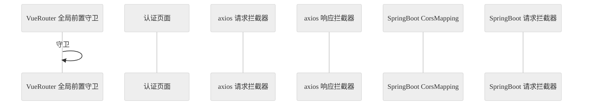

1. 做任何事情千万不要多线程并行。
2. 在把自己会的东西实现之前，千万不要考虑不会的。
3. 在没熟悉为什么这么做之前，千万不要一上来就拆分文件。
4. 在这一个问题解决之前，不要问大模型下一个问题。
5. 困了就睡。

<!--more-->

<style>
    .main{
        width:100%
    }
</style>

仅限笔者自身在这一届的经历，如果你不**提前**自学而是在每个学期里只完成这个学期**之内**课程的任务，你会：

在大三之前 **没有《Linux 操作系统》** 这门课，当然之后也没有。如果你运气好的话会遇到让你使用命令行的老师；如果你运气不好你可能不知道 `gcc` 是什么。在大三**上学期**，一边的《大规模分布式系统》让你装两台或以上的 Linux 虚拟机，使用命令行并装一个几百来兆的 Java 软件；另一边的《网络编程技术》在讲 Java 的基本语法，按课程名来看是在补教学计划里**没有**的 **《Java 程序设计》**这门课。在大三上学期末，一些课程的大作业会要求你做一个前后端交互的系统出来，前端的框架自然是不在教学范围里的。在大三**下学期** 《J2EE 技术》姗姗来迟，你第一次在你的电脑上装了一个叫服务器的东西。如果你到了期末还是没有自学前后端框架的话，后面也没有课程会教你了，于是你继续重复上学期的大作业窘境。

## 需求分析

真正的需求其实是：想做一个自己之前没做出来过，或者做失败了的东西：就是前后端交互的问题。

Vue 3.4.21 + Vue Router 3.4.0 + ElementPlus 2.7.4 + Axios 1.7.2

JDK 8 + Spring Boot Starter 2.7.18（Tomcat 9.0.83 + JUnit 5.8.2 + SLF4J 1.7.36）+ HBase 2.5.8

搞一个家政服务管理系统出来。我们的最终目的是搞出来一个能看的东西，搞一个“原型”。所以简单一点，不要在意样式，也不要在意能不能真的拿来用，因为百分之百是没人会拿来用的。

用户：服务提供者（接单的）、服务需求者（订单的）、系统管理员（管账的）

服务项目：清洁、护理、家教、搬家

需求者可以访问的页面：创建订单 new、下新单的页面、历史下单记录（包括刚下的）、每一单的详情页面 order

服务者可以访问的页面：接收订单 userinfo、接新单的页面、已接单的页面（包括刚接的）、每一单的详情页面

系统管理员可以访问的页面：所有下单的记录，每一单的详情页面，所有用户的信息

订单的状态：待接单、已接单、已结束

订单：需求者下一个订单，指定服务项目、服务地址、服务时间，POST 给系统。系统生成一个订单号，完善订单信息，写到数据库里

服务提供者在其接新单的页面里刷新，GET，系统根据提供者的地址返回与其地址匹配的单。

提供者可选择一个单接，且不能选择与已有单时间冲突的。完成之后由需求者点击完成。

### 工程目录

后端：

- controller：负责处理 HTTP 请求，返回响应，调用 Service 类的方法
- service：负责调用 DAO 类的方法
- dao：负责读写数据库

### 关键问题

RESTful API（Representational State Transfer -ful Application Programming Interface），即表述性状态转移风格的应用程序编程接口。

HTTP 状态码：1 开头的是请求正在被处理，2 开头的是请求成功，3 开头的是重定向，4 开头的是客户端错误，5 开头的是服务器错误。

单页面应用，发任何请求之后，如果后端返回 401，前端怎么加载登录表单：axios 响应拦截器

再设置一个全局前置守卫（global before guard）通过检查 localStorage 里的 token 字段是否存在，来检查用户是否已认证，并根据情况重定向到认证页面。

0. 后端加一个拦截器，拦截所有请求（除了 /auth 下的），是否有/验证 Authorization 字段。如果失败，重定向到 /auth。如果验证到对应的用户，把用户身份保存下来，以便于后续的 Controller 操作。
1. 注册 signup：点击注册，POST 表单，后端检查 phone 是否存在。如果存在，响应。如果不存在，向 User 表里插入，响应。
2. 登录 login：搜索 phone 验证 password 是否匹配，写 token，返回 token，前端接收 token，重定向到 /

**已解决**：火狐上可以正常注册、登录、查询个人信息、注销登录。

**未解决**：

- 跨域的问题：Edge 和 Chrome 在登录之后，照样向 localStorage 里写 token 了，但是之后的操作它们发了两个请求，一个带 Authorization 字段，一个不带（火狐只发了一个带 Authorization 字段的请求），且报错：

```log
userinfo:1 Access to XMLHttpRequest at 'http://localhost:8080/api/user/info' from origin 'http://localhost:54322' has been blocked by CORS policy: Response to preflight request doesn't pass access control check: No 'Access-Control-Allow-Origin' header is present on the requested resource.
```

- 修改个人信息
- 创建订单

### 注册登录注销逻辑

自己都没搞明白，但是它还是可以跑出来。



### 菜单

- 下单者
  - 创建订单页 NewOrder
  - 我的订单页（一系列 Order）
  - 个人信息页（UserInfo + 修改 + 注销登录）
- 接单者
  - 接收订单页（一系列 Order，可以选一个接收）
  - 我的订单页（一系列 Order）
  - 个人信息页（UserInfo + 修改 + 注销登录）

## 数据库里的表

### Token：每次接收到请求都要查询

| RowKey: token | Column Family: user  |
| ------------- | -------------------- |
| xxxxxx        | phone -> 13333333333 |

### User：用户信息

图方便，把密码和其他东西存在一起。

| RowKey: phone | Column Family: auth | Column Family: profile          |
| ------------- | ------------------- | ------------------------------- |
| 13333333333   | password -> 123456  | name -> 黄若凡                  |
|               |                     | sex -> 男                       |
|               |                     | age -> 23                       |
|               |                     | role -> customer/provider/admin |
|               |                     | adcode -> 420112                |

### Order：订单

| RowKey: 订单号 | Column Family: basic_info               | Column Family: dynamic_info   |
| -------------- | --------------------------------------- | ----------------------------- |
| 1              | service_item -> 清洁                    | status -> 已接单              |
|                | service_address -> 湖北省武汉市东西湖区 | provider -> 张师傅            |
|                | service_adcode -> 420112                | provider_phone -> 15555555555 |
|                | order_time -> 2024-06-16 14:30:00       |                               |
|                | customer -> 李四                        |                               |
|                | customer_phone -> 14444444444           |                               |

## API 文档

所有请求和响应体都是 `application/json`。在响应头加上 HTTP 状态码。后端根据请求头里的 Authorization: Bearer your-token-here 字段判断是哪个用户在操作。如果没有 Authorization 字段，或找不到 token 对应的用户：

401

```json
{
  "error": "认证失败"
}
```

## 不需要任何权限的 API

### POST /api/auth/signup 用户注册 201 | 409

```json
{
  "phone": "13333333333",
  "password": "123456"
}
```

```json
{
  "message": "注册成功"
}
```

```json
{
  "error": "该手机号已被注册"
}
```

### POST /api/auth/login 用户登录 201 | 401

```json
{
  "phone": "13333333333",
  "password": "123456"
}
```

```json
{
  "message": "登录成功",
  "token": "xxxxxx"
}
```

```json
{
  "error": "手机号或密码错误"
}
```

## 需要下单者/接单者/管理员权限的 API

### GET /api/user/info 获取个人信息 200

```json
{
  "name": "黄若凡",
  "sex": "男",
  "age": "23",
  "role": "admin",
  "adcode": "420112",
  "phone": "13333333333"
}
```

### DELETE /api/user/logout 注销登录 204

无响应体

## 需要下单者权限的 API

### POST /api/order 创建新的订单 201
