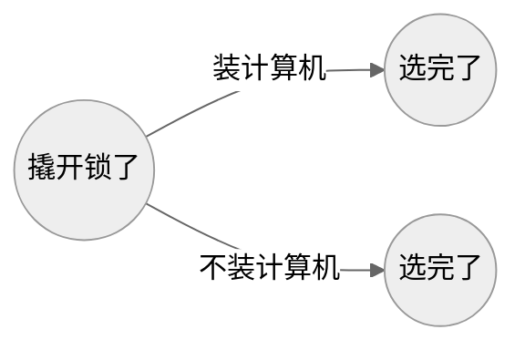
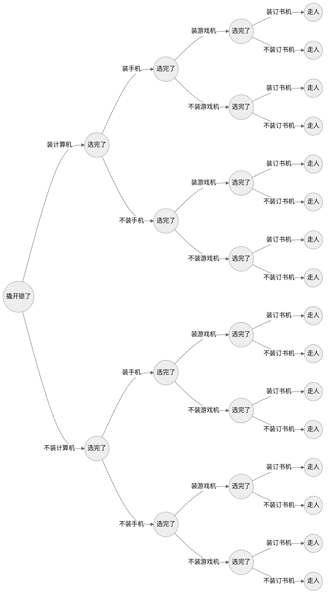

在解决背包问题之前，我们得先把它的定义弄明白。

<!--more-->

## 背包问题的定义

你是一个小偷，现在有四样东西（且每样只有一个）：

- 计算机 20 元 130 克
- 手机 200 元 87 克
- 游戏机 600 元 170 克
- 订书机 8 元 208 克

你的背包只能装 400 克的东西，问你选哪几样装，使得你偷的东西价值最大。

- 聪明的你肯定会选前三样，记作 1110
- 一个比较笨的小偷可能会选后两样，记作 0011
- 更笨的小偷会只选最后一样，记作 0001

这个最终的选择序列里只有 0 和 1，就叫 0-1 背包问题

它是一颗横向的完美二叉树（perfect binary tree），横轴是时间轴，每一层是一个时间断面（宙）

根节点为第 0 层，这是你刚撬开锁的时候，然后你看到一台计算机了

你琢磨：我是装它还是不装它？

不管你装还是不装它，对于这台计算机，你只有两种选择

当你做出任意一个选择的时候，你的宇宙就会被分裂出来一条支路。类似这样：

现在你做出第一个选择了，二叉树会变成这样：

这颗二叉树就是多重宇宙。横轴为宙，纵轴为宇

当你做出所有选择之后，它会变成这样：

其中每一个节点都是一个背包。有两个属性：【当前重量】和【当前价格】

解决背包问题，就是找到这样一个背包：

1. 它在最后一个时间断面里
2. 它的【当前重量】小于等于 400 克
3. 它是在所有满足前两条的背包里【当前价格】最大的
