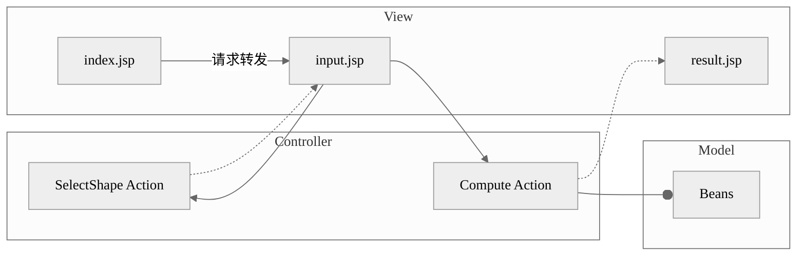
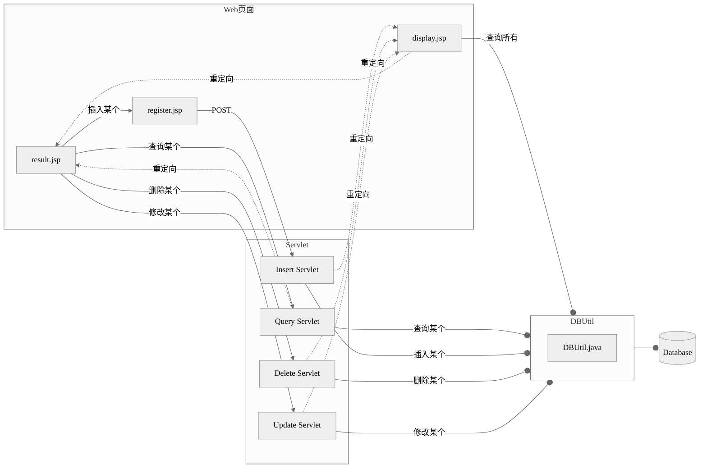

Web 基础不牢。

<!--more-->

> Web 是一种分布式的应用框架。基于 Web 的应用是典型的浏览器/服务器（B/S）架构。

——ISBN 9787302438090

> JSP 技术是以 Java 语言作为脚本语言的，JSP 网页为整个服务器端的 Java 库单元提供了一个接口来服务于 HTTP 的应用程序。

——菜鸟教程

<style>
    .main{
        width:100%
    }
</style>

## 整



## 整



## 新建工程

笔者测试，用 VSCode 和 IDEA 社区版（2024.1）都没办法格式化 JSP 代码，或者是暂时没找到解决方法。或者你可以用 CSDN 网友分享的 IDEA 破解版（不是用蓝绿修改器破解的） https://blog.csdn.net/hlizoo/article/details/137562771

**用 VSCode 或 IDEA 社区版**

```bat
mvn archetype:generate "-DgroupId=com.example" "-DartifactId=demo" "-DarchetypeArtifactId=maven-archetype-webapp" "-DinteractiveMode=true"
```

VSCode 使用 Community Server Connectors 插件、IDEA 使用 Smart Tomcat 插件

**用 Eclipse 2020-03 (4.15.0)**

在首选项里设置 JDK 和 Tomcat 的路径。

New -> Dynamic Web Project

按 Ctrl + Shift + F 格式化代码——這個快捷鍵會和 Win10 的微軟拼音輸入法簡繁體切換功能衝突。解决方法除了再按一次，还可以右击你任务栏上的[中]，进输入法设置，把热键关了。

## 一个 JSP 文件的示例

```jsp
<%@ page language="java" contentType="text/html; charset=UTF-8"
	pageEncoding="UTF-8" import="java.util.Date"%>
<!DOCTYPE html>
<html>
<head>
<meta charset="UTF-8">
<title></title>
</head>
<body>
	<%
		Date now = new Date();
	%>
	<%=now%>
</body>
</html>
```

它在 html 的基础上扩展了一些标签。可以使用 Java 库。

## JSP 运行的原理

1. 客户向 Tomcat 服务器发送 HTTP 请求

你可以使用 Fiddler 来抓包（或者直接用浏览器控制台抓，这是最方便的）。在 Eclipse 里按“播放键”之后，Eclipse 向 `localhost:8080` 发送了一个 GET 请求。

使用

```bat
netstat -ano | grep 8080
```

查与 8080 端口有关的进程号。再打开任务管理器的详细信息，查到进程为 `javaw.exe`。右击打开文件所在位置，在你 Eclipse 首选项里设置的 JDK 目录的 bin 目录里面。

使用

```bat
jcmd
```

查看 java 进程，为 `org.apache.catalina.startup.Bootstrap start`

2. Tomcat 启动一个线程，把 jsp 文件转换成 java 文件

（一个继承自 `javax.servlet.http.HttpServlet` 的类，头上带一个注解 `@WebServlet("/path")`，相当于 Python 的 Flask 框架里的 `@app.route("/path")`）

3. 把 java 文件编译成 class 文件（字节码）
4. 客户

## 问答

### Struts2 是干嘛的？

是一个框架，是一个库，是一系列 Jar 包。

`com.opensymphony.xwork2.ActionSupport` 这个类的子类充当 MVC 架构中的控制器，jsp 充当视图，JavaBean 充当模型。

#### 视图表单怎么写？

```jsp
<%@ taglib prefix="s" uri="/struts-tags"%>
<s:form action="user/selectShape" method="post">
    <s:radio list="{'圆形','矩形'}" name="shapeSelected" label="请选择处理的图形">
    </s:radio>
    <s:submit value="确定"/>
</s:form>

<s:if test="%{#request['shapeSelected'] == '圆形'}">
    <s:form action="user/compute" method="post">
        <s:textfield label="圆形的半径" name="circle.radius" type="number"/>
        <s:submit value="计算面积" name="calcType"/>
        <s:submit value="计算周长" name="calcType"/>
    </s:form>
</s:if>
<s:elseif test="%{#request['shapeSelected'] == '矩形'}">
    <s:form action="user/compute" method="post">
        <s:textfield label="矩形的宽度" name="rectangle.width" type="number" />
        <s:textfield label="矩形的高度" name="rectangle.height" type="number"/>
        <s:submit value="计算面积" name="calcType"/>
        <s:submit value="计算周长" name="calcType"/>
    </s:form>
</s:elseif>
```

#### Action 怎么获取视图传过来的表单？

设置与传过来的表单里同名的属性，并设置 getter 和 setter 方法

- selectShape Action
  - 覆写 validate 方法处理异常
  ```java
  @Override
  public void validate() {
      if (shapeSelected == null || shapeSelected.isEmpty()) {
          addFieldError("shapeSelected", "选择不能为空");
      }
  }
  ```
  - 覆写 execute 方法返回逻辑视图 input
  ```java
  @Override
  public String execute() {
      return "input";
  }
  ```
- compute Action
  ```java
  @Override
  public String execute() {
      //...
      shapeInfo = sb.toString();
      return "result";
  }
  ```

#### result.jsp

```jsp
<%@ taglib prefix="s" uri="/struts-tags" %>
<s:property value="shapeInfo" />
```

#### struts.xml

```xml
<?xml version="1.0" encoding="UTF-8" ?>
<!DOCTYPE struts PUBLIC
        "-//Apache Software Foundation//DTD Struts Configuration 2.0//EN"
        "http://struts.apache.org/dtds/struts-2.0.dtd" >
<struts>
    <package name="webexp6" namespace="/user" extends="struts-default">
        <action name="selectShape" class="action.SelectShape">
            <result name="input">/input.jsp</result>
        </action>
        <action name="compute" class="action.Compute">
            <result name="result">/result.jsp</result>
        </action>
    </package>
</struts>
```

#### web.xml

```xml
<?xml version="1.0" encoding="UTF-8"?>
<web-app xmlns:xsi="http://www.w3.org/2001/XMLSchema-instance" xmlns="http://xmlns.jcp.org/xml/ns/javaee"
         xsi:schemaLocation="http://xmlns.jcp.org/xml/ns/javaee http://xmlns.jcp.org/xml/ns/javaee/web-app_3_1.xsd"
         id="WebApp_ID" version="3.1">
    <display-name>webexp6</display-name>
    <filter>
        <filter-name>struts2</filter-name>
        <filter-class>org.apache.struts2.dispatcher.ng.filter.StrutsPrepareAndExecuteFilter
        </filter-class>
    </filter>
    <filter-mapping>
        <filter-name>struts2</filter-name>
        <url-pattern>/*</url-pattern>
    </filter-mapping>
</web-app>
```

### jsp 指令与 jsp 动作？

前者是静态的，后者是动态的（感性认识）

前者类似

```jsp
<%@ include file = "sub.jsp" %>
```

后者类似

```jsp
<jsp:include page = "sub.jsp"/>
```

### 在一个 jsp 页里，如何把表单传递给另一个 jsp 页？另一个 jsp 页如何接收？

三种方式：（使用 get 方法会在 url 里看到请求参数，post 不会）

1.  【包含对面的】 `jsp:include` 配合 `jsp:param`。这是把另一个 jsp 页包含进来。

```jsp
<form method="get">
    请输入圆的半径：
    <input type="text" name="radius" />
    <input type="submit" value="提交" />
</form>
<jsp:include page="computeAreaOfCircle.jsp">
    <jsp:param value="${param.radius}" name="radius" />
</jsp:include>
```

2. 【请求转发】先使用本页面的 Java 代码处理表单，再使用 `jsp:forward` 配合 `jsp:param`，把 request 对象转发给另一个 jsp 页面。

这种把 JSP 标签和 Java 代码混在一起的写法很新鲜：

接收方用 `request.getParameter("name")` 接收

```jsp
<form method="post" action="">
    请选择一个图形：<br />
    <input type="radio" name="shape" id="circle" value="circle" />圆形<br />
    <input type="radio" name="shape" id="rectangle" value="rectangle" />矩形<br />
    <input type="submit" value="提交" />
</form>
<%
	Random random = new Random();
String shape = request.getParameter("shape");
if (shape != null) {
    if (shape.equals("circle")) {
        double radius = 100 * random.nextDouble();
%>
<jsp:forward page="process.jsp">
    <jsp:param value="<%=shape%>" name="shape" />
    <jsp:param value="<%=radius%>" name="radius" />
</jsp:forward>
<%
    } else if (shape.equals("rectangle")) {
    double width = 100 * random.nextDouble();
    double height = 100 * random.nextDouble();
%>
<jsp:forward page="process.jsp">
    <jsp:param value="<%=shape%>" name="shape" />
    <jsp:param value="<%=width%>" name="width" />
    <jsp:param value="<%=height%>" name="height" />
</jsp:forward>
<%
	}
}
%>
```

3. 【重定向】`response.sendRedirect("result.jsp")` 不会把 request 对象传递过去

应 `session.setAttribute("name", value)`

对方使用 `session.getAttribute("name")` 接收。

访问使用 response.sendRedirect 的一方 jsp 时，会跳转到对面的一方

### 重定向和请求转发？

重定向会丢失 request 对象，请求转发不会。

在 JSP 或者 Servert 里请求转发：

```java
request.setAttribute("studentList", studentList);
RequestDispatcher dispatcher = request.getRequestDispatcher("result.jsp");
dispatcher.forward(request, response);
```

### 如何实现点一个按钮出现一个新表单？

在第一个表单里加一个隐藏的 `<input>` 标签，第一个表单提交给本页面，然后在本页面里写 Java 代码：

笔者觉得这比 JS 操作 DOM 看起来新鲜，很好玩。

```jsp
<form action="">
    <input type="hidden" name="showInput" value="true">
    <input type="submit" value="查找">
</form>
<%
    String showInput = request.getParameter("showInput");
if (showInput != null && showInput.equals("true")) {
%>
<form action="Query" method="get">
    <input type="text" name="id" placeholder="输入学号">
    <input type="submit" value="提交">
</form>
<%
}
%>
```

### Filter 是什么？

一个实现了 `javax.servlet.Filter` 接口的类。可在 `doFilter` 方法里对请求预处理，响应后处理：

```java
@WebFilter("/*")
public class ProZhInput implements Filter {
    //...
    public void doFilter(ServletRequest request, ServletResponse response, FilterChain chain) throws IOException, ServletException {
        request.setCharacterEncoding("UTF-8");
        response.setCharacterEncoding("UTF-8");
        response.setContentType("text/html;charset=UTF-8");
        chain.doFilter(request, response);
    }
    //...
}
```

### 如何使用 JDBC 连接 MySQL？

```java
public class DBUtil {
    private static Connection connection = null;

    public static boolean createConnection()  {
        String url = "jdbc:mysql://localhost:3306/yourdbname?serverTimezone=UTC";
        String user = "yourname";
        String password = "yourpassword";
        try {
            Class.forName("com.mysql.cj.jdbc.Driver");// 注册MySQL JDBC驱动程序
            connection = DriverManager.getConnection(url, user, password);
            if (connection != null) {
            	System.out.println("成功连接到数据库！");
            	return true;
            }
        } catch (SQLException e) {
            e.printStackTrace();
        } catch (ClassNotFoundException e) {
            e.printStackTrace();
        }
        return false;
    }
}
```

1. 下载驱动 Jar 包 https://dev.mysql.com/downloads/connector/j/
2. 把 Jar 包 复制到 `yourprojectname\WebContent\WEB-INF\lib`

### 插入的问题

> MySQL 里有两张表，一张表的外键是另一张表的主键（如 id），级联更新和删除。如何插入“一条”id 的记录“分散给”这两张表？即对这两张表分别插了一个 id 相同的记录。

先插 id 为主键所在的表，后插 id 为外键所在的表。

这是（关系型）数据库原理的知识。本表里的“外键”就是引用外部表里的“主键”，那得先有外部表。

### 乱码的问题

保证这些地方的编码是 UTF-8：

1. Eclipse 首选项里的文件编码
2. 搞一个 Filter
3. MySQL 数据库表的编码
4.

```jsp
<%@ page language="java" contentType="text/html; charset=UTF-8"
	pageEncoding="UTF-8"%>
```
