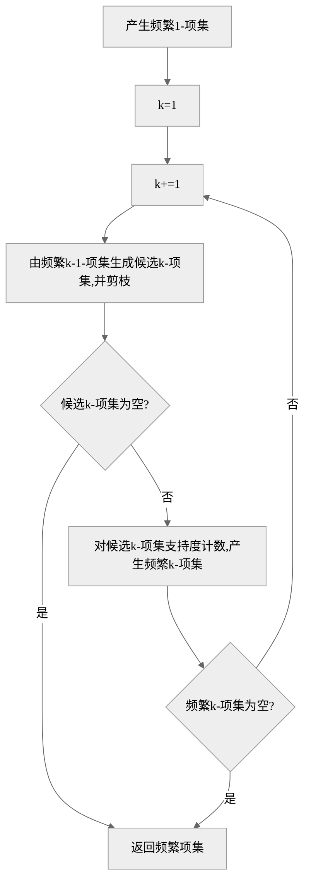

起因是两年前，《数据结构》及格了，《离散数学》及格了，《线性代数》在第四次及格了，《算法》也在第二次及格了。可以说是什么都及格了，太不拉胯了。

<!--more-->

## 排序算法

### 数据集

`dataSet.json` 类似：

里面还有更长的数组。

```json
[
  [],
  [-1],
  [3, 2, 2, 5, 2, 4, 1],
  [-3, 9999991247561, 3456, -111, 2, 7, 9, 23, 6, 0],
  [-1.23, 3.14, 3.14, 2.71, 0, 2, -4, -2]
]
```

### 二分查找

二分查找就是翻书。

有一本 200 页的书，你想翻到 124 页，一下就翻到的概率是很小的

- 翻到中间，发现是 100 页
- 翻到 100~200 页的中间，发现是 150 页
- 翻到 100~150 页的中间，发现是 125 页

以此类推。

二分查找就是从列表里查找一个值，前提列表是有序的，这样可以比较大小，在二分之后仍然是有序的。如果要查找的值比列表的中间值小，就在列表的左半部分找，这就是二分。这时需要变换查找范围的右边界，到中间值的左边一个位置。

然后对查找范围继续二分，与中间值作比较，如果要查找的值比中间值大，就在查找范围的右半部分找，这时需要变换查找范围的左边界到中间值的右一个位置。

以此类推，如果找到了，就返回目标元素的索引（位置）。找不到就返回-1。

**非递归版**

```py
def binary_search(lis: list[int | float], key: int) -> int:
    '''
    二分查找（非递归版），传列表和要查找的值。返回目标值的索引。
    前提列表是有序的，有多个相同值时不一定返回哪个索引。
    '''
    left = 0
    right = len(lis) - 1  # 左边界和右边界，刚开始的查找范围是整个列表。
    while left <= right:  # 二分，与中间值作比较，变换边界。
        mid = (left + right) // 2
        if key < lis[mid]:
            right = mid - 1
        elif key > lis[mid]:
            left = mid + 1
        else:
            return mid
    return -1  # 如果找不到，返回-1
```

**递归版**

```py
def binary_search1(lis: list[int | float], key: int, left: int, right: int) -> int:
    '''
    二分查找（递归版），调用时传列表、要查找的值、0、列表长度减一。返回目标值的索引。
    前提列表是有序的，有多个相同值时不一定返回哪个索引。
    '''
    if left > right:  # 没有找到，递归结束
        return -1
    mid = (left + right) // 2  # 中间值的索引
    if key < lis[mid]:  # 要查找的值比中间值小时，递归调用自身查找，并变换右边界
        return binary_search1(lis, key, left, mid - 1)
    elif key > lis[mid]:
        return binary_search1(lis, key, mid + 1, right)
    else:
        return mid
```

### 插入排序

插入排序就是接扑克牌。

插入排序就像一张一张地接扑克牌，接到第一张扑克牌时什么也不做，接到第二张扑克牌时要与第一张作比较，看插入到第一张的前面还是后面，……，接到第 n 张扑克牌时要与前 n - 1 张比较，看插入到手牌的哪个位置。

```js
/**
 * 插入排序
 * @param {number[]} arr 待排序数组
 * @returns 原地排序后的数组
 */
function insertionSort(arr) {
  const len = arr.length; // 数组长度
  let preIndex, current; // 当前元素的前一个元素的索引，和当前元素的值
  for (let i = 1; i < len; i++) {
    // i 相当于是一个指针，指向当前新接的牌
    // 只有一张或零张牌时不用排序，此时 len == 1 || len == 0，不满足循环条件，直接退出
    preIndex = i - 1; // 刚开始是新接的牌的前一张牌的索引，后来向左扫描
    current = arr[i]; // 新接的牌牌面
    while (preIndex >= 0 && arr[preIndex] > current) {
      // 游标 preIndex 向左扫描，当每找到一张比当前新接的牌大的牌时，把游标当前指向的值覆盖给它右面的元素
      // 能进到这层循环，说明牌有两张或以上
      // 如果 preIndex 当前指向的牌比 current 大，把 preIndex 右边的值用 arr[preIndex] 覆盖
      // 由于 preIndex 是从新接的牌的左边一张牌开始取的，所以会把“插入位置”之后的牌都覆盖了，相当于整体向右挪了一位
      // 包括新接的牌也被覆盖了，所以前面才要单独用一个 current 变量保存新接的牌
      // 当 preIndex 指向的牌比 current 小，说明 preIndex 和 preIndex + 1 “之间” 就是应插入的位置
      // 由于是用覆盖的形式，所以真正的插入位置是 preIndex，在 preIndex 原来位置的牌覆盖给右面了
      // 又由于每次循环 preIndex 都要自减，退出循环之后往插入位置的左边偏了一位，所以退出之后插入位置变成了 preIndex + 1
      // 结束条件是 preIndex 指向的牌比 current 小，找到“插入位置”了
      // 结束条件或者是已经把第 0 张牌覆盖给了第 1 张牌，preIndex 自减之后变成了 -1
      // 所以反过来说，循环继续的条件是 preIndex >= 0 && arr[preIndex] > current
      // 当 preIndex < 0 时，arr[preIndex] 会越界，所以把 preIndex >= 0 的条件写在前面，短路退出
      arr[preIndex + 1] = arr[preIndex]; // 把游标当前指向的值覆盖给它右面的元素
      preIndex--; //向左扫描
    }
    arr[preIndex + 1] = current; // “插入”牌
  }
  return arr;
}
```

### 选择排序

拿到一手混乱的牌，从中选取最小的，与第 0 张交换位置。

之后忽略第 0 张，从剩余的牌里选取最小的，与第 1 张交换位置。

之后忽略第 0、1 张，从剩余的牌里选取最小的，与第 2 张交换位置。

以此类推。

```js
/**
 * 选择排序
 * @param {number[]} arr 待排序数组
 * @returns 原地排序后的数组
 */
function selectionSort(arr) {
  // 选择排序
  const len = arr.length;
  for (let i = 0; i < len - 1; i++) {
    // 有零张或一张牌时，不会进入这层循环
    // 两个指针 i 和 j，i 指向每次外层循环的第一个元素。内层循环开始时，j 在 i 的后一位
    // i < len - 1，说明外层 i 只循环到倒数第二位。每次内层循环，j 都要到最后一位
    let minIndex = i; // 最小值索引
    for (let j = i + 1; j < len; j++) {
      // j 向右扫描，寻找后面牌的最小值
      if (arr[j] < arr[minIndex]) {
        // 如果找到更小的了，更新最小值索引
        minIndex = j;
      }
    }
    // 把外层循环的第一张牌与后面的最小值交换位置
    [arr[minIndex], arr[i]] = [arr[i], arr[minIndex]];
  }
  return arr;
}
```

### 归并排序

把一沓牌分成一张一张的，摆在桌子上。相邻的两张合并成一个组。

相邻的两组分别排序，合并成一个新组。

相邻的两组分别排序，合并成一个新组。

以此类推。

```js
/**
 * 归并排序（递归版）
 * @param {number[]} arr 待排序数组
 * @returns {number[]} 排序后的数组（元素个数大于等于 2 时，为非原地排序）
 */
function mergeSort(arr) {
  let len = arr.length;

  // 元素个数为 0 或 1 时不用排序，返回原数组
  if (len < 2) {
    return arr;
  }

  // 计算中间元素的索引
  // 如果数组长度为奇数：索引就是最中间的
  // 如果数组长度为偶数：索引是右半部分的开头
  let middleIndex = Math.floor(len / 2);

  // 获取数组的左半部分和右半部分
  // 如果数组长度为奇数：左半部分比右半部分短一
  // 如果数组长度为偶数：左右两部分长度相等
  let leftPart = arr.slice(0, middleIndex);
  let rightPart = arr.slice(middleIndex);

  /**
   * 合并左右两部分
   * @param {number[]} leftPart 左半部分
   * @param {number[]} rightPart 右半部分
   * @returns {number[]} 两部分合并之后的数组
   */
  let merge = (leftPart, rightPart) => {
    let result = []; // 保存合并结果的数组

    // 当左右两部分都有元素时
    // 如果数组长度为 2：左右两部分长度都是 1
    // 如果数组长度为 3：左边长 1，右边长 2
    while (leftPart.length && rightPart.length) {
      // 这两个分支用于：
      // 比较左右两部分的第一个元素，把小的剔除，剔除后的那一边所有元素向前补位
      // 把剔除后的元素推进结果数组
      if (leftPart[0] < rightPart[0]) {
        result.push(leftPart.shift());
      } else {
        result.push(rightPart.shift());
      }
      // 总会有一边的元素会被先剔除完的，这造成退出循环之后，另一边还有元素没进结果数组
    }

    // 这两个循环用于：把上面没进到结果数组里的元素推进去
    while (leftPart.length) {
      result.push(leftPart.shift());
    }
    while (rightPart.length) {
      result.push(rightPart.shift());
    }

    return result;
  };

  // 返回合并之后的两部分
  // 在这之前也要用 mergeSort() 自己对两部分进行排序
  return merge(mergeSort(leftPart), mergeSort(rightPart));
}
```

### 快速排序

快速排序就是选一个基准，所有比基准小的放在基准左边，比基准大的放在基准右边。

然后就分成了两个区，对每一个区里的元素再选一个基准，重复上面的操作。

```py
def quick_sort0(lis: list[int | float]) -> list[int | float]:
    '''
    比较直观的快速排序，但是是非原地排序，占内存。
    还有列表加法，所以执行时间比下面的长。
    传列表，返回新列表。
    '''
    if len(lis) <= 1:  # 分区有一个或零个元素时不用排序
        return lis
    pivot = lis[0]  # 选分区最左边的元素作为基准（枢轴）
    left = [x for x in lis[1:] if x <= pivot]  # 生成左半分区，取比最左边元素小或等于它的
    right = [x for x in lis[1:] if x > pivot]  # 生成右半分区，取比最左边元素大的
    # 对两个分区分别调用自身排序，把它们和枢轴合并
    return quick_sort0(left) + [pivot] + quick_sort0(right)
```

## 数据挖掘

- 数据：《数据挖掘导论》这本书里的所有符号
- 信息：此笔记
- 知识：
- 决策：通过知识得出的解决方案

从【信息】到【知识】的这一步，叫【数据挖掘】

### 数据挖掘的任务

**预测：说明变量->目标变量**

- 预测建模：使目标变量的预测值与实际值之间的误差达到最小
  - 分类：预测离散的目标变量：做明尼苏达多项人格测验的两百道判断题，100%的概率分成三份，分到这三大类里面：正常、焦虑抑郁障碍、精神病性障碍
  - 回归：预测连续的目标变量：听音乐时（假定音乐是连续的），预测音乐下一步的发展，“回归”到音乐整体

**描述：数据->模式**

关联分析：
聚类分析：
异常检测：

### 属性与度量

- 测量：将对象的属性映射为数值/符号值
- 测量标度：函数、秤

例如：秤将人的体重映射为一个数值

属性的类型（也叫测量标度的类型）：

- 分类的（定性的）
  - 标称：有意义的只有等于/不等于操作。例如你的性别，不能与其他性别进行比较大小、加减、乘除操作
  - 序数：有意义的有：等于/不等于和比较大小。例如你的成绩在这五个档次里面{A,B,C,D,E}
- 数值的（定量的）

  - 区间：除了能等于/不等于/比较大小，还要能加减。比如某年某月某日、华氏/摄氏温度
  - 比率：在上面的基础上，还要能乘除

- 离散的属性：可取有限个值，或无限可数个值
- 连续的属性：取实数值
- 非对称的属性：出现非零值比零值重要

### 数据集

**特性**

- 维度：对象具有的属性数目
- 稀疏性：0 越多，越稀疏
- 分辨率：采样精度

**类型**

- 记录的
  - 事务数据/购物篮数据：一张表，每一行是一次事务：某顾客某次消费所买的一些东西
  - 数据矩阵/模式矩阵：
  - 稀疏数据矩阵：行是文档，列是单词，单元格是该文档该单词出现次数
- 基于图形的
  - 带有对象之间联系的数据：有超链接的网页
  - 具有图形对象的数据：化合物分子的结构
- 有序的
  - 时序/时间数据：每一个记录，有一个对应的时间。日志
  - 序列数据：基因组序列。没有时间戳的
  - 时间序列数据：每一个记录，是在一段时间之内测量得出的。月-月平均温度。有时间自相关性：测量时间相近时，值通常相似
  - 空间数据：有空间自相关性：地球上相近的两个点通常具有相近的气温/降水量

### 关联分析

```py
class AssociationRule(namedtuple("AssociationRule", ["X", "Y"])):
    """
    关联规则，是两个不相交集合的蕴含表达式
    {牛奶，尿布} -> {啤酒}
    """

    def __new__(cls, X: set, Y: set):
        assert X.isdisjoint(Y)
        return super().__new__(cls, X, Y)
```

支持度计数 sigma，即事务列表里，项集的超集个数

支持度，即项集的超集个数与集合总个数（事务个数）的比值

大于等于最小支持度（计数）的项集，称为频繁项集

置信度，由 X 引起 Y 的可能性。X 的支持度计数做分母，XY 并集的支持度计数做分子

先验原理：如果一个项集是频繁的，它的所有子集都是频繁的

反过来：如果一个项集是非频繁的，它的所有超集都是非频繁的

即：一个项集的子集的支持度，大于等于它本身的支持度

### 决策树示例

对于一组数据集，其每一个数据有它的几个属性的值，和一个分类标签。

如：我们可以给一系列人的数据集：（方便理解，学习用，无歧视）

```py
# 特征列表
features = ["性别", "使用手机的牌子", "年龄", "是否赌博", "喜欢玩的游戏", "喜欢音乐的曲风"]
dataset = [
    # 最后一个是分类标签
    ["男", "小米", "中", "否", "王者荣耀", "前卫摇滚", "有病"],
    ["男", "华为", "中", "否", "和平精英", "前卫摇滚", "有病"],
    ["男", "苹果", "中", "否", "明日方舟", "前卫摇滚", "有病"],
    ["女", "小米", "中", "是", "王者荣耀", "前卫摇滚", "有病"],
    ["女", "小米", "中", "否", "和平精英", "前卫摇滚", "有病"],
    ["女", "华为", "小", "否", "明日方舟", "前卫摇滚", "有病"],
    ["男", "华为", "小", "否", "王者荣耀", "前卫摇滚", "有病"],
    ["男", "苹果", "小", "否", "和平精英", "前卫摇滚", "有病"],
    ["男", "苹果", "大", "否", "明日方舟", "华语流行", "没病"],
    ["女", "小米", "大", "否", "王者荣耀", "华语流行", "没病"],
    ["女", "小米", "大", "否", "和平精英", "前卫摇滚", "没病"],
    ["女", "华为", "小", "否", "明日方舟", "华语流行", "没病"],
    ["男", "华为", "中", "否", "王者荣耀", "前卫摇滚", "没病"],
    ["女", "苹果", "中", "否", "明日方舟", "前卫摇滚", "没病"],
    ["男", "苹果", "中", "否", "明日方舟", "华语流行", "没病"],
    ["女", "小米", "中", "否", "和平精英", "华语流行", "没病"],
    ["男", "华为", "中", "否", "明日方舟", "日语流行", "没病"],
]
```

生成类似这样的决策树：


### 针对购物篮数据集的关联分析

关联分析到底是**什么意思**？是发现隐藏在大型**数据集**中的有意义的**联系**。

购物篮数据集**怎么表示**？是一张**表**，表里有一系列**行**，每一个行是一个**事务**，每一个事务表现为一个**集合**，这个集合里有一系列商品的**名字**，比如{"面包","牛奶","尿布"}

联系**怎么表示**？有两种形式：**关联规则**、和**频繁项集**

关联规则是**什么意思**？是**两个不相交集合的蕴含表达式**，如{尿布}->{啤酒}这个表达式的意思是：购买尿布，**引起了**购买啤酒，前面是**因**、后面是**果**。

项集是**什么意思**？是一些**项**的**集合**。是 `list[str]`

什么叫**频繁项集**？是**支持度**或者**支持度计数大于等于最小阈值**的项集。

什么叫**支持度计数**？是该项集在事务列表里的**超集数量**，是事务列表里的所有**包含该项集**的**事务数量**。

什么叫**支持度**？是事务列表里，**包含该项集的事务的数量**占**所有事务数量**里的比值。

{面包，牛奶}支持度 0.3 是**什么意思**？是在所有的购物记录里，同时包含购买了面包、牛奶的购物记录的比值。是**在每 10 次购物里，就有三次同时购买了面包和啤酒**。

**怎么挖掘关联规则**？分两步：

1. **产生频繁项集**:发现满足最小支持度阈值的所有项集
   - 什么意思？项集里有几个元素？**最少**有一个，**最多**有 `len(unique(flatten(basket)))` 个，是所有独立的商品组成的集合。
2. **产生规则**
   - 提取所有高置信度的规则。

格结构是什么意思？格结构里的所有节点构成一个集合的幂集。格结构的第一层是 null，第二层是所有 1-项集，第三层是所有 2-项集……最底层是 `len(unique(flatten(basket)))`项集

**先验原理**是什么意思？如果一个**项集**是**频繁**的，它的**所有子集**都一定是**频繁的**。

什么叫一个项集是频繁的？它的支持度计数大于等于最小阈值

什么叫一个项集的子集是频繁的？它的子集的支持度计数大于等于最小阈值

为什么项集支持度计数大于等于最小阈值后，它的所有子集的支持度计数都会大于等于最小阈值？

因为：就是这样，我明白，但是就是**说得出来**。那说明还是**明白**。

**支持度计数 +1 的操作是在什么时候**？把这个项集和事务列表里的所有项集做比较，如果该项集是事务列表里项集的子集，把该项集的支持度计数 +1。所以：支持度计数，就是**找超集数量**

**一个集合的子集的超集数量**，必定**大于等于该集合的超集数量**，为什么？**因为这个集合本身就是它子集的超集**。

好了，现在明白了。

什么叫**基于支持度的剪枝**？把先验原理**反过来说**：如果一个项集是非频繁的，它的所有超集都是非频繁的。

非频繁是什么意思？支持度计数小于最小阈值，超集数量小于最小阈值，**包含它的事务数量**小于最小阈值

如果一个集合的超集数量小于最小阈值，它的（所有超集）的超集数量都会小于最小阈值。为什么？**你确定这句话对吗**？

正确的描述方法是：如果**包含 A 的事务数**小于最小阈值， 那么**包含（A 的超集）的事务数**会小于最小阈值。为什么？

因为在一个购物篮里，事务数量是有限的。

只会说这一句话吗？如果不只会说这一句，说明你**还是明白**。为什么？

**支持度计数 +1 的操作是在什么时候**？是针对一个项集，**判断各个事务**是不是它的超集的时候。还是明白。

```py
basket = [
    [1,2,3],
    [1,3,4],
    [1,3,5],
    [2,3,5]
]
```

问：[2,3] 的支持度计数是几？是 2，是第一行和第四行

现在规定：最小支持度计数是 3。问，[2,3]超集的支持度计数？既然是超集，考虑它自己是它自己的超集这种情况，它的支持度计数还是小于 3。现在再往里加一个，能达到要求吗？加一个之后，**超集的判定变严了**。不只能说出这一句感性的话，说明你还是明白。因为 **_算法不只讲感性_**。

理性的说法是：原来是 A 超集的集合 B，在 A 加一个元素之后变成 C 后，B 不一定还是 C 的超集，因为新加的那个元素可能不在 B 里。如果新加的那个元素在 B 里，C 超集的数量（相对于购物篮）至少减零。如果不在 B 里，C 超集的数量（相对于购物篮）至少减一。

好了，现在明白了。

**基于支持度的剪枝**什么意思？如果**一个项集是非频繁的**，把它格结构里**所有的超集剪了**。

**反单调性**什么意思？一个项集的支持度小于等于它的自己的支持度。

### numpy 库的多维数组切片语法

```py
import numpy as np
# 假装这是事务列表
X = np.array(
    [
        [1, 2, 3, 4, 5, 6, 7],
        [8, 9, 10, 11, 12, 13, 14],
        [15, 16, 17, 18, 19, 20, 21],
        [22, 23, 24, 25, 26, 27, 28],
    ]
)
# 假装这是一系列3-项集
combin = np.array([[0, 1, 2], [1, 4, 6]])
print(X[:, combin])

"""
这是什么玩意？？？
[[[ 1  2  3]
  [ 2  5  7]] 把第一个事务的对应的各个3-项集摘出来（可能有True有False），便于后续判断它是不是某个3-项集的子集
              如果第二行全True，说明该事务是[1,4,6]的超集

 [[ 8  9 10]
  [ 9 12 14]]

 [[15 16 17]
  [16 19 21]]]
"""
```

```py
import numpy as np

X = np.array(
    [
        [1, 0, 0, 0, 0, 0, 0],
        [1, 1, 1, 0, 0, 0, 0],
        [1, 0, 1, 1, 0, 0, 0],
        [0, 0, 0, 0, 1, 0, 0],
    ]
)
combin = np.array([[0, 1, 2], [1, 4, 6]])
print(X[:, combin])

"""
[[[1 0 0]
  [0 0 0]] 把对应的3-项集摘出来

 [[1 1 1]
  [1 0 0]] 全1为True，说明第二行事务它是对应[0,1,2]的超集

 [[1 0 1]
  [0 0 0]]

 [[0 0 0]
  [0 1 0]]]
"""

_bools = np.all(X[:, combin], axis=2)
print(_bools)

"""
[[False False]
 [ True False] 四个事务里，只有这一个事务是[0,1,2]的超集
 [False False]
 [False False]]
"""
```

### Apriori 算法



直接看 mlxtend 库的源码（删除了一些相对于算法本身无关紧要的，比如低内存下的算法和 pandas 兼容性的问题）：

```py
from itertools import combinations

import numpy as np
import pandas as pd


def association_rules(df, min_threshold=0.9):
    """
    找出置信度大于等于min_threshold的关联规则
    """

    confidence = lambda sAC, sA, _: sAC / sA

    # 获取 {频繁项集} -> 支持度 字典
    keys = df["itemsets"].values
    values = df["support"].values
    frozenset_vect = np.vectorize(lambda x: frozenset(x))
    frequent_items_dict = dict(zip(frozenset_vect(keys), values))

    # 规则的前件、后件、支持度
    rule_antecedents = []
    rule_consequents = []
    rule_supports = []

    # 遍历所有频繁项集
    for k in frequent_items_dict.keys():
        sAC = frequent_items_dict[k]
        # 找到所有可能的组合
        for idx in range(len(k) - 1, 0, -1):
            # 前件和后件的组合
            for c in combinations(k, r=idx):
                antecedent = frozenset(c)
                consequent = k.difference(antecedent)
                sA = frequent_items_dict[antecedent]
                sC = frequent_items_dict[consequent]
                # 计算置信度
                score = confidence(sAC, sA, sC)
                if score >= min_threshold:
                    rule_antecedents.append(antecedent)
                    rule_consequents.append(consequent)
                    rule_supports.append([sAC, sA, sC])

    # 返回结果
    if not rule_supports:
        return pd.DataFrame(columns=["antecedents", "consequents", "confidence"])
    else:
        rule_supports = np.array(rule_supports).T.astype(float)
        df_res = pd.DataFrame(
            data=list(zip(rule_antecedents, rule_consequents)),
            columns=["antecedents", "consequents"],
        )
        sAC = rule_supports[0]
        sA = rule_supports[1]
        sC = rule_supports[2]
        df_res["confidence"] = confidence(sAC, sA, sC)
        return df_res


def generate_new_combinations(old_combinations):
    """
    由上一步的频繁k-1项集生成候选项k集，并剪枝
    使用F_{k-1} x F_{k-1} 算法
    """
    items_types_in_previous_step = np.unique(old_combinations.flatten())
    for old_combination in old_combinations:
        max_combination = old_combination[-1]
        mask = items_types_in_previous_step > max_combination
        valid_items = items_types_in_previous_step[mask]
        old_tuple = tuple(old_combination)
        for item in valid_items:
            yield from old_tuple
            yield item


def apriori(df, min_support=0.3):
    """
    产生频繁项集
    """

    def _support(_x, _n_rows):
        """
        计算支持度。它按每一列求和，输出一个一维数组，是每一列里True的数量占总行数的比值
        """
        out = np.sum(_x, axis=0) / _n_rows
        return np.array(out).reshape(-1)

    X = df.values  # 二维数组
    support = _support(X, X.shape[0])  # 所有1-项集的支持度
    ary_col_idx = np.arange(X.shape[1])  # 列索引，即不同商品的编号

    support_dict = {1: support[support >= min_support]}
    itemset_dict = {1: ary_col_idx[support >= min_support].reshape(-1, 1)}

    max_itemset = 1  # 最大k项集里的k
    rows_count = float(X.shape[0])  # 行数，即事务数

    while max_itemset:
        next_max_itemset = max_itemset + 1  # 开始计算k-项集
        # 把频繁(k-1)-项集传进去，返回一个包含所有候选k-项集的生成器
        combin = generate_new_combinations(itemset_dict[max_itemset])
        # 把生成器转成数组
        combin = np.fromiter(combin, dtype=int)
        combin = combin.reshape(-1, next_max_itemset)
        # 结束条件：候选k-项集为空
        if combin.size == 0:
            break
        # 对事务列表里的每行（事务）切片，选出，作为三维数组的第二维，便于后续判断超集关系
        _bools = np.all(X[:, combin], axis=2)
        support = _support(np.array(_bools), rows_count)
        # 遮罩，每个候选项集的支持度是否大于最小支持度
        _mask = (support >= min_support).reshape(-1)
        if any(_mask):
            # 对候选项集combin作用，过滤出频繁项集
            itemset_dict[next_max_itemset] = np.array(combin[_mask])
            support_dict[next_max_itemset] = np.array(support[_mask])
            max_itemset = next_max_itemset
        else:  # 结束条件：候选k-项集为空
            break

    # 返回结果
    all_res = []
    for k in sorted(itemset_dict):
        support = pd.Series(support_dict[k])
        itemsets = pd.Series([frozenset(i) for i in itemset_dict[k]], dtype="object")
        res = pd.concat((support, itemsets), axis=1)
        all_res.append(res)

    res_df = pd.concat(all_res)
    res_df.columns = ["support", "itemsets"]
    res_df = res_df.reset_index(drop=True)

    return res_df
```

### 鸢尾花数据集关联分析示例

```py
import os

# Python 3.10.9
os.chdir(r"C:\Users\rcooh\Desktop\数据挖掘\大作业\算法设计")

import numpy as np
import pandas as pd
from algo import apriori, association_rules
from mlxtend.preprocessing import TransactionEncoder
from sklearn import datasets

iris = datasets.load_iris()
data: np.ndarray = iris["data"]
target: np.ndarray = iris["target"]
modify_value = lambda v: f"{int(v):.1f}~{int(v)+1:.1f}"  # 把数据划分到1cm范围内
FLOWER = {0: "山鸢尾", 1: "变色鸢尾", 2: "维吉尼亚鸢尾"}
dataset = np.array(
    [
        [
            "花萼长度" + modify_value(data[i][0]),
            "花萼宽度" + modify_value(data[i][1]),
            "花瓣长度" + modify_value(data[i][2]),
            "花瓣宽度" + modify_value(data[i][3]),
            FLOWER[target[i]],
        ]
        for i in range(data.shape[0])
    ]
)
np.savetxt("dataset.csv", dataset, delimiter=",", fmt="%s", encoding="utf-8")


te = TransactionEncoder()
item_array = te.fit(dataset).transform(dataset)
df = pd.DataFrame(item_array)


frequent_itemsets = apriori(df, min_support=0.3)
# 把编码后的转成原来的
frequent_itemsets["itemsets"] = frequent_itemsets["itemsets"].apply(
    lambda cell: frozenset([te.columns_[i] for i in cell])
)
frequent_itemsets.to_csv("frequent_itemsets.csv")


rules = association_rules(frequent_itemsets, min_threshold=0.8)
rules.to_csv("result.csv")
```

## 动态规划

### 滚动数组怎么滚

以三个数为例：

1. 先处理前两个，直接返回
2. 声明三个变量，只给前两个赋值
3. 循环[下标看具体情况]在每次循环里：
   1. 先作用
   2. 把第二个数赋值给第一个
   3. 把第三个数赋值给第二个
4. 返回第三个

笔者认为这种写法符合人的直觉，且不容易出错。

### 70.爬楼梯

> 假设你正在爬楼梯。需要 n 阶你才能到达楼顶。每次你可以爬 1 或 2 个台阶。你有多少种不同的方法可以爬到楼顶呢？

换一种问题描述方式：把一个正整数 n 拆分成一系列 1 和 2 有顺序地相加，共有几种拆分方式 f(n)？

从它的尾巴向前看，有这两种：

- n = (n-1) + 1
- n = (n-2) + 2

其中(n-1)和(n-2)有它们各自被拆分的种类数，于是 f(n)=f(n-1)+f(n-2)

边界：f(1)=1,f(2)=2（2=1+1=2+0）

```c
int climbStairs(int n) {
    if (n <= 2) {
        return n;
    }
    int a = 1, b = 2, c;
    for (int i = 3; i <= n; i++) {
        c = a + b;
        a = b;
        b = c;
    }
    return c;
}
```

### 746.使用最小花费爬楼梯

我们把问题描述改写一下：

给你一个非负整数数组，长度大于等于 2，让你在数组里选一些数求和，要求选的这些数：

- 0 号和 1 号元素必须二选其一
- 最后两个元素必须二选其一
- 选的相邻两数之间至多间隔一个数
- 要求和最小，输出和

状态转移就是从过去转移到现在。现在虚空设一个数叫 dp[i]表示爬到下标为 i 的台阶时的花费

（注意：此时的 dp[i]是不包含本级台阶的花费的，往后跨了之后才加）

有两种转移的情况：从 i-1 爬一层、从 i-2 爬两层

从 i-1 爬一层之后、转移到现在，现在的花费等于跨上一步之前的花费+跨上一步之后的花费

即 dp[i] = dp[i-1] + cost[i-1]

总的状态转移方程为 dp[i] = min(dp[i-1] + cost[i-1], dp[i-2] + cost[i-2])

边界为 dp[0]=dp[1]=0，返回值为 dp[n]，下标 n 在楼梯的顶层，cost 数组右边一个位置，等于 cost 数组长。用滚动数组，循环 [2, cost 长]

```c
int minCostClimbingStairs(int* cost, int costSize) {
    int a = 0, b = 0, c;
    for (int i = 2; i <= costSize; i++) {
        c = fmin(a + cost[i - 2], b + cost[i - 1]);
        a = b;
        b = c;
    }
    return c;
}
```

### 198.打家劫舍

我们把问题描述改写一下：

给你一个长度[1,100]的非负整数数组，让你选一些数求和，要求选的这些数间隔至少为 1，返回最大和

虚空设一个数 dp[i]表示你对 i 号下标纠结之后的和，你正在纠结打还是不打

- 如果打 i，就不能打 i-1，dp[i] = dp[i-2] + value[i]
- 如果不打 i，就可以打 i-1，dp[i] = dp[i-1]

这两种情况求大的

```c
int rob(int* nums, int numsSize) {
    if (numsSize == 1) {
        return nums[0];
    } else if (numsSize == 2) {
        return fmax(nums[0], nums[1]);
    }
    int a = nums[0];
    int b = fmax(nums[0], nums[1]);
    int c;
    for (int i = 2; i < numsSize; i++) {
        c = fmax(a + nums[i], b);
        a = b;
        b = c;
    }
    return c;
}
```
