- CSMA/CD：Carrier Sense Multiple Access with Collision Detection，载波监听多址接入/碰撞检测协议。以太网用的。
  - 使用曼彻斯特编码（中心始终跳变，01 为跳变方向不同），频带宽度比基带信号增加一倍。
  - 多点接入：多台计算机连在一根总线上：多个人在同一个房间。
  - 载波（载体）监听：每个站都不停地检测信道：在说话前和说话中听别人有没有说话。
  - 碰撞检测：检测信号电压：听到了自己和其他人同时说话的声音。
  - 一个站不能同时发送和接收：人不能同时（并行）听懂和说明白。半双工（双向交替通信）。
  - 是无连接的协议：一群人头脑风暴。
  - 碰撞的过程。
  - 计算碰撞后重传的等待时间：截断二进制指数退避。用 r 乘争用期。
- [以太网](/blog/CN/09)
  - 以太网的信道利用率
  - 争用期规定为 $51.2 \mathrm{\mu s}$，如果在这段时间内没有检测到碰撞，后续就不会碰撞。
  - 帧间最小间隔为 $9.6 \mathrm{\mu s}$
  - 最短帧长 = 争用期 × 带宽。

<!--more-->

## 名词辨析：CSMA 与 CDMA

CS 是载波监听（Carrier Sense），CD 是码分（Code Division），MA 都是多址接入（Multiple Access）。

后者是码分多址复用。

而 CSMA/CD 的 CD 是碰撞检测（Collision Detection）。

CSMA/CD 用于有线网，还有一个 CSMA/CA（Collision Avoidance，碰撞避免），用于无线网。

## CSMA/CD 协议工作流程

听到有别人正在说话时，自己不说话。

没人正在说话时，自己说话，说话过程中听到有别人说了就不说，等一段时间后再准备说。

```
准备发送 -> 载波监听<------
   ^           |         ^
   |           v         |
   |       监听到了 -> 准备发送
   |       没监听到 -> 发送，同时开始碰撞检测
   |                           |
等待随机时间（截二退）           |
   ^                           |
   |                           |
发送人为干扰信号                |
   ^                           |
   |                           v
停止发送<-------------------检测到了
                           没检测到就发送直到完成
```

## 碰撞

单程端到端传播时延（从【说出口】到【被人听到】经历的时间）记为 $\tau$。为方便看，这里 $\tau = 20$。

B 在 $\tau - \delta$ 时刻向 A 发送，过程中检测到了碰撞。这里 $\delta = 5$。

这里碰撞的时刻是 $17.25$，即 $\tau - \delta / 2$。

```mermaid
gantt
    title 碰撞（甘特图）
    dateFormat s
    axisFormat %S

    section 传播过程
    A发送后，从A到B传播          :0,20s
    B发送后，从B到A传播          :15,20s
    B检测到了碰撞，然后……          :20,36s
    A检测到了碰撞，然后……          :35,21s
```



A 或 B 发送之后，至多需要 $2 \tau$ 的时间，即端到端往返时延，才能检测到与对方发生了碰撞。

$2 \tau$ 叫【争用期】或【碰撞窗口】。

$2 \tau$ 规定为 $51.2 \mathrm{\mu s}$。

## 强化碰撞

碰撞之后，除了停止发送数据，还要发送 32 比特或 48 比特的人为干扰信号，告诉所有用户已经发送了碰撞。

## 截断二进制指数退避

计算碰撞后重传的等待时间。

```py
import random

tau = 25.6  # 单程时延
basic_backoff_time = 2 * tau  # 往返时延，基本退避时间


for retransmit_count in range(1, 17):
    print(f"第{retransmit_count}次重传")
    k = min(retransmit_count, 10)
    r = random.randint(0, 2**k - 1)
    print(f"退避时间：{r*basic_backoff_time}")
```

重传 16 次仍不成功就丢弃，并向高层报告。

## 以太网的信道利用率

帧的发送时间 $T_0$：

$$
\mathrm{s = \frac{bit}{bit/s} = } \frac{L}{C} = \frac{帧长}{数据发送速率}
$$

拖一会。

## 例题

### 【3-24】

> 假定站点 A 和 B 在同一个 10 Mbit/s 以太网网段上。这两个站点之间的传播时延为 225 比特时间。现假定 A 开始发送一帧，并且在 A 发送结束之前 B 也发送一帧。如果 A 发送的是以太网所容许的最短的帧，那么 **A 在检测到和 B 发生碰撞之前能否把自己的数据发送完毕？** 换言之，如果 A 在发送完毕之前并没有检测到碰撞，那么能否肯定 A 所发送的帧不会和 B 发送的帧发生碰撞？（提示：在计算时应当考虑到每一个以太网帧在发送到信道上时，在 MAC 帧前面还要增加若干字节（8 字节，64 比特）的前同步码和帧定界符。）

即比较【假定 A 发送完】的时刻与【A 检测到碰撞】的时刻谁在前。

这里【A 检测到碰撞】的时刻要取最晚的情况，即 B “即将” 接收到 A 发送的时刻。传播时延是 225 比特时间，如果在 225 时刻 B 还没发送，B 就会接收到 A 发送的，这时 B 就不会发送，进而不会发生碰撞。

所以要取 B 在 224 时刻开始发送。经过一个传播时延，A 在 224 + 225 = 449 时刻检测到碰撞。

假定 A 会发送完：

51.2 μs × 10 Mbit/s = 512 bit

512 + 64 = 576 bit

假定不会发生碰撞，A 将在 576 比特时刻发送完。但是 A 已经在 449 时刻检测到碰撞了，所以 A 不会发送完。

### 【3-25】

> 上题中的站点 A 和 B 在 t = 0 时同时发送了数据帧。当 t = 225 比特时间，A 和 B 同时检测到发生了碰撞，并且在 t = 225 + 48 = 273 比特时间完成了干扰信号的传输。A 和 B 在 CSMA/CD 算法中选择不同的 r 值退避。假定 A 和 B 选择的随机数分别是 rA = 0 和 rB = 1。试问 A 和 B 各在什么时间开始重传其数据帧？ A 重传的数据帧在什么时间到达 B？ A 重传的数据会不会和 B 重传的数据再次发生碰撞？B 会不会在预定的重传时间停止发送数据？

A 或 B 在检测到碰撞之后，需要做以下几件事：

1. 发送 48 比特的干扰信号
2. 退避等待一段时间（r × 争用期 51.2 μs）
3. 开始检测信道
4. 检测到空闲后，再等待一个帧最小间隔 9.6 μs
5. 期间没有接收到信号，则重传

下面的单位都是比特时间：

- 0 ~ 225：A 和 B 发送的数据在信道上传播
- 225：A 和 B 同时检测到碰撞
- 225 ~ 273：A 和 B 都发送干扰信号
- 273：A 和 B 都发送完了干扰信号，开始退避等待
  - 273：A 退避时间为 0，开始检测信道
  - 273 ~ 785：B 退避时间为 512
- 225|273 ~ 450|498：干扰信号在信道上传播
- 450：A 和 B 都接收到了干扰信号
- 498：A 和 B 都接收完了干扰信号，B 仍然在退避
  - 498 ~ 594：A 检测到空闲，等待 96
  - 594：A 开始重传
  - 594 ~ 819：A 重传的数据在信道上传播
- 785：B 开始检测信道
  - 785 ~ 881：B 等待 96
  - 但是在 819 时间 B 接收到了 A 重传的，所以 B 暂时不重传

> 试问 A 和 B 各在什么时间开始重传其数据帧？

A 在 594，B 不知道

> A 重传的数据帧在什么时间到达 B？

819

> A 重传的数据会不会和 B 重传的数据再次发生碰撞？

不会

> B 会不会在预定的重传时间停止发送数据？

会
