- CSMA/CD：Carrier Sense Multiple Access with Collision Detection，带冲突检测的载波侦听多路访问协议。以太网用的。
  - 使用曼彻斯特编码（中心始终跳变，01 为跳变方向不同），频带宽度比基带信号增加一倍。
  - 多点接入：多台计算机连在一根总线上：多个人在同一个房间。
  - 载波（载体）监听：每个站都不停地检测信道：在说话前和说话中听别人有没有说话。
  - 碰撞检测：检测信号电压：听到了自己和其他人同时说话的声音。
  - 一个站不能同时发送和接收：人不能同时（并行）听懂和说明白。半双工（双向交替通信）。
  - 是无连接的协议：一群人头脑风暴。
  - 碰撞的过程。
  - 计算碰撞后重传的等待时间：截断二进制指数退避。
- [以太网](/blog/CN/09)
  - 以太网的信道利用率
  - 争用期规定为 $51.2 \mathrm{\mu s}$，如果在这段时间内没有检测到碰撞，后续就不会碰撞。
  - 帧间最小间隔为 $9.6 \mathrm{\mu s}$

<!--more-->

## CSMA/CD 协议工作流程

听到有别人正在说话时，自己不说话。

没人正在说话时，自己说话，说话过程中听到有别人说了就不说，等一段时间后再准备说。

```
准备发送 -> 载波监听<------
   ^           |         ^
   |           v         |
   |       监听到了 -> 准备发送
   |       没监听到 -> 发送，同时开始碰撞检测
   |                           |
等待随机时间（截二退）           |
   ^                           |
   |                           |
发送人为干扰信号                |
   ^                           |
   |                           v
停止发送<-------------------检测到了
                           没检测到就发送直到完成
```

## 碰撞

单程端到端传播时延（从【说出口】到【被人听到】经历的时间）记为 $\tau$。为方便看，这里 $\tau = 20$。

B 在 $\tau - \delta$ 时刻向 A 发送，过程中检测到了碰撞。这里 $\delta = 5$。

这里碰撞的时刻是 $17.25$，即 $\tau - \delta / 2$。

```mermaid
gantt
    title 碰撞（甘特图）
    dateFormat s
    axisFormat %S

    section 传播过程
    A发送后，从A到B传播          :0,20s
    B发送后，从B到A传播          :15,20s
    B检测到了碰撞，然后……          :20,36s
    A检测到了碰撞，然后……          :35,21s
```



A 或 B 需要 $2 \tau$ 的时间，即端到端往返时延，才能检测到与对方发生了碰撞。

$2 \tau$ 叫【争用期】或【碰撞窗口】。

$2 \tau$ 规定为 $51.2 \mathrm{\mu s}$。

## 强化碰撞

碰撞之后，除了停止发送数据，还要发送 32 比特或 48 比特的人为干扰信号，告诉所有用户已经发送了碰撞。

## 截断二进制指数退避

计算碰撞后重传的等待时间。

```py
import random

tau = 25.6  # 单程时延
basic_backoff_time = 2 * tau  # 往返时延，基本退避时间


for retransmit_count in range(1, 17):
    print(f"第{retransmit_count}次重传")
    k = min(retransmit_count, 10)
    r = random.randint(0, 2**k - 1)
    print(f"退避时间：{r*basic_backoff_time}")
```

重传 16 次仍不成功就丢弃，并向高层报告。

## 以太网的信道利用率

帧的发送时间 $T_0$：

$$
\mathrm{s = \frac{bit}{bit/s} = } \frac{L}{C} = \frac{帧长}{数据发送速率}
$$

鸽