- $\mathrm{K,M,G...}$ 的不同含义
- 速率、带宽、吞吐量
- 时延
  - 发送时延
  - 传播时延
  - 处理时延
  - 排队时延
- 时延带宽积
- RTT 和有效数据（速）率
- （网络）利用率

对应谢希仁《计算机网络》第八版 1.6

<!--more-->

## $\mathrm{K,M,G...}$ 的不同含义

基数不同：

- 在计算机领域，$\mathrm{K = 2^{10}}$，$\mathrm{M = 2^{10}K}$……

- 在通信的领域，$\mathrm{K = 10^{3}}$，$\mathrm{M = 10^{3}K}$……

数据通过网线或空气传播时，是在通信的领域。

## 速率

$\mathrm{bit/s}$

通常指额定速率。

## 带宽

### 频域上的：$\mathrm{Hz}$

信号频率范围 $\mathrm{200Hz \sim 300Hz}$

带宽为 $\mathrm{300Hz - 200Hz = 100Hz}$

### 时域上的：$\mathrm{bit/s}$

指某信道的最高速率。

基数是 $2^{10}$

## 吞吐量

指实际速率 $\mathrm{bit/s}$，进量 + 出量。

## 时延

单位都是时间单位。

### 发送时延

网卡发送数据的时间。**与信道长度无关**。不要使用【传输时延】这个词。

$\mathrm{s = \dfrac{bit}{bit/s}} = \dfrac{数据长度}{发送速率（基数）}$

### 传播时延

电磁波在网线或空气中传播的时间。**与信道长度有关**。

$\mathrm{s = \dfrac{m}{m/s} = \dfrac{信道长度}{信号传播速率}}$

- 光速：$\mathrm{3.0 \times 10^5 km/s}$
- 铜线：$\mathrm{2.3 \times 10^5 km/s}$
- 光纤：$\mathrm{2.0 \times 10^5 km/s}$

发送时延和传播时延没啥关系。

### 处理时延

主机或路由器收到分组后，对分组进行处理的时间。

### 排队时延

分组在路由器输入队列和输出队列里排队的时间。

### 过程

……->输出排队->发送->传播->输入排队->处理->输出排队……

## 时延带宽积

$\mathrm{bit = s \times bit/s = 时延 \times 带宽}$

已经从发送端发出，但尚未到达接收端的比特数。又叫**以比特为单位的链路长度**。

## RTT

往返时间（Round-Trip Time）

```mermaid
gantt
    title RTT（甘特图）
    dateFormat s
    axisFormat %S

    section RTT
    RTT :3,17s

    section A
    发送           :0,3s
    接收    :17,3s
    ……    :20,4s

    section 传播
    从A到B传播    :0,10s
    从B到A传播    :10,10s

    section B
    接收      :7,3s
    发送    :10,3s
```

其中排队时间和处理时间在接收和发送之间，这里忽略了。

## 有效数据率

$\mathrm{bit/s = \dfrac{bit}{s} = \dfrac{数据长度}{发送时间+RTT}}$

是有效的数据**速率**。

## 利用率

$网络利用率 = 1 - \dfrac{空闲时延}{当前时延}$

利用率越高，当前时延越大（堵车）。
