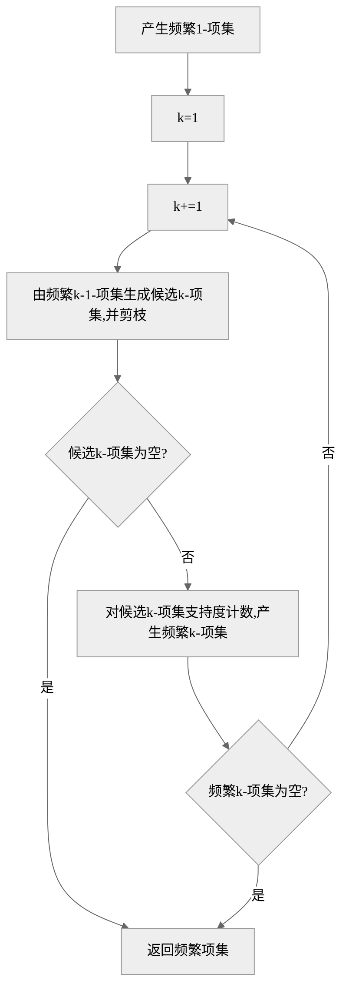

## JSON

json是一个文本文件或者字符串，它的字符具有特定的格式，这个文件可以与程序设计语言里的对象互相转化。

JS：

```js
jsonStr = JSON.stringify(jsObj);
jsObj = JSON.parse(jsonStr);
```

Python：

```python
import json
json_str = json.dumps(py_obj)
py_obj = json.loads(json_str)
```

<!--more-->

## 给 VM 里的 Ubuntu 扩容

层次（空间缝隙）

- `/dev/sda`：大概是 VM 设置里分配的硬盘空间大小
  - `/dev/sda1`：bios_grub
  - `/dev/sda2`：`/boot`
  - 物理卷 pv：`/dev/sda3`
    - 逻辑卷 lv：
      - 文件系统 `/dev/mapper/ubuntu--vg-ubuntu--lv` -> `/dev/dm-0`

需求：

1. 先扩 sda
2. 从 sda 向 sda3 匀
3. 从 sda3 向 lv 匀

1. 给 VM 的虚拟磁盘扩容

   关机状态下：编辑虚拟机设置 -> 硬盘 -> 扩展

2. 从 sda 向 sda3 匀

   ```sh
   sudo parted
   ```

   ```
   GNU Parted 3.4
   Using /dev/sda
   Welcome to GNU Parted! Type 'help' to view a list of commands.
   (parted) print all
   // 输出……

   (parted) print free
   Model: VMware, VMware Virtual S (scsi)
   Disk /dev/sda: 32.2GB
   Sector size (logical/physical): 512B/512B
   Partition Table: gpt
   Disk Flags:

   Number  Start   End     Size    File system  Name  Flags
           17.4kB  1049kB  1031kB  Free Space
    1      1049kB  2097kB  1049kB                     bios_grub
    2      2097kB  1904MB  1902MB  ext4
    3      1904MB  21.5GB  19.6GB
           21.5GB  32.2GB  10.7GB  Free Space

   (parted) resizepart 3
   End?  [21.5GB]? 32.3GB //在后面输入扩到的 End，比 End 略大就是扩到底
   ```

   扩完后，`sudo pvs` 出的 /dev/sda3 会比 `lsblk` 出的 sda3 小，执行：

   ```sh
   sudo pvresize /dev/sda3
   ```

3. 从 sda3 向 lv 匀

   ```sh
   sudo lvresize -l +100%FREE /dev/mapper/ubuntu--vg-ubuntu--lv
   ```

   扩完后，`df -h` 出的 /dev/mapper/ubuntu--vg-ubuntu--lv 还没变，执行：

   ```sh
   sudo resize2fs /dev/mapper/ubuntu--vg-ubuntu--lv
   ```

## 计算机网络

### 接网线头的流程和注意事项

RJ45 水晶头的接线方式有两种，多使用 T568B：橙白|橙、绿白|蓝、蓝白|绿、棕白|棕。

1. 用网线钳的圆孔把网线的表皮剥开，转一下不要使太大力
   - 露出来里面的线的长度长一点，比两倍水晶头的长度长
2. 你会看到有四对缠在一起的线，把它们分开成一根一根的
   - 这时候先不用管它们的顺序
3. 用力把它们捋直，多捋几次
4. 它们缠在一起的时候是：橙白|橙、绿白|绿、蓝白|蓝、棕白|棕，接线的时候要把中间两根交换一下位置
5. 用网线钳的刀把它们从中间剪断，保证这几根线的末端是平齐的。注意两点：
   - 哪里排列地最整齐紧密，就从哪里剪
   - 留下的长度不要比一倍水晶头的长度过长，否则露出来的部分容易损坏。这是一个**反面的例子**：这几根线的下面留得太长了，没还有完全地分开


6. 把这几根线插入到水晶头里。注意：水晶头的卡扣是朝下的
   - 如果顺利，这八根线会待在它们的八个凹槽里，它们的头上有八个片片
7. 把水晶头插入网线钳的槽里，用网线钳用力把这八个片片刺入线的内部，在刺的时候能感受到阻力
8. 两头都接好之后，用工具测试是否联通

### 概述

世界上第一个网页：[http://info.cern.ch](http://info.cern.ch)

RFC 文档：“请求评论”（Request For Comments）的文档，公开发布的互联网建议标准，请求公众评论。最后制定互联网标准 STD。

互联网服务提供者（Internet Service Provider），可以是移动联通电信公司，也可以是非营利组织。主干 ISP：国 | 地区 ISP：省 | 本地 ISP：省以下。两个同级 ISP 交换信息时，可以通过互联网交换点（Internet eXchange Point）IXP，而不必通过上级 ISP。

计算机网络分边缘部分和核心部分。边缘部分是我们所有人直接使用的主机，如手机和电脑。核心部分是除了边缘主机之外的所有硬件设施，如交换机、路由器、网线。接入网是边缘部分向核心部分过渡的部分。

边缘部分的通信分 C/S 模式和 P2P 模式。两者的区别是学生向老师请教题目和学生之间互相讲题，在下载文件之后做不做种。

核心部分的通信：电路交换是提前联系用一辆专车运货；分组交换是把货物拆分成小的快递，再经过各种站点发送出去；报文交换是将货物作为一个整体，通过多个中转站运送。前两者的区别是一手和多手，后两者的区别是切不切片。

分组交换：

1. TCP 协议把报文分组，每组写上头部信息。（包裹大包分成小包，写上序号、寄出地和目的地等）
2. 通过路由器一级一级地转发到目的地。


title 分组交换（甘特图）
dateFormat s
axisFormat %S

section 1 号包
从 A 到 B :0, 5s
从 B 到 C :5, 5s
从 C 到 D :10, 5s

section 2 号包
从 A 到 B :5, 5s
从 B 到 C :10, 5s
从 C 到 D :15, 5s

section 3 号包
从 A 到 B :10, 5s
从 B 到 C :15, 5s
从 C 到 D :20, 5s


- 0-5 时间 1 号包裹从 A 站到 B 站
- 5-10 时间 1 号包裹从 B 站到 C 站、2 号包裹从 A 站到 B 站
- 10-15 时间 1 号包裹从 C 站到 D 站、2 号包裹从 B 站到 C 站、3 号包裹从 A 站到 B 站

3. 把各个包裹合并。

### 物理层

RJ45 水晶头的接线方式有两种，多使用 T568B：橙白|橙、绿白|蓝、蓝白|绿、棕白|棕。传的是数字信号。

- 物理层之下的传输媒体
  - 导引性传输媒体：双绞线、光缆、同轴电缆、架空明线
  - 非导引性传输媒体：空气或真空

集线器工作在物理层。

- 通信双方的交互方式
  - 单向通信（单工）：一段单行道。电视、广播。
  - 双向交替通信（半双工）：一段有两个车道的马路，但是规定在一边的车道有车正在走时，另一边（相反方向）的车道不能有车走。对讲机。
  - 双向同时通信（全双工）：一段正常的两个车道的马路。

编码方式：编码的终点是码，即数字信号。

如何把比特和电压互相转换。

```
 1  1  0  0  1

‾‾‾‾‾‾______‾‾‾    # 极性不归零电平 Polar NRZL，Non-Return-to-Zero level

‾‾‾_________‾‾‾    # 极性不归零反转 Polar NRZI，Non-return-to-zero inverted，边界遇 1 跳变

-‾--‾--_--_--‾-    # 极性归零 Polar RZ，Return-to-Zero，正脉冲凸，负脉冲凹

‾_|‾_|_‾|_‾|‾_|    # 曼彻斯特编码（G.E. Thomas Convention）

‾_|_‾|_‾|_‾|‾_|    # 差分曼彻斯特编码（G.E. Thomas Convention）
```

曼彻斯特编码：中心始终跳变

- G.E. Thomas Convention：
  - 中心向下跳变，`‾_`，`1`
  - 中心向上跳变，`_‾`，`0`
  - 简记：**下为 1**
- IEEE 802.3 Convention 和上面的定义相反

差分曼彻斯特编码：中心始终跳变

- G.E. Thomas Convention：
  - 左边界无跳变，`1`
    - `_|_‾`
    - `‾|‾_`
  - 左边界有跳变，`0`
    - `_|‾_`
    - `‾|_‾`
  - 简记：**左连为 1**
- IEEE 802.3 Convention 和上面的定义相反

### 数据链路层

解决三个问题：发出去之后，哪一方接收；传输何时开始，何时结束；判断是否有传输错误

网卡：

- 负责把有线或无线电信号与比特流互转。工作在物理层和数据链路层。
- 与 CPU 和存储器并行通信，与局域网串行通信
- 接收并缓存 MAC 帧，帧的目标地址不是它自己时，或者不符合格式、校验失败时就丢弃
- 安装驱动到操作系统，实现以太网协议

> MAC

MAC 地址有 6 个字节。全 1 的地址是广播地址

Windows 查看网络适配器的 MAC 地址：ipconfig /all

- 前三个字节是 IEEE 的注册管理机构分配的，后三个字节是厂家自行分配的
- 第一个字节最低位：0 为单播，1 为多播

> 透明传输

帧定界符 SOH 0x01、EOT 0x10，转义字符 ESC 0x1B

如果数据长度超过了 MTU，会被分割成多个帧。

下到物理层：在 MAC 帧前面插入 7 字节的前同步码和 1 字节的帧定界符：就是 `10101010 10101010 ... 10101010 10101011`。交替的 10 用于时钟同步，最后一个字节的最后一个比特变了，告诉接收端，后面的就是 MAC 帧。不用标记帧结束，因为是曼彻斯特编码，一直在跳变，脱离原本的规律了就是帧结束了。

> 差错检测

比特差错：01 错了。误码率（BER）：平均每传送 $\mathrm{(BER)^{-1}}$ 个比特，会有一个比特出错。

传输差错：接收方没有收到某一个帧，或者收到了重复的帧，或者收到帧的顺序错了

**FCS**

帧检验序列 Frame Check Sequence，确保无比特差错

1. 提前规定冗余码有 3 位
2. 提前规定一个除数 $P$ ，比冗余码的长度多一位，如 `1100`
3. 把待传的数据 `1001 0001` 后边补上冗余码长度个 0，用除数除它
4. 不管大小，`1` 开头就商 `1`，`0` 开头就商 `0`：

```txt
        1
    --------------
1100|1001 0001 000
     1100
     ------
      101 0
```

5. 相减，相当于异或
6. 继续除，最后的余数 `100` 就是冗余码
7. 把冗余码添加到原数据的末尾

**CRC**

循环冗余检验 Cyclic Redundancy Check

接收方把收到的、经发送方添加了冗余码后的数据再用 $P$ 去除。传输没出错 -> 余数为零，反之为极大概率。

除数 $P$ 还有一种记法，叫生成多项式 $P(X)$：如 `1100` 记作：$X^3+X^2$

> 交换机

交换机工作在数据链路层，全双工。并且不使用 CSMA/CD 协议，但仍然使用以太网的帧结构。

交换表的结构：MAC 地址、端口号、有效时间、状态标志

源机器发送数据帧 → 交换机记录源 MAC 地址 → 交换机查找目标 MAC 地址 → 如果目标未知，广播数据帧 → STP 确保广播不会形成环路。

交换机分为直通交换和存储转发。直通交换不校验 FCS，直接读 6 字节的目标地址（有时包含前导码）。

> 以太网

以太网是局域网的一种实现方式，与 Wifi 的区别是后者不用网线。

- DIX Ethernet V2 和 IEEE 802.3 是以太网的协议，使用 CSMA/CD（冲突检测）
- IEEE 802.11 是 Wifi 的协议，使用 CSMA/CA（冲突避免）

局域网共享信道，为避免冲突，可采用静态划分信道（复用）或动态媒体接入控制

以太网 V2 的 MAC 头部：目标 MAC + 源 MAC + 类型 0800【IPv4】/80DD【IPv6】

- MAC 帧的格式
  - （带宽为 $\mathrm{10Mbit/s}$ 的）以太网 V2：
    $$
    6 + 6 + 2 + (46 \sim 1500) + 4 = (64 \sim 1518) 字节
    $$
    其中 $\mathrm{64Byte = \dfrac{51.2 \mu s \times 10Mbit/s}{8bit/Byte}}$，减去 18 字节的首部和尾部后，得到数据部分的最小长度 46 字节。

100BASE-T 以太网：

- 使用双绞线（T），带宽为 100Mbit/s。
- 标准是 IEEE 802.3u，半双工时使用 CSMA/CD 协议，全双工时不使用。
- 争用期为 5.12 μs，帧最小间隔 0.96 μs，是 10 Mbit/s 以太网的十分之一。

### 网络层

> IPv4 分类编址

4 个字节。

- A 类地址：0 + 7 位网络号 + 3 字节主机号，首字节 0 到 127
- B 类地址：10 + 14 位网络号 + 2 字节主机号，首字节 128 到 191
- C 类地址：110 + 21 位网络号 + 1 字节主机号，首字节 192 到 223

主机号全 1 是广播地址，全 0 是该子网。

私有地址：用于局域网（LAN）内部，不可直接在互联网上路由。

- A 类：10.0.0.0 到 10.255.255.255
- B 类：172.16.0.0 到 172.31.255.255
- C 类：192.168.0.0 到 192.168.255.255

> 无分类编址 CIDR

子网掩码：用于标记用 IP 地址前面的几位来表示网络地址。

子网掩码类似 `255.248.0.0` （`11111111 11111000 00000000 00000000`），即用前面 13 位表示网络地址，后面的位表示主机地址。记作 `IP地址/13`。

### 计算

信道长度、带宽和信噪比会影响数据在信道中传输的速率，而信号传播速度（电磁波在介质中的传播速度）不会。

信噪比越大，接收方接收到的信息失真越少。两种表示方式：

- $\dfrac{S}{N} = \dfrac{信号平均功率}{噪声平均功率} = 10^{\mathrm{dB}/10}$
- $\mathrm{dB} = 10 \lg\dfrac{S}{N}$

计算传输速率时，取奈氏准则和香农公式的结果小的。

Kibi：内存、存储容量，KiB = KB = 1024B

Kilo：网络带宽，K = 1000，国际单位制的词头

$\mathrm{bit/s}$

- 速率
- 吞吐量：指实际速率，进量 + 出量。有多条链路时，吞吐量由瓶颈链路决定。
- 某信道的最高速率：时域上的带宽
- 有效数据（速）率：$\mathrm{\dfrac{数据长度}{发送时间+RTT}}$

$\mathrm{Hz}$

频域上的带宽 W：信号频率范围的宽度

秒

- 发送时延：网卡发送数据的时间，与信道长度无关。$\mathrm{\dfrac{bit}{bit/s}} = \dfrac{数据长度}{发送速率}$
- 传播时延：电磁波在网线或空气中传播的时间。与信道长度有关。$\mathrm{\dfrac{m}{m/s} = \dfrac{信道长度}{信号传播速率}}$
- 处理时延：主机或路由器收到分组后，对分组进行处理的时间。
- 排队时延：分组在路由器输入队列和输出队列里排队的时间。
- ……->输出排队->发送->传播->输入排队->处理->输出排队……
- RTT：往返时间（Round-Trip Time）

这里忽略了在接收和发送之间的排队时间和处理时间。


title RTT（甘特图）
dateFormat s
axisFormat %S

    section RTT
    RTT :3,17s

    section A
    发送           :0,3s
    接收    :17,3s
    ……    :20,4s

    section 传播
    从A到B传播    :1,8s
    从B到A传播    :11,8s

    section B
    接收      :7,3s
    发送    :10,3s



bit

时延带宽积：$\mathrm{s \times bit/s = 传播时延 \times 带宽}$

已经从发送端发出，但尚未到达接收端的比特数。又叫以比特为单位的链路长度。

m/bit

每比特宽度：每个比特在信道中占据的长度。

$$
\begin{aligned}
&\mathrm{m/bit = \dfrac{m}{bit} = \dfrac{信道长}{比特数}} \\
&\mathrm{m/bit = \dfrac{m/s}{bit/s} = \dfrac{信道传播速率}{信道当前带宽}}
\end{aligned}
$$

其他

利用率：$网络利用率 = 1 - \dfrac{空闲时延}{当前时延}$

利用率越高，当前时延越大（堵车）。

> 码元

用来表示码的单个元。类比信号，码就是波形，码元就是在发送和解读波形时，可以分辨的最小单位波形。码元种类数是信号的状态数 $n = 2^x$

- 码元对应的比特数 $x = \log_2(n)$
- 当 $0 < x < 1$时，一个比特由多个码元表示

> 比特率和波特

$\mathrm{bit/s} = 2Wx = 2W\log_2(n)$

符号速率（码元每秒）也叫波特 Baud

> 奈奎斯特准则

无噪声低通信道中，保证接收方接收符号不出错时的速率上限为 2W x 码元数，W 为频域带宽 Hz，单位为波特。

> 香农公式

速率是有极限的，但要信息传输速率低于极限速率，就一定能找到某种方法实现无差错的传输。

香农—哈特莱容量定理，考虑到了信道有噪声：

$$
\begin{aligned}
信道极限速率 & = \mathrm{bit/s = Hz \times bit} \\
& = W \log_2(1 + \dfrac{S}{N}) \\
\end{aligned}
$$

> 正交振幅调制（QAM）

$$
\begin{aligned}
调制后的信号 & = 振幅 \times 载波(相位) \\
y & = A\sin(\omega x + \phi) \\
\end{aligned}
$$

用不同的**振幅**和**相位**排列组合，来表示（承载）不同的基带信号，比只调幅/只调频/只调相的信息密度高。

使用 $x$ 个振幅和 $y$ 个相位的 QAM 时，一个码元对应的比特数是 $\log _2(xy)$ 向上取整。

> 信道复用

频分复用（FDM）：Frequency Division Multiplexing，把一个大频带划分成若干个小频带，把不同的信号分别调制到这些小频带里。

```
^频率
|
|-----------------
|C信号
|-----------------
|B信号
|-----------------
|A信号
|-----------------
|
|----------------------->时间
```

时分复用（TDM）：把时间分割成一个个 TDM 帧，每帧内分为若干个时隙，每个时隙内分别传送不同的信号。相当于 CPU 单核进程并发。每个 TDM 帧内保证每组信号都传了，就是没传也要保留留给它的空时隙。这造成信道利用率不高。

```
^频率
|
|--------------------------
|A|B|C|A|B|C| |B|C|A| |C|
|--------------------------
|     |     |     |     |
|TDM帧|TDM帧|TDM帧|TDM帧|
|------------------------------>时间
```

统计时分复用（STDM）：在每个 STDM 帧内，时隙数量小于信号种类数量。为每组信号动态分配时隙，比如 B 信号断了可以先不传它。

**有四组信号 ABCD：**

```
 ^信号
 |
 |--------------------------
D| d | d | d | d |
 |--------------------------
C|   | c | c | c |
 |--------------------------
B| b | b |   |   |
 |--------------------------
A| a |   | a | a |
 |------------------------------>时间
```

**STDM：**

```
^频率
|
|--------------------------
|a|b|d|b|c|d|a|d|c|c|d|a|
|--------------------------
|     |     |     |     |
|STDMf|STDMf|STDMf|STDMf|
|------------------------------>时间
```

波分复用（WDM）：就是光的频分复用，但是用波长表示。

码分复用（CDM）：CDMA 通过为每个用户分配一个独特的扩频码来实现信号的分离，这些扩频码之间是正交的。

- 编码：某用户的码元内积扩频码，与其他用户的叠加成混合信号。
- 解码：混合信号内积用户的扩频码，得到一个码元。

## 计算机组成原理

注意：这里的知识是未经验证的，不一定正确。

### 计算机体系概论

> “存储程序”特点？

早期计算机通过硬件开关或打孔纸带输入程序，程序和数据是分离的。老冯提出了把毒和鸡汤存储在一起的思想：把程序和数据存在一起，存在存储器里。

> 计算机的五个子系统？

我们为什么要造计算机，要算个什么东西。所以输入、输出、算术逻辑运算肯定是有的。怎么算，你在草稿纸上算题，得有你这个人控制，得有中间结果。所以控制和存储是有的。

> 主机？

主机就是你引脚直接装在主板上的东西，粗略地理解为 CPU + 内存。显示器和鼠标键盘属于输入输出系统，用线连在机箱外面。剩下三个系统就是主机：控制单元和算术逻辑单元 ALU 合称中央处理单元 CPU；存储系统包括硬盘、内存、cache、寄存器，这四个是体积越小、容量越小、价格越贵。但是：硬盘不属于主存，不算在主机里面，它和输入输出系统合称外部设备，即“用户与计算机通信的界面”。

> ALU？

即算术逻辑单元 Arithmetic and Logic Unit

> 指令和数据？

指令和数据都是二进制的，在形式上无法区分，由控制器判断谁是指令，谁是数据。判断的依据是：当前处于哪个访问阶段，是处于取指周期还是执行周期。当程序被启动执行后，其指令和数据从外存被装进内存。

> K？

按具体上下文，单独一个 K 可指 KB，即 2 的 10 次方个字节（Byte）

> 汇编语言？

汇编语言与具体的机器结构（指令集架构）有关，其源程序不能直接在机器上执行，还得过一道汇编器。

> 机器语言？

计算机硬件可以直接执行的是机器语言程序，一系列 0 和 1。不是硬件描述语言，硬件描述语言是写电路的，用这种语言描述电路结构。汇编语言还要过一遍汇编器。

> 机器字长？

机器字长是二进制的位数，是 ALU 和通用寄存器的宽度。指令寄存器和浮点寄存器的宽度可能与其不等。

> 面向量纲/单位计算？

CPI 的单位是：个(时钟周期)每个(指令)

时钟周期的量纲是：时间。这一个时钟周期有它的具体时间长度。

主频的量纲是：频率，时间的倒数。一秒钟被分割成了有多少个时钟周期。

MIPS 的单位是：(百万)个(指令)每个(秒)

这里的 M 是 10 的 6 次方，主频里的 G 是 10 的 9 次方，往上指数+3 为 T P E B

做计算题，先搞明白指令总数、时钟周期总数。指令总数乘上 CPI 等于时钟周期总数。时间就是时钟周期总数乘上每个时钟周期所占的时间长度。

在纸上画图：一个秒被切割成了一系列时钟周期，每个时钟周期执行一条指令。直接设未知数，列方程。

### 运算方法和运算器

幺二八六四 三二幺六 八四二幺 五二五幺二五 零六二五

在发草稿纸之后，直接把 0 到 F 全写下来（想当年笔者可以把元素周期表画下来（除了镧系和锕系），包括一直到气奥的各个元素名、绝大部分元素符号以及常见的相对原子质量，还有 38324 14122 横批 4546 之类的。但是现在不行了。还有 2^31 - 1 = 2147483647，这是四字节 int 类型的最大值，这个数字最早在《植物大战僵尸》的修改器里见到，如果你无尽模式或者自选关过了这一波，它的程序会崩掉）

> 原码反码补码移码？

正整数的原码反码补码都是它的二进制按照某一个特定的位数表示，前面补零。

负整数的原码，最高位为符号位 1，后面为它的二进制形式按照某一个特定的位数表示，前面补零。

负整数的反码，为原码除符号位的所有位按位取反后的结果。

负整数的补码，为其反码 + 1，按位截断。

移码 = 【真值 + （最高位所代表的 2 的次方值 - 1）】的无符号整数表示

如八位下 5 的移码是 `5 + 2^(8-1)` = `5 + 127` = `4 + 128` = `1000 0100`

> 八位下，零的表示形式？

正零的原码：00000000

负零的原码：10000000

正零的反码：00000000

负零的反码：11111111

正零/负零的补码：00000000

> -26？

26 = 16 + 8 + 2

= 10000 + 1000 + 10

= 00011010

-26 = 10011010（原）= 11100101（反）= 11100110（补）= E6H

> BCD 码？

用二进制编码的十进制数(Binary-Coded Decimal)。对于 8421 码，是把十进制数的每一个位转换成一个四位的二进制数。

如(1145)\_10 = (0001 0001 0100 0101)\_BCD

> 进制转换？

分向十进制转、从十进制向外转、二八十六互转。

向十进制转：各个位的十进制值乘上以原进制为底、该位与小数点的相对位置为指数的幂，再相加。其中小数点左边一位的相对位置为零，小数点右边一位的相对位置为负一，以此类推。

从十进制向外转：除 k 取余法+乘 k 取整法。整数部分用短除法列竖式，用新进制的基数去除，除到商为零为止，之前的所有余数从下向上排列为新数的整数部分；小数部分乘上新进制的基数，取积的整数部分为新数的小数部分，积的小数部分继续与基数乘，直到积的小数部分为零或者出现循环节为止。

对于一个 1000 以内的十进制数转成二进制，除 k 取余法还是太教科书了，你可以直接把它拆分成 2 的幂相加，因为加减法不容易出错。

二八十六互转：四位二进制位与一位十六进制位在[0,16)这个整数范围内一一对应。小数点前后的部分直接按片段替换。三位二进制位与一位八进制位在[0,8)这个整数范围内一一对应。小数点前后的部分直接按片段替换。八与十六互转时，以二作为桥梁。

> 浮点数的编码方式？

对于 32 位浮点数 float，即单精度浮点数，最高位为符号位，后 8 位为阶码，再后 23 位为尾数。

阶码决定范围，尾数决定精度。

浮点数转真值：把 1.与 23 位尾数缝合起来，转成十进制；把阶码作为移码求真值，作为 2 的指数；两者相乘，带上符号位。

普通数转浮点数：把**绝对值**先转成二进制，小数点挪到第一个 1 的后面，为符号(1.xxx)乘 2^指数；符号放最高位；指数转为移码放后 8 位；小数点后的部分取“0 舍 1 入”的 23 位。

（意思就是：1.7 和 -1.7 只差一个符号位）

对于 64 位双精度浮点数 double：阶码变成了 11 位

> float 的五种形式？

32 位二进制浮点数，她的位数是有限的，不可能双射无限多（阿列夫一）的（实）数。

- 阶码全零，尾数全零：正/负机器零
- 阶码全零，尾数不全零：非规格化数
- 阶码全 1，尾数全零：正/负无穷大
- 阶码全 1，尾数不全零：不是数（NaN）

她的阶码有 8 位，当不是全零或全一时，我们称她为规格化的。把阶码移码的身份转回正经数后，指数范围为[-126,+127]，不考虑尾数，对应真值约 2^(-126) 到 2^127，又约 10^(-38) 到 10^38。

浮点数原码运算时，判定结果为规格化数的条件是：尾数的最高位为 1

> 奇偶校验？

看 1 的个数

> 串行运算器？

从低位到高位逐位运算

> 加法器采用先行进位的目的？

加速传递进位信号（没明白）

> 采用双符号位的定点补码运算器，何时结果溢出？

双符号位不同（没明白）

### 存储系统

> 存取周期？

存储器进行连续读和写操作所允许的最短时间间隔（没明白）

> 存储器采用分级存储的目的？

钱、容量、速度三者不能兼得。

> 寻址范围？

1. 内存能存储多少位二进制数
2. 多少位二进制数作为一个地址
3. 两者相除，结果无单位

> 已被淘汰的存储器？

磁芯存储器

> 主存？

主存由 RAM(Random Access Memory，随机存取存储器)和 ROM(只读存储器，Read-Only Memory)组成。同一个存储器里，每个存储单元宽度相同

> PROM? EPROM?

前者是可编程(P)的 ROM，后者是可擦除的 PROM。

PROM 不一定可被改写。EPROM 可被改写多次，但不能作 RAM

U 盘、TF 卡属于闪存，闪存属于 EPROM

> SRAM? DRAM?

一静一动，一快一慢。

前者用于 CPU 缓存。后者用于主存、需要定时刷新、行列地址引脚复用(RAS 行地址选通信号引脚、CAS 列地址选通信号引脚)

> 磁盘和磁带？

存取时间与存取单元的物理位置有关。磁带串行存取，磁盘部分串行存取。

> 存储芯片的地址线数据线？

存储容量=地址数\*位宽

数据线或引脚数目=位宽

SRAM 地址线或引脚数目=log_2(地址数)，与位宽无关

DRAM 地址线或引脚数目=0.5log_2(地址数)，与位宽无关

> MAR? MDR?

存储器地址寄存器、存储器数据寄存器

MAR 宽度=log_2(地址数)

MDR 宽度至少为每次读写操作最多存取的位数

> 某一 RAM 芯片其容量是 512\*8 位，除电源和接地端外该芯片引线的最少数目是多少？

数据线 8+地址线 log2(512)+片选线 1+读写线 1=19

> 双端口存储器？

左右端口地址码相同时，发生读写冲突

### 指令系统

> 程序控制类指令的功能？

改变程序执行的顺序

> RISC？

指令长度固定，减少指令数，增加寄存器数

> 一地址格式的指令？

一地址格式的算术运算指令，另一个操作数隐含在累加器里

一地址格式的指令，可能有一个操作数，也可能有两个操作数

> 怎么区分寄存器中的值是地址还是数据？

指令操作码或寻址方式位

> 一条指令中，操作数的寻址方式？

看指令地址码是什么：

- 操作数所在的存储单元：寄存器间接寻址
- 操作数所在的存储单元地址：直接寻址
- 操作数所在的寄存器编号：寄存器直接寻址
- 操作数本身：立即寻址

### CPU 性能指标

$T$ 时钟周期：计算机中最短的时间。类比：一面有秒针的钟，最短时间为 1 秒。类比：普朗克时间。类比：“一周”的“最短时间”为“天”

$f$ 主频/时钟频率：一秒钟之内，包含多少个时钟周期。对于一个可以精确到 0.01 秒的秒表，其“主频”为 100Hz

$N_\mathrm{C}$ 时钟周期数：天数、Num of Cycle

$I_\mathrm{N}$ 指令数：任务数、Instruction Num

$\mathrm{CPI}$ (Cycle Per Instruction)：每条指令平均时钟周期数。完成每个任务的平均天数。你的时钟周期为“天”，有 100 个任务(指令)要完成，完成它们共花了 200 天。你的 CPI 为 2 天/任务

$\mathrm{CPI} \times I_\mathrm{N} = N_\mathrm{C}$

$\mathrm{MIPS}$：百万条指令数/秒

$\mathrm{FLOPS}$：浮点操作数/秒

$t_\mathrm{CPU}$ 执行时间：执行一段程序(若干条指令)所花费时间。

$$
\begin{aligned}
= & 指令数 \times \mathrm{CPI} \times  时钟周期\\
= & 任务数 \times 每个任务所花天数 \times 一天有多少秒\\
= & 执行该程序所经过时钟周期数 \times 时钟周期\\
= & 花了多少天 \times 一天有多少秒\\
\end{aligned}
$$

### 使用一个字节记录整数

计算机存储的数据由一系列 `0` 和 `1` 表示，每个 `0` 或 `1` 称为一个二进制位，八个二进制位组成一个字节。一个字节的范围：

`0000 0000 - 1111 1111`

使用一个字节，可以表示多少种状态？对每一位来说，只有两种可能的状态：`0` 或 `1`。一共有八个不同的位，所以可以表示 $2^8=256$ 种状态。

把 `0000 0000 - 1111 1111` 转换为十进制数是 $0$ 到 $255$，有 $256$ 个数。它当然可以通过进制转换，表示 $0$ 到 $255$ 的整数（也可以叫“无符号整数”）。

我们想表示负数，可以这样规定：只把后面七个二进制位转换成十进制，而用第一个二进制位表示符号（其中 `0` 表示正号，`1` 表示负号），即：

- `0 0000000 - 0 1111111` 表示 $+0$ 到 $+127$
- `1 0000000 - 1 1111111` 表示 $-0$ 到 $-127$

这被称为**原码**表示法。

我们想用原码计算 $4 - 7$，即 $4 + (-7)$：

- `0000 0100` $-$ `0000 0111` $=$ `1111 1101`，可以看到，结果不是 $-3$
- `0000 0100` $+$ `1000 0111` $=$ `1000 1011`，可以看到，结果不是 $-3$

因为有符号位干扰，但我们想**让符号位也参与计算**的同时，加和减的结果相同且满足定义。还是用符号位表示正负，后七个位表示绝对值。

有一台钟（12 个数字的）慢了 3 小时，此时 `+3` 和 `-9` 是等价的。它的“循环周期”是 `12`

用后七个位表示绝对值，“循环周期”就是 `128`。此时，`-7` 和 `+121` 等价

采用**补码**表示法：

- `0 0000000 - 0 1111111` 表示 $0$ 到 $127$
- `1 0000000 - 1 1111111` 表示 $-128$ 到 $-1$

此时计算 $4 - 7$：

- `0000 0100` $-$ `0000 0111` $=$ `1111 1101`
- `0000 0100` $+$ `1111 1001` $=$ `1111 1101`

可以看到：

- 正数的补码与原码相同
- 负数的补码：
  - 总是以“全 $1$”来表示 $-1$，然后依次往前推
  - 原码按位取反（除了符号位）后再加一
  - 原码从右往左第一个 $1$ 之前的位（除了符号位）按位取反

### 普通十进制数转单精度浮点数

交叉引用[运算方法和运算器](#运算方法和运算器)

- 在 IEEE 754 标准下

单精度浮点数，即 32 位二进制浮点数，包含：

一位符号位 + 八位指数位 + 二十三位尾数位

下面的例子中，没有带尾缀的都是十进制，带尾缀 $\mathrm{B}$ 的是二进制

> 例一：以 $0.1$ 为例

1. 把十进制转换为二进制
   $0.1 = 0.0\dot{0}01\dot{1}... \mathrm{B}$
2. 用以 $2$ 为基数的科学计数法表示，并保证【尾数的小数点前是 $1 \mathrm{B}$】
   $= 1.\dot{1}00\dot{1}...\mathrm{B} \times (2^{-4})$
   可以看到指数是 $-4$
3. 计算指数位（又叫阶码），用指数加上偏移量 $(2^{e-1}-1)$

   这里 $e$ 等于【用于表示指数位的位数】 $8$，所以偏移量为 $127$

   则阶码为 $-4 + 127 = 123$

   阶码的二进制为 `0111 1011`，注意 _阶码为无符号整数_

4. 取科学计数法的【小数点后二十三位】作为【尾数位】，因为是无限的，所以要舍去一部分

   它的前二十位是：`1001 1001 1001 1001 1001`

   二十一至二十八位是：`1001 1001`

   所以二十一至二十三位，要么取 `100`，要么取 `101`。

   第二十四位是 `1`，0 舍 1 入，所以取 `101`

5. 把符号位连同阶码、尾数位缝合起来

   `0 | 0111 1011 | 1001 1001 1001 1001 1001 101`

> 例二：以 $-12 = 1.5 \times (2^{3})$ 为例：

1. 把十进制转换为二进制

   $12  = 1100 \mathrm{B}$

2. 用以 $2$ 为基数的科学计数法表示，并保证【尾数的小数点前是 $1$】

   $= 1.1\mathrm{B} \times (2^3)$

   可以看到指数是 $3$

3. 计算指数位（又叫阶码），用指数加上偏移量 $(2^{e-1}-1)$

   这里 $e$ 等于【用于表示指数位的位数】 $8$，所以偏移量为 $127$

   则阶码为 $3 + 127 = 130$

   阶码的二进制为 `1000 0010`，注意 _阶码为无符号整数_

4. 取科学计数法的【小数点后二十三位】作为【尾数位】，因为是有限的，所以后面直接补零

   小数点后二十三位是：`1000 0000 0000 0000 000`

5. 把符号位连同阶码、尾数位缝合起来

   `1 | 1000 0010 | 1000 0000 0000 0000 000`

如何验证：

- [在线转换](https://baseconvert.com/ieee-754-floating-point)
- [Wikipedia](https://en.wikipedia.org/wiki/IEEE_754) | [维基百科](https://zh.wikipedia.org/wiki/IEEE_754)
- 获取国际标准文件。IEEE 754 标准是电气与电子工程师协会（Institute of Electrical and Electronics Engineers）制定的关于浮点数表示和运算的标准。最新标准是 [IEEE 754-2019](https://standards.ieee.org/ieee/754/6210/)，对应国际标准 [ISO/IEC 60559:2020](https://www.iso.org/cms/%20render/live/en/sites/isoorg/contents/data/standard/08/09/80985.html)，预计下一次在 2028 年修订。http://snti.ru/ 这个网站分享了各种国际标准文件的磁力链接，但是可以免费下载的不全，IEC 的只有 61xxx。据说可以给站长发邮件要 `popov_al@perm.ru`，每个文件一刀乐。在 ISO 官网上下载需要 187 瑞士法郎，合 1000 多人民币。

用 GDB：

```c
#include <stdio.h>

int main()
{
    float num = 1.7;
    printf("");
}
```

在第六行打上断点，VSCode 开调试，在调试控制台里：

```sh
-exec x/4tb &num
```

- `-exec` 执行命令
- `x` 查看内存
- `4` 输出 4 个单元
  - 不写默认为 `1`
- `t` 以二进制形式输出
  - `x` 十六进制
- `b` 以【一个字节】为一个单元
  - `h` 两个字节
  - `w` 四个字节
  - `g` 八个字节
- `&`取变量地址

输出结果：

`0x61fe1c: 10011010 10011001 11011001 00111111`

从右往左排列后：

`00111111 11011001 10011001 10011010`

`0 01111111 10110011001100110011010`

才是`float 1.7`的二进制表示。

还可以直接用

```sh
-exec x/tw &num
```

输出四个字节，结果：

`0x61fe1c: 00111111110110011001100110011010`

## Vue 实现点击 Echarts 图表的一部分后更新另一个图表

环境：

```json
{
  "echarts": "^5.5.1",
  "vue": "^3.5.12",
  "vue-echarts": "^7.0.3"
}
```

[import code generator](https://vue-echarts.dev/#codegen)

组合式 API。一个 View 的父组件里面有两个 Echarts 图表的子组件 A 和 B。

问题：图表的数据从何而来：

1. 在清洗和导出数据的时候直接导出为 Echarts 所需要的 JSON 格式的文件
2. 准备图表的 option 的 JSON 格式为一个计算属性，把 data 字段设置为 Ref 对象的 value
3. 给 v-chart 标签的 :option 绑定这个计算属性
4. 写一个更新图表的函数，fetch 一个文件，转换成图表需要的格式，赋值给那个 Ref.value

点击子组件图表后的事件和参数如何传递给父组件：

1. 在子组件里定义一个发射源 const emit = defineEmits(["eventName"]);
2. 给子组件 v-chart 标签的 @click 绑定一个方法
3. 该方法带一个参数 param 为图表点击后的参数，在该方法里发射事件 emit("eventName", param);
4. 在父组件里引用子组件标签处的 @event-name 绑定一个带参数 param 的方法，用于接收子组件发射的事件和参数

父组件如何向子组件传消息：

1. 在子组件里定义它的属性

```js
const props = defineProps({
  propName: {
    type: String,
    default: "",
  },
});
```

2. 在父组件里引用子组件标签处的 :prop-name 绑定一个 Ref 对象，更新 Ref 对象

如何实现点击图表 A 的一部分后，更新图表 B：

1. 把点击图表 A 后的事件和参数 emit 给父组件
2. 父组件在 A 组件标签 @ 处绑定的方法处接收，并更新图表 B 标签的 :prop-name 的 Ref
3. 在 B 组件里监视它 props 的变化，调用更新图表的方法

```js
watch(
  () => props.propName,
  async (newVal) => {
    console.log("propName updated:", newVal);
    await updateChartData(newVal);
  },
  { immediate: true } //确保在组件初始化时也执行一次回调函数
);
```

5. 在更新图表的方法里，根据接收到的参数，fetch 不同的文件，赋给 data 的 Ref.value

## Word 文档模板留存

1. 对称页边距，留出一点装订距离。上下 2.5 cm，内 3 cm，外 2.5 cm
2. 第一面是封面，第二面是目录。页码从第三面开始编 1，奇数页在右下角，偶数页在左下角
3. 所有中英文标题都是黑体加粗，格式都是 `1.1.标题`。一级标题三号，二级标题四号，三级标题小四。不缩进
4. 所有正文中文都是宋体，西文都是 Times New Roman。字号都是小四。首行缩进两字符，左对齐
5. 所有标题和正文段落都是段前段后 0，行距 1.5 倍
6. 大部分代码用截图，把 VSCode 的背景调到纯白
7. 把 VSCode 编辑器的字体调为中文宋体，西文 Consolas
8. 单独定义一个图片样式，应用于段落的阴影边框，宽度 0.75 磅
9. 小部分短的代码（Shell 命令之类的）单独定义一个代码样式继承自正文，使用与图片同款的边框，首行缩进 2 字符
10. 参考文献样式继承自“列表段落”，悬挂缩进 2 字符，左对齐，允许西文在单词中间换行

## 解决 VSCode 集成终端按键与快捷键冲突

`Ctrl + Shift + P` 打开命令面板，搜键盘快捷方式，搜冲突的按键，右键更改 When 表达式，加上 `&& !terminalFocus`

## 用 browser-sync 实现在文件内容改变后立即刷新页面

起因是：不管是直接打开 html 文件，还是用`python -m http.server 8000 --bind 127.0.0.1`，在修改保存 html 文件后浏览器都不能立马刷新。

```sh
npm install browser-sync
```

```sh
npx browser-sync start --server --files "."
```

`--files` 后指定要监视的文件。

`.` 表示监视当前目录以及子目录下的所有文件。

可以改成 `*.html`，`public/*.*` 等。

html 文件里至少得有一对`<body>`标签，要么没法自动刷新。

## Python

[本体](https://docs.python.org/zh-cn/3/tutorial/whatnow.html)
| [Anaconda](https://mirrors.tuna.tsinghua.edu.cn/help/anaconda/)
| [PyPI](https://pypi.org/)

### Anaconda

不要把包都安到 base 环境里。

```sh
conda env export > environment.yml # 导出当前环境依赖
conda env create -f environment.yml # 重建环境
conda create -n xxx
conda env remove -n xxx
conda activate xxx
conda deactivate
conda list
conda list numpy
pip list
pip show numpy
```

### 报菜名

Python 的标准库有上百个。用 `import` 还是 `from ... import ...`，后面加不加 `as` ，以易读为主。因为代码是给人看的。

使用 `from xxx import *` 类似于：你在搭积木的时候，闭着眼睛把一整个塑料袋的积木全倒出来，然后闭着眼睛摸一个、闭着眼睛摸一个。

`import` 语句的顺序是：标准库、第三方库、自定义库。可通过 VSCode 插件 isort 解决，按 Ctrl + Shift + O 排序。

在你的工程目录下面，使用 https://github.com/bndr/pipreqs 可以把你用到的所有第三方库写到依赖文件 `requirements.txt` 里。

虽然 Python 的一个变量名可以赋多个类型，但在有必要的情况下，还是加上类型注解。这对 VSCode 的代码补全也有帮助：把鼠标移到一个变量名上边，如果你想要它是某一个类的对象，但是它显示为 `Any`，这时候你在它后面加 `.`，VSCode 没法给你列出它的方法。这时候你需要显式标注它的类型，比如 `foo: Bar`。或者 `assert isinstance(foo, Bar)`

### 输出函数名和本地时间

使用装饰器：

```py
import datetime


def log(func):
    def wrapper(*args, **kwargs):
        print(f"{func.__name__}，系统时间：{datetime.datetime.now()}")
        return func(*args, **kwargs)

    return wrapper


@log
def test(): ...

test()
```

上面是一种很笨的方法，我们可以用其自带的 logging 模块记录日志到文件：

```py
import datetime
import logging

logging.basicConfig(
    filename=f"{datetime.date.today()}.log",
    filemode="w",
    encoding="utf-8",
    level=logging.INFO,
    format="%(asctime)s - %(levelname)s - %(message)s",
)
logging.info(...)
logging.warning(...)
logging.error(...)
```

日志有五个等级：DEBUG 调试诊断用的；INFO 确认正常运行；WARNING 是不影响正常运行的错误，如向数据库里插入一条已经存在的记录，然后忽略它；ERROR 是影响正常运行的错误，如数据库连接失败（但是你系统的其他功能可用）；CRITICAL 是你的系统的关键功能不可用（如果你的系统必须要用数据库）。

### plt

条形图和柱形图的区别是：前者是横着的，后者是竖着的。前者用 `plt.barh`，后者用 `plt.bar`

中文字体：

```py
plt.rcParams["font.family"] = "SimHei"
```

### 最小二乘法多项式拟合

```py
import numpy as np
import matplotlib.pyplot as plt

x = np.array([48, 47, 54, 50, 73, 72, 62, 52, 47, 83, 70, 65, 48])
y = np.array([0.42, 0.38, 0.66, 0.5, 0.99, 0.98, 0.89,
             0.58, 0.38, 0.99, 0.98, 0.93, 0.42])

# polynomial 多项式 fit 拟合
# 第三个参数是多项式的次数，为大于等于零的整数
z = np.polyfit(x, y, 2)

# 这样一转换，可以以人可读的方式打印，可以在下面 call 它，把传参给 p 的数组转换为另一个数组
p = np.poly1d(z)

print(p)

# 左闭右开的等差数列
x2 = np.linspace(40, 100, 100)

# 画散点图
plt.scatter(x, y, color='red', label='Data Points')
# 画曲线
plt.plot(x2, p(x2), color='blue', label='Quadratic Curve')

# xy轴标签、图题
plt.xlabel('x')
plt.ylabel('y')
plt.title('Scatter plot with Quadratic Curve')
# 图例
plt.legend()
plt.show()
```

### scipy.stats.某种分布.

$$
\begin{aligned}
\mathrm{rvs(分布参数,size = 实验次数)} & = X\\
离散型 \mathrm{pmf}(分布参数,k = [x_1,x_2, ...]) &  = \mathrm{P}(X = x) \\
连续型 \mathrm{pdf}(分布参数,x = [x_1,x_2, ...]) & = f_{X}(x) \\
离散型 \mathrm{cdf}(分布参数,k = [x_1,x_2, ...]) & = F_{X}(x) = \mathrm{P}(X \le x) \\
连续型 \mathrm{cdf}(分布参数,x = [x_1,x_2, ...]) & = F_{X}(x) = \mathrm{P}(X \le x) \\
返回 \mathrm{numpy.ndarray}
\end{aligned}
$$

### selenium

```py
import json

from selenium import webdriver
from selenium.webdriver.common.by import By
from selenium.webdriver.support import expected_conditions as EC
from selenium.webdriver.support.ui import WebDriverWait


class SeleniumSpider:

    def __init__(self):
        # 使用本地的火狐浏览器
        options = webdriver.FirefoxOptions()
        options.binary_location = (
            r"D:\Program Files\Firefox Developer Edition\firefox.exe"
        )
        self.driver = webdriver.Firefox(options)
        self.data: list[dict] = []  # 暂存爬取的数据

    def wait_and_click(self, xpath: str):
        """
        保证元素可以被点击，并点击
        """
        WebDriverWait(self.driver, 20).until(
            EC.all_of(
                EC.element_to_be_clickable((By.XPATH, xpath)),
                EC.visibility_of_element_located((By.XPATH, xpath)),
            )
        )
        el = self.driver.find_element(By.XPATH, xpath)
        print(xpath, el)
        try:
            el.click()
        except:
            webdriver.ActionChains(self.driver).move_to_element(el).click(el).perform()
        return el

    def save_to(self, file_name: str):
        """
        写一个json文件
        """
        try:
            with open(file_name, mode="w+", encoding="utf-8") as f:
                f.write(json.dumps(self.data, ensure_ascii=False, indent=2))
        except Exception as e:
            print(e)
```

## Java

[Maven 仓库](https://mvnrepository.com/)
| [阿里云 Maven 仓库](https://developer.aliyun.com/mvn/guide)
| [Spring Boot 文档](https://docs.spring.io/spring-boot/docs/)
| [Spring Boot 支持的 Java 版本](https://endoflife.date/spring-boot)

关键字：没有 `unsigned` 关键字

运算符：无符号右移 `>>>`，前面直接补零。

- C/C++/Java 在对整型变量右移 `>>` 时：
  - 正整数前面全补 `0`
  - 负整数前面全补 `1`
  - 无符号整数前面全补 `0`
  - 作用相当于除以 2

数据类型：布尔 `boolean`，值为 `true` 或者 `false`。可以直接用，占一个字节。

- 写 `if(3 == true)` 时会报错，数据类型不同，不能直接比较。
- 在 C 的 `<stdbool.h>` 中被 `#define` 了为 `1` 和 `0`。
  - 写 `if(3 == true)` 时会跳过分支。
- C++ 同 C，但是不用引头文件，可以直接用。
- 在 Python 中是首字母大写的，也相当于 `0` 和 `1`，但是数据类型不同。
  - 写 `if(3 == True)` 时会按 `1` 比较。
  - 写 `if(3 is True)` 时会报错。
- 在 JS 中也相当于 `0` 和 `1`，但是数据类型不同。
  - 写 `if(1 == true)` 时会执行分支。
  - 写 `if(1 === true)` 时会跳过分支。

字符 `char`：无符号的两个字节。在 C/C++ 里是一个字节。

有符号整型

- `byte`：一个字节
- `short`：两个字节
- `int`：四个字节
- `long`：八个字节

语法：

```java
Type[] arr = ...
for (Type element : arr) {
    System.out.print(element + ",");
}
Arrays.toString(arr);
System.arraycopy(...);
String.equals(string);
// == 运算符比较的是两对象的内存地址
// 该方法先用 == 判断，后一个一个字符地比较
// 可用 System.identityHashCode() 获取对象的标识哈希码，这是基于对象的内存地址计算的
int Arrays.binarySearch(arr, elm);
// 二分查找，返回的不一定是第一个。
```

接口：接口是一种特殊的类。写出来就是用来被继承的——不用 `extends`（扩展），用 `implements`（实现）。

```java
public interface USB {
    void start();
    void stop();
}
```

一个类只能 `extends` 自一个父类，但可以 `implements` 多个接口。实现接口的子类必须得实现接口里声明的方法。

JavaBean 规则：

- 必须有一个无参构造方法
- 所有属性私有，且对其提供 public 的 `getXxx()` 与 `setXxx()` 方法

## JSP

> Web 是一种分布式的应用框架。基于 Web 的应用是典型的浏览器/服务器（B/S）架构。——ISBN 9787302438090

> JSP 技术是以 Java 语言作为脚本语言的，JSP 网页为整个服务器端的 Java 库单元提供了一个接口来服务于 HTTP 的应用程序。——菜鸟教程

笔者测试，用 VSCode 和 IDEA 社区版（2024.1）都没办法格式化 JSP 代码，或者是暂时没找到解决方法。或者你可以用 CSDN 网友分享的 IDEA 破解版（不是用蓝绿修改器破解的） https://blog.csdn.net/hlizoo/article/details/137562771

**用 VSCode 或 IDEA 社区版**

```bat
mvn archetype:generate "-DgroupId=com.example" "-DartifactId=demo" "-DarchetypeArtifactId=maven-archetype-webapp" "-DinteractiveMode=true"
```

VSCode 使用 Community Server Connectors 插件、IDEA 使用 Smart Tomcat 插件

**用 Eclipse 2020-03 (4.15.0)**

在首选项里设置 JDK 和 Tomcat 的路径。

New -> Dynamic Web Project

按 Ctrl + Shift + F 格式化代码——這個快捷鍵會和 Win10 的微軟拼音輸入法簡繁體切換功能衝突。解决方法除了再按一次，还可以右击你任务栏上的[中]，进输入法设置，把热键关了。

> 一个 JSP 文件的示例

```jsp
<%@ page language="java" contentType="text/html; charset=UTF-8"
	pageEncoding="UTF-8" import="java.util.Date"%>
<!DOCTYPE html>
<html>
<head>
<meta charset="UTF-8">
<title></title>
</head>
<body>
	<%
		Date now = new Date();
	%>
	<%=now%>
</body>
</html>
```

它在 html 的基础上扩展了一些标签。可以使用 Java 库。

> JSP 运行的原理

1. 客户向 Tomcat 服务器发送 HTTP 请求

你可以使用 Fiddler 来抓包（或者直接用浏览器控制台抓，这是最方便的）。在 Eclipse 里按“播放键”之后，Eclipse 向 `localhost:8080` 发送了一个 GET 请求。

使用

```bat
netstat -ano | grep 8080
```

查与 8080 端口有关的进程号。再打开任务管理器的详细信息，查到进程为 `javaw.exe`。右击打开文件所在位置，在你 Eclipse 首选项里设置的 JDK 目录的 bin 目录里面。

使用

```bat
jcmd
```

查看 java 进程，为 `org.apache.catalina.startup.Bootstrap start`

2. Tomcat 启动一个线程，把 jsp 文件转换成 java 文件

（一个继承自 `javax.servlet.http.HttpServlet` 的类，头上带一个注解 `@WebServlet("/path")`，相当于 Python 的 Flask 框架里的 `@app.route("/path")`）

3. 把 java 文件编译成 class 文件（字节码）

> jsp 指令与 jsp 动作？

前者是静态的，后者是动态的（感性认识）

前者类似

```jsp
<%@ include file = "sub.jsp" %>
```

后者类似

```jsp
<jsp:include page = "sub.jsp"/>
```

> 在一个 jsp 页里，如何把表单传递给另一个 jsp 页？另一个 jsp 页如何接收？

三种方式：（使用 get 方法会在 url 里看到请求参数，post 不会）

1.  【包含对面的】 `jsp:include` 配合 `jsp:param`。这是把另一个 jsp 页包含进来。

```jsp
<form method="get">
    请输入圆的半径：
    <input type="text" name="radius" />
    <input type="submit" value="提交" />
</form>
<jsp:include page="computeAreaOfCircle.jsp">
    <jsp:param value="${param.radius}" name="radius" />
</jsp:include>
```

2. 【请求转发】先使用本页面的 Java 代码处理表单，再使用 `jsp:forward` 配合 `jsp:param`，把 request 对象转发给另一个 jsp 页面。

这种把 JSP 标签和 Java 代码混在一起的写法很新鲜：

接收方用 `request.getParameter("name")` 接收

```jsp
<form method="post" action="">
    请选择一个图形：<br />
    <input type="radio" name="shape" id="circle" value="circle" />圆形<br />
    <input type="radio" name="shape" id="rectangle" value="rectangle" />矩形<br />
    <input type="submit" value="提交" />
</form>
<%
	Random random = new Random();
String shape = request.getParameter("shape");
if (shape != null) {
    if (shape.equals("circle")) {
        double radius = 100 * random.nextDouble();
%>
<jsp:forward page="process.jsp">
    <jsp:param value="<%=shape%>" name="shape" />
    <jsp:param value="<%=radius%>" name="radius" />
</jsp:forward>
<%
    } else if (shape.equals("rectangle")) {
    double width = 100 * random.nextDouble();
    double height = 100 * random.nextDouble();
%>
<jsp:forward page="process.jsp">
    <jsp:param value="<%=shape%>" name="shape" />
    <jsp:param value="<%=width%>" name="width" />
    <jsp:param value="<%=height%>" name="height" />
</jsp:forward>
<%
	}
}
%>
```

3. 【重定向】`response.sendRedirect("result.jsp")` 不会把 request 对象传递过去

应 `session.setAttribute("name", value)`

对方使用 `session.getAttribute("name")` 接收。

访问使用 response.sendRedirect 的一方 jsp 时，会跳转到对面的一方

> 重定向和请求转发

重定向会丢失 request 对象，请求转发不会。

在 JSP 或者 Servert 里请求转发：

```java
request.setAttribute("studentList", studentList);
RequestDispatcher dispatcher = request.getRequestDispatcher("result.jsp");
dispatcher.forward(request, response);
```

> 如何实现点一个按钮出现一个新表单？

在第一个表单里加一个隐藏的 `<input>` 标签，第一个表单提交给本页面，然后在本页面里写 Java 代码：

笔者觉得这比 JS 操作 DOM 看起来新鲜，很好玩。

```jsp
<form action="">
    <input type="hidden" name="showInput" value="true">
    <input type="submit" value="查找">
</form>
<%
    String showInput = request.getParameter("showInput");
if (showInput != null && showInput.equals("true")) {
%>
<form action="Query" method="get">
    <input type="text" name="id" placeholder="输入学号">
    <input type="submit" value="提交">
</form>
<%
}
%>
```

> Filter 是什么？

一个实现了 `javax.servlet.Filter` 接口的类。可在 `doFilter` 方法里对请求预处理，响应后处理：

```java
@WebFilter("/*")
public class ProZhInput implements Filter {
    //...
    public void doFilter(ServletRequest request, ServletResponse response, FilterChain chain) throws IOException, ServletException {
        request.setCharacterEncoding("UTF-8");
        response.setCharacterEncoding("UTF-8");
        response.setContentType("text/html;charset=UTF-8");
        chain.doFilter(request, response);
    }
    //...
}
```

> 如何使用 JDBC 连接 MySQL

1. 下载驱动 Jar 包 https://dev.mysql.com/downloads/connector/j/
2. 把 Jar 包 复制到 `yourprojectname\WebContent\WEB-INF\lib`

> 插入的问题

> MySQL 里有两张表，一张表的外键是另一张表的主键（如 id），级联更新和删除。如何插入“一条”id 的记录“分散给”这两张表？即对这两张表分别插了一个 id 相同的记录。

先插 id 为主键所在的表，后插 id 为外键所在的表。

这是关系型数据库原理的知识。本表里的“外键”就是引用外部表里的“主键”，那得先有外部表。

> 乱码的问题

保证这些地方的编码是 UTF-8：

1. Eclipse 首选项里的文件编码
2. 搞一个 Filter
3. MySQL 数据库表的编码
4.

```jsp
<%@ page language="java" contentType="text/html; charset=UTF-8"
	pageEncoding="UTF-8"%>
```

## 排序算法

二分查找就是翻书。有一本 200 页的书，你想翻到 124 页，一下就翻到的概率是很小的。翻到中间，发现是 100 页；翻到 100~200 页的中间，发现是 150 页；翻到 100~150 页的中间，发现是 125 页，以此类推。

二分查找就是从列表里查找一个值，前提列表是有序的，这样可以比较大小，在二分之后仍然是有序的。如果要查找的值比列表的中间值小，就在列表的左半部分找，这就是二分。这时需要变换查找范围的右边界，到中间值的左边一个位置。然后对查找范围继续二分，与中间值作比较，如果要查找的值比中间值大，就在查找范围的右半部分找，这时需要变换查找范围的左边界到中间值的右一个位置。以此类推，如果找到了，就返回目标元素的索引。找不到就返回-1。

插入排序：一张一张地接扑克牌，接到第一张扑克牌时什么也不做，接到第二张扑克牌时要与第一张作比较，看插入到第一张的前面还是后面，……，接到第 n 张扑克牌时要与前 n - 1 张比较，看插入到手牌的哪个位置。

选择排序：拿到一手混乱的牌，从中选取最小的，与第 0 张交换位置；之后忽略第 0 张，从剩余的牌里选取最小的，与第 1 张交换位置；之后忽略第 0、1 张，从剩余的牌里选取最小的，与第 2 张交换位置。以此类推。

归并排序：把一沓牌分成一张一张的，摆在桌子上。相邻的两张合并成一个组；相邻的两组分别排序，合并成一个新组；以此类推。

快速排序：选一个基准，所有比基准小的放在基准左边，比基准大的放在基准右边。然后就分成了两个区，对每一个区里的元素再选一个基准，重复上面的操作。

## 数据挖掘

### 属性与度量

- 测量：将对象的属性映射为数值/符号值
- 测量标度：函数、秤

例如：秤将人的体重映射为一个数值

属性的类型（也叫测量标度的类型）：

- 分类的（定性的）
  - 标称：有意义的只有等于/不等于操作。例如你的性别，不能与其他性别进行比较大小、加减、乘除操作
  - 序数：有意义的有：等于/不等于和比较大小。例如你的成绩在这五个档次里面{A,B,C,D,E}
- 数值的（定量的）

  - 区间：除了能等于/不等于/比较大小，还要能加减。比如某年某月某日、华氏/摄氏温度
  - 比率：在上面的基础上，还要能乘除

- 离散的属性：可取有限个值，或无限可数个值
- 连续的属性：取实数值
- 非对称的属性：出现非零值比零值重要

### 关联分析

```py
class AssociationRule(namedtuple("AssociationRule", ["X", "Y"])):
    """
    关联规则，是两个不相交集合的蕴含表达式
    {牛奶，尿布} -> {啤酒}
    """

    def __new__(cls, X: set, Y: set):
        assert X.isdisjoint(Y)
        return super().__new__(cls, X, Y)
```

支持度计数 sigma，即事务列表里，项集的超集个数

支持度，即项集的超集个数与集合总个数（事务个数）的比值

大于等于最小支持度（计数）的项集，称为频繁项集

置信度，由 X 引起 Y 的可能性。X 的支持度计数做分母，XY 并集的支持度计数做分子

先验原理：如果一个项集是频繁的，它的所有子集都是频繁的

反过来：如果一个项集是非频繁的，它的所有超集都是非频繁的

即：一个项集的子集的支持度，大于等于它本身的支持度

### 针对购物篮数据集的关联分析

关联分析到底是**什么意思**？是发现隐藏在大型**数据集**中的有意义的**联系**。

购物篮数据集**怎么表示**？是一张**表**，表里有一系列**行**，每一个行是一个**事务**，每一个事务表现为一个**集合**，这个集合里有一系列商品的**名字**，比如{"面包","牛奶","尿布"}

联系**怎么表示**？有两种形式：**关联规则**、和**频繁项集**

关联规则是**什么意思**？是**两个不相交集合的蕴含表达式**，如{尿布}->{啤酒}这个表达式的意思是：购买尿布，**引起了**购买啤酒，前面是**因**、后面是**果**。

项集是**什么意思**？是一些**项**的**集合**。是 `list[str]`

什么叫**频繁项集**？是**支持度**或者**支持度计数大于等于最小阈值**的项集。

什么叫**支持度计数**？是该项集在事务列表里的**超集数量**，是事务列表里的所有**包含该项集**的**事务数量**。

什么叫**支持度**？是事务列表里，**包含该项集的事务的数量**占**所有事务数量**里的比值。

{面包，牛奶}支持度 0.3 是**什么意思**？是在所有的购物记录里，同时包含购买了面包、牛奶的购物记录的比值。是**在每 10 次购物里，就有三次同时购买了面包和啤酒**。

**怎么挖掘关联规则**？分两步：

1. **产生频繁项集**:发现满足最小支持度阈值的所有项集
   - 什么意思？项集里有几个元素？**最少**有一个，**最多**有 `len(unique(flatten(basket)))` 个，是所有独立的商品组成的集合。
2. **产生规则**
   - 提取所有高置信度的规则。

格结构是什么意思？格结构里的所有节点构成一个集合的幂集。格结构的第一层是 null，第二层是所有 1-项集，第三层是所有 2-项集……最底层是 `len(unique(flatten(basket)))`项集

**先验原理**是什么意思？如果一个**项集**是**频繁**的，它的**所有子集**都一定是**频繁的**。

什么叫一个项集是频繁的？它的支持度计数大于等于最小阈值

什么叫一个项集的子集是频繁的？它的子集的支持度计数大于等于最小阈值

为什么项集支持度计数大于等于最小阈值后，它的所有子集的支持度计数都会大于等于最小阈值？

**支持度计数 +1 的操作是在什么时候**？把这个项集和事务列表里的所有项集做比较，如果该项集是事务列表里项集的子集，把该项集的支持度计数 +1。所以：支持度计数，就是**找超集数量**

**一个集合的子集的超集数量**，必定**大于等于该集合的超集数量**，为什么？**因为这个集合本身就是它子集的超集**。

什么叫**基于支持度的剪枝**？把先验原理**反过来说**：如果一个项集是非频繁的，它的所有超集都是非频繁的。

非频繁是什么意思？支持度计数小于最小阈值，超集数量小于最小阈值，**包含它的事务数量**小于最小阈值

如果一个集合的超集数量小于最小阈值，它的（所有超集）的超集数量都会小于最小阈值。为什么？**你确定这句话对吗**？

正确的描述方法是：如果**包含 A 的事务数**小于最小阈值， 那么**包含（A 的超集）的事务数**会小于最小阈值。为什么？

因为在一个购物篮里，事务数量是有限的。

**支持度计数 +1 的操作是在什么时候**？是针对一个项集，**判断各个事务**是不是它的超集的时候。

```py
basket = [
    [1,2,3],
    [1,3,4],
    [1,3,5],
    [2,3,5]
]
```

问：[2,3] 的支持度计数是几？是 2，是第一行和第四行

现在规定：最小支持度计数是 3。问，[2,3]超集的支持度计数？既然是超集，考虑它自己是它自己的超集这种情况，它的支持度计数还是小于 3。现在再往里加一个，能达到要求吗？加一个之后，**超集的判定变严了**。

理性的说法是：原来是 A 超集的集合 B，在 A 加一个元素之后变成 C 后，B 不一定还是 C 的超集，因为新加的那个元素可能不在 B 里。如果新加的那个元素在 B 里，C 超集的数量（相对于购物篮）至少减零。如果不在 B 里，C 超集的数量（相对于购物篮）至少减一。

**基于支持度的剪枝**什么意思？如果**一个项集是非频繁的**，把它格结构里**所有的超集剪了**。

**反单调性**什么意思？一个项集的支持度小于等于它的自己的支持度。

### numpy 库的多维数组切片语法

```py
import numpy as np
# 假装这是事务列表
X = np.array(
    [
        [1, 2, 3, 4, 5, 6, 7],
        [8, 9, 10, 11, 12, 13, 14],
        [15, 16, 17, 18, 19, 20, 21],
        [22, 23, 24, 25, 26, 27, 28],
    ]
)
# 假装这是一系列3-项集
combin = np.array([[0, 1, 2], [1, 4, 6]])
print(X[:, combin])

"""
这是什么玩意？？？
[[[ 1  2  3]
  [ 2  5  7]] 把第一个事务的对应的各个3-项集摘出来（可能有True有False），便于后续判断它是不是某个3-项集的子集
              如果第二行全True，说明该事务是[1,4,6]的超集

 [[ 8  9 10]
  [ 9 12 14]]

 [[15 16 17]
  [16 19 21]]]
"""
```

```py
import numpy as np

X = np.array(
    [
        [1, 0, 0, 0, 0, 0, 0],
        [1, 1, 1, 0, 0, 0, 0],
        [1, 0, 1, 1, 0, 0, 0],
        [0, 0, 0, 0, 1, 0, 0],
    ]
)
combin = np.array([[0, 1, 2], [1, 4, 6]])
print(X[:, combin])

"""
[[[1 0 0]
  [0 0 0]] 把对应的3-项集摘出来

 [[1 1 1]
  [1 0 0]] 全1为True，说明第二行事务它是对应[0,1,2]的超集

 [[1 0 1]
  [0 0 0]]

 [[0 0 0]
  [0 1 0]]]
"""

_bools = np.all(X[:, combin], axis=2)
print(_bools)

"""
[[False False]
 [ True False] 四个事务里，只有这一个事务是[0,1,2]的超集
 [False False]
 [False False]]
"""
```

### Apriori 算法



直接看 mlxtend 库的源码（删除了一些相对于算法本身无关紧要的，比如低内存下的算法和 pandas 兼容性的问题）：

```py
from itertools import combinations

import numpy as np
import pandas as pd


def association_rules(df, min_threshold=0.9):
    """
    找出置信度大于等于min_threshold的关联规则
    """

    confidence = lambda sAC, sA, _: sAC / sA

    # 获取 {频繁项集} -> 支持度 字典
    keys = df["itemsets"].values
    values = df["support"].values
    frozenset_vect = np.vectorize(lambda x: frozenset(x))
    frequent_items_dict = dict(zip(frozenset_vect(keys), values))

    # 规则的前件、后件、支持度
    rule_antecedents = []
    rule_consequents = []
    rule_supports = []

    # 遍历所有频繁项集
    for k in frequent_items_dict.keys():
        sAC = frequent_items_dict[k]
        # 找到所有可能的组合
        for idx in range(len(k) - 1, 0, -1):
            # 前件和后件的组合
            for c in combinations(k, r=idx):
                antecedent = frozenset(c)
                consequent = k.difference(antecedent)
                sA = frequent_items_dict[antecedent]
                sC = frequent_items_dict[consequent]
                # 计算置信度
                score = confidence(sAC, sA, sC)
                if score >= min_threshold:
                    rule_antecedents.append(antecedent)
                    rule_consequents.append(consequent)
                    rule_supports.append([sAC, sA, sC])

    # 返回结果
    if not rule_supports:
        return pd.DataFrame(columns=["antecedents", "consequents", "confidence"])
    else:
        rule_supports = np.array(rule_supports).T.astype(float)
        df_res = pd.DataFrame(
            data=list(zip(rule_antecedents, rule_consequents)),
            columns=["antecedents", "consequents"],
        )
        sAC = rule_supports[0]
        sA = rule_supports[1]
        sC = rule_supports[2]
        df_res["confidence"] = confidence(sAC, sA, sC)
        return df_res


def generate_new_combinations(old_combinations):
    """
    由上一步的频繁k-1项集生成候选项k集，并剪枝
    使用F_{k-1} x F_{k-1} 算法
    """
    items_types_in_previous_step = np.unique(old_combinations.flatten())
    for old_combination in old_combinations:
        max_combination = old_combination[-1]
        mask = items_types_in_previous_step > max_combination
        valid_items = items_types_in_previous_step[mask]
        old_tuple = tuple(old_combination)
        for item in valid_items:
            yield from old_tuple
            yield item


def apriori(df, min_support=0.3):
    """
    产生频繁项集
    """

    def _support(_x, _n_rows):
        """
        计算支持度。它按每一列求和，输出一个一维数组，是每一列里True的数量占总行数的比值
        """
        out = np.sum(_x, axis=0) / _n_rows
        return np.array(out).reshape(-1)

    X = df.values  # 二维数组
    support = _support(X, X.shape[0])  # 所有1-项集的支持度
    ary_col_idx = np.arange(X.shape[1])  # 列索引，即不同商品的编号

    support_dict = {1: support[support >= min_support]}
    itemset_dict = {1: ary_col_idx[support >= min_support].reshape(-1, 1)}

    max_itemset = 1  # 最大k项集里的k
    rows_count = float(X.shape[0])  # 行数，即事务数

    while max_itemset:
        next_max_itemset = max_itemset + 1  # 开始计算k-项集
        # 把频繁(k-1)-项集传进去，返回一个包含所有候选k-项集的生成器
        combin = generate_new_combinations(itemset_dict[max_itemset])
        # 把生成器转成数组
        combin = np.fromiter(combin, dtype=int)
        combin = combin.reshape(-1, next_max_itemset)
        # 结束条件：候选k-项集为空
        if combin.size == 0:
            break
        # 对事务列表里的每行（事务）切片，选出，作为三维数组的第二维，便于后续判断超集关系
        _bools = np.all(X[:, combin], axis=2)
        support = _support(np.array(_bools), rows_count)
        # 遮罩，每个候选项集的支持度是否大于最小支持度
        _mask = (support >= min_support).reshape(-1)
        if any(_mask):
            # 对候选项集combin作用，过滤出频繁项集
            itemset_dict[next_max_itemset] = np.array(combin[_mask])
            support_dict[next_max_itemset] = np.array(support[_mask])
            max_itemset = next_max_itemset
        else:  # 结束条件：候选k-项集为空
            break

    # 返回结果
    all_res = []
    for k in sorted(itemset_dict):
        support = pd.Series(support_dict[k])
        itemsets = pd.Series([frozenset(i) for i in itemset_dict[k]], dtype="object")
        res = pd.concat((support, itemsets), axis=1)
        all_res.append(res)

    res_df = pd.concat(all_res)
    res_df.columns = ["support", "itemsets"]
    res_df = res_df.reset_index(drop=True)

    return res_df
```

### 鸢尾花数据集关联分析示例

```py
import os

# Python 3.10.9
os.chdir(r"C:\Users\rcooh\Desktop\数据挖掘\大作业\算法设计")

import numpy as np
import pandas as pd
from algo import apriori, association_rules
from mlxtend.preprocessing import TransactionEncoder
from sklearn import datasets

iris = datasets.load_iris()
data: np.ndarray = iris["data"]
target: np.ndarray = iris["target"]
modify_value = lambda v: f"{int(v):.1f}~{int(v)+1:.1f}"  # 把数据划分到1cm范围内
FLOWER = {0: "山鸢尾", 1: "变色鸢尾", 2: "维吉尼亚鸢尾"}
dataset = np.array(
    [
        [
            "花萼长度" + modify_value(data[i][0]),
            "花萼宽度" + modify_value(data[i][1]),
            "花瓣长度" + modify_value(data[i][2]),
            "花瓣宽度" + modify_value(data[i][3]),
            FLOWER[target[i]],
        ]
        for i in range(data.shape[0])
    ]
)
np.savetxt("dataset.csv", dataset, delimiter=",", fmt="%s", encoding="utf-8")


te = TransactionEncoder()
item_array = te.fit(dataset).transform(dataset)
df = pd.DataFrame(item_array)


frequent_itemsets = apriori(df, min_support=0.3)
# 把编码后的转成原来的
frequent_itemsets["itemsets"] = frequent_itemsets["itemsets"].apply(
    lambda cell: frozenset([te.columns_[i] for i in cell])
)
frequent_itemsets.to_csv("frequent_itemsets.csv")


rules = association_rules(frequent_itemsets, min_threshold=0.8)
rules.to_csv("result.csv")
```

## 动态规划

### 滚动数组怎么滚

以三个数为例：

1. 先处理前两个，直接返回
2. 声明三个变量，只给前两个赋值
3. 循环[下标看具体情况]在每次循环里：
   1. 先作用
   2. 把第二个数赋值给第一个
   3. 把第三个数赋值给第二个
4. 返回第三个

笔者认为这种写法符合人的直觉，且不容易出错。

### 70.爬楼梯

> 假设你正在爬楼梯。需要 n 阶你才能到达楼顶。每次你可以爬 1 或 2 个台阶。你有多少种不同的方法可以爬到楼顶呢？

换一种问题描述方式：把一个正整数 n 拆分成一系列 1 和 2 有顺序地相加，共有几种拆分方式 f(n)？

从它的尾巴向前看，有这两种：

- n = (n-1) + 1
- n = (n-2) + 2

其中(n-1)和(n-2)有它们各自被拆分的种类数，于是 f(n)=f(n-1)+f(n-2)

边界：f(1)=1,f(2)=2（2=1+1=2+0）

```c
int climbStairs(int n) {
    if (n <= 2) {
        return n;
    }
    int a = 1, b = 2, c;
    for (int i = 3; i <= n; i++) {
        c = a + b;
        a = b;
        b = c;
    }
    return c;
}
```

### 746.使用最小花费爬楼梯

我们把问题描述改写一下：

给你一个非负整数数组，长度大于等于 2，让你在数组里选一些数求和，要求选的这些数：

- 0 号和 1 号元素必须二选其一
- 最后两个元素必须二选其一
- 选的相邻两数之间至多间隔一个数
- 要求和最小，输出和

状态转移就是从过去转移到现在。现在虚空设一个数叫 dp[i]表示爬到下标为 i 的台阶时的花费

（注意：此时的 dp[i]是不包含本级台阶的花费的，往后跨了之后才加）

有两种转移的情况：从 i-1 爬一层、从 i-2 爬两层

从 i-1 爬一层之后、转移到现在，现在的花费等于跨上一步之前的花费+跨上一步之后的花费

即 dp[i] = dp[i-1] + cost[i-1]

总的状态转移方程为 dp[i] = min(dp[i-1] + cost[i-1], dp[i-2] + cost[i-2])

边界为 dp[0]=dp[1]=0，返回值为 dp[n]，下标 n 在楼梯的顶层，cost 数组右边一个位置，等于 cost 数组长。用滚动数组，循环 [2, cost 长]

```c
int minCostClimbingStairs(int* cost, int costSize) {
    int a = 0, b = 0, c;
    for (int i = 2; i <= costSize; i++) {
        c = fmin(a + cost[i - 2], b + cost[i - 1]);
        a = b;
        b = c;
    }
    return c;
}
```

### 198.打家劫舍

我们把问题描述改写一下：

给你一个长度[1,100]的非负整数数组，让你选一些数求和，要求选的这些数间隔至少为 1，返回最大和

虚空设一个数 dp[i]表示你对 i 号下标纠结之后的和，你正在纠结打还是不打

- 如果打 i，就不能打 i-1，dp[i] = dp[i-2] + value[i]
- 如果不打 i，就可以打 i-1，dp[i] = dp[i-1]

这两种情况求大的

```c
int rob(int* nums, int numsSize) {
    if (numsSize == 1) {
        return nums[0];
    } else if (numsSize == 2) {
        return fmax(nums[0], nums[1]);
    }
    int a = nums[0];
    int b = fmax(nums[0], nums[1]);
    int c;
    for (int i = 2; i < numsSize; i++) {
        c = fmax(a + nums[i], b);
        a = b;
        b = c;
    }
    return c;
}
```

## 用 C 语言模拟一个像素时钟

### myclock.h

```c
#define YIN ' '
#define YANG 'O'
#define SCREEN_WIDTH 34
#define SCREEN_HEIGHT 7
#define PROBE_NUM 4

extern char screen[SCREEN_HEIGHT][SCREEN_WIDTH]; // 模拟屏幕，34 * 7 像素
extern const int hOffset[6];                     // 水平方向上的偏移量，每位数字的左上角
extern char *probe[PROBE_NUM];                   // 一排四个探针，存放四个像素的地址
extern const int model[10][SCREEN_HEIGHT];       // 每行是一个数字模型的像素情况，每行里的一个记录代表数字模型的一行
extern int timeDidits[6];                        // 18:44:02

void probeReset();                 // 探针回到原点，屏幕左上角
void probeMoveDown1Px();           // 探针向下移动一个像素
void probeMoveRightPx(int offset); // 探针向右移动多个像素

void getTimeDidits();                    // 获取本地时间的六个数字
void writeTimeToScreen();                // 写六个数字
void writeDigit(int digit, int hOffset); // 按偏移量写一个数字
```

### myclock.c

```c
#include <stdio.h>
#include <stdlib.h> //system("cls")
#include <conio.h>  //_kbhit()
#include <time.h>
#include "myclock.h"

char screen[SCREEN_HEIGHT][SCREEN_WIDTH] = {
    /*0                        5                                  12                       17                                 24                       29                  33*/
    {'O', 'O', 'O', 'O', ' ', 'O', 'O', 'O', 'O', ' ', ' ', ' ', 'O', 'O', 'O', 'O', ' ', 'O', 'O', 'O', 'O', ' ', ' ', ' ', 'O', 'O', 'O', 'O', ' ', 'O', 'O', 'O', 'O', '\n'},
    {'O', ' ', ' ', 'O', ' ', 'O', ' ', ' ', 'O', ' ', ' ', ' ', 'O', ' ', ' ', 'O', ' ', 'O', ' ', ' ', 'O', ' ', ' ', ' ', 'O', ' ', ' ', 'O', ' ', 'O', ' ', ' ', 'O', '\n'},
    {'O', ' ', ' ', 'O', ' ', 'O', ' ', ' ', 'O', ' ', 'O', ' ', 'O', ' ', ' ', 'O', ' ', 'O', ' ', ' ', 'O', ' ', 'O', ' ', 'O', ' ', ' ', 'O', ' ', 'O', ' ', ' ', 'O', '\n'},
    {'O', 'O', 'O', 'O', ' ', 'O', 'O', 'O', 'O', ' ', ' ', ' ', 'O', 'O', 'O', 'O', ' ', 'O', 'O', 'O', 'O', ' ', ' ', ' ', 'O', 'O', 'O', 'O', ' ', 'O', 'O', 'O', 'O', '\n'},
    {'O', ' ', ' ', 'O', ' ', 'O', ' ', ' ', 'O', ' ', 'O', ' ', 'O', ' ', ' ', 'O', ' ', 'O', ' ', ' ', 'O', ' ', 'O', ' ', 'O', ' ', ' ', 'O', ' ', 'O', ' ', ' ', 'O', '\n'},
    {'O', ' ', ' ', 'O', ' ', 'O', ' ', ' ', 'O', ' ', ' ', ' ', 'O', ' ', ' ', 'O', ' ', 'O', ' ', ' ', 'O', ' ', ' ', ' ', 'O', ' ', ' ', 'O', ' ', 'O', ' ', ' ', 'O', '\n'},
    {'O', 'O', 'O', 'O', ' ', 'O', 'O', 'O', 'O', ' ', ' ', ' ', 'O', 'O', 'O', 'O', ' ', 'O', 'O', 'O', 'O', ' ', ' ', ' ', 'O', 'O', 'O', 'O', ' ', 'O', 'O', 'O', 'O', '\0'}};

const int hOffset[6] = {0, 5, 12, 17, 24, 29};

char *probe[PROBE_NUM] = {&screen[0][0], &screen[0][1], &screen[0][2], &screen[0][3]};

const int model[10][SCREEN_HEIGHT] =
    {
        {0b1111, 0b1001, 0b1001, 0b1001, 0b1001, 0b1001, 0b1111},
        /* 0 1 2 3
        **********
        0| O O O O
        1| O     O
        2| O     O
        3| O     O
        4| O     O
        5| O     O
        6| O O O O
        **********/
        {0b0001, 0b0001, 0b0001, 0b0001, 0b0001, 0b0001, 0b0001},
        /* 0 1 2 3
        **********
        0|       O
        1|       O
        2|       O
        3|       O
        4|       O
        5|       O
        6|       O
        **********/
        {0b1111, 0b0001, 0b0001, 0b1111, 0b1000, 0b1000, 0b1111},
        /* 0 1 2 3
        **********
        0| O O O O
        1|       O
        2|       O
        3| O O O O
        4| O
        5| O
        6| O O O O
        **********/
        {0b1111, 0b0001, 0b0001, 0b1111, 0b0001, 0b0001, 0b1111},
        /* 0 1 2 3
        **********
        0| O O O O
        1|       O
        2|       O
        3| O O O O
        4|       O
        5|       O
        6| O O O O
        **********/
        {0b1001, 0b1001, 0b1001, 0b1111, 0b0001, 0b0001, 0b0001},
        /* 0 1 2 3
        **********
        0| O     O
        1| O     O
        2| O     O
        3| O O O O
        4|       O
        5|       O
        6|       O
        **********/
        {0b1111, 0b1000, 0b1000, 0b1111, 0b0001, 0b0001, 0b1111},
        /* 0 1 2 3
        **********
        0| O O O O
        1| O
        2| O
        3| O O O O
        4|       O
        5|       O
        6| O O O O
        **********/
        {0b1111, 0b1000, 0b1000, 0b1111, 0b1001, 0b1001, 0b1111},
        /* 0 1 2 3
        **********
        0| O O O O
        1| O
        2| O
        3| O O O O
        4| O     O
        5| O     O
        6| O O O O
        **********/
        {0b1111, 0b0001, 0b0001, 0b0001, 0b0001, 0b0001, 0b0001},
        /* 0 1 2 3
        **********
        0| O O O O
        1|       O
        2|       O
        3|       O
        4|       O
        5|       O
        6|       O
        **********/
        {0b1111, 0b1001, 0b1001, 0b1111, 0b1001, 0b1001, 0b1111},
        /* 0 1 2 3
        **********
        0| O O O O
        1| O     O
        2| O     O
        3| O O O O
        4| O     O
        5| O     O
        6| O O O O
        **********/
        {0b1111, 0b1001, 0b1001, 0b1111, 0b0001, 0b0001, 0b1111}
        /* 0 1 2 3
        **********
        0| O O O O
        1| O     O
        2| O     O
        3| O O O O
        4|       O
        5|       O
        6| O O O O
        **********/
};

int timeDidits[6];

int main()
{
    system("cls");
    printf("\033[?25l"); // 隐藏光标
    while (!_kbhit())
    {
        getTimeDidits();
        writeTimeToScreen();
        printf("%s\n\n\nPress any key to exit...\n", (const char *)screen);
        printf("\033[0;0H"); // 光标移动到 (0,0)
    }
    system("cls");
    printf("\033[?25h"); // 显示光标
}

void probeReset()
{
    for (int i = 0; i < PROBE_NUM; i++)
    {
        probe[i] = &screen[0][i];
    }
}

void probeMoveDown1Px()
{
    for (int i = 0; i < PROBE_NUM; i++)
    {
        probe[i] += SCREEN_WIDTH;
    }
}

void probeMoveRightPx(int offset)
{
    for (int i = 0; i < PROBE_NUM; i++)
    {
        probe[i] += offset;
    }
}

void getTimeDidits()
{
    time_t utc = time(NULL);
    struct tm local_time;
    localtime_s(&local_time, &utc);
    timeDidits[0] = local_time.tm_hour / 10;
    timeDidits[1] = local_time.tm_hour % 10;
    timeDidits[2] = local_time.tm_min / 10;
    timeDidits[3] = local_time.tm_min % 10;
    timeDidits[4] = local_time.tm_sec / 10;
    timeDidits[5] = local_time.tm_sec % 10;
}

void writeTimeToScreen()
{
    for (int i = 0; i < 6; i++)
    {
        writeDigit(timeDidits[i], hOffset[i]);
    }
}

void writeDigit(int digit, int hOffset)
{
    probeMoveRightPx(hOffset); // 探针移动到数字的起始位置
    for (int digitRowIndex = 0; digitRowIndex < SCREEN_HEIGHT; digitRowIndex++)
    {
        // 写一个数字的每一行.对于所有数字的每一行，总共有四种状态
        int digitRowStatus = model[digit][digitRowIndex];
        switch (digitRowStatus)
        {
        // 探针写一行，四个像素点
        case 0b1111:
            *probe[0] = YANG;
            *probe[1] = YANG;
            *probe[2] = YANG;
            *probe[3] = YANG;
            break;
        case 0b1000:
            *probe[0] = YANG;
            *probe[1] = YIN;
            *probe[2] = YIN;
            *probe[3] = YIN;
            break;
        case 0b0001:
            *probe[0] = YIN;
            *probe[1] = YIN;
            *probe[2] = YIN;
            *probe[3] = YANG;
            break;
        case 0b1001:
            *probe[0] = YANG;
            *probe[1] = YIN;
            *probe[2] = YIN;
            *probe[3] = YANG;
            break;
        default:
            break;
        }

        probeMoveDown1Px(); // 向下按行扫描
    }
    probeReset(); // 回归原位
}
```

## Hadoop

一种不看完整教程安装软件的方法：

1. 在软件安装的目录里面，通常有一个 doc 文件夹
2. 在解压软件包之后，什么配置都别写，上来先启动了再说
3. 找到软件的日志文件在哪里
4. 在日志里搜索 `WARN` `ERROR`
5. 在网上搜索或者问 AI 为什么会出现这个错误

## VSCode 远程附加调试

hadoop-env.sh

```sh
export 某某_OPTS="-agentlib:jdwp=transport=dt_socket,address=8888,server=y,suspend=n"
```

launch.json

```json
{
  "version": "0.2.0",
  "configurations": [
    {
      "type": "java",
      "name": "Hadoop 某某",
      "request": "attach",
      "hostName": "ubuntu101",
      "port": 8888
    }
  ]
}
```

## Java 代码运行环境的问题

“连接 HDFS”是什么意思？再往前问：你是如何知道你的“集群”是正在运行着的？用 `jps` 查看 Java 进程。

`jps` 查看的是什么？是所有正在运行着的 JVM 实例，每一个进程是一个单独的 JVM。

“连接 HDFS”的意思是：再运行一个新的 JVM，称为“客户端”。这个 JVM 要与另一个 JVM 通信，那个 JVM 叫 NameNode。怎么通信？虽然不知道细节，但你可能看过这样的代码：

```java
package com.example;

import java.io.IOException;
import java.net.URI;
import java.net.URISyntaxException;

import org.apache.hadoop.conf.Configuration;
import org.apache.hadoop.fs.FileStatus;
import org.apache.hadoop.fs.FileSystem;
import org.apache.hadoop.fs.Path;

public class App {
    public static void main(String[] args) throws IOException, URISyntaxException {
        Configuration conf = new Configuration();
        FileSystem fs = FileSystem.get(new URI("hdfs://ubuntu101:9820"), conf);
        FileStatus[] fileStatuses = fs.listStatus(new Path("/"));
        for (FileStatus status : fileStatuses) {
            System.out.println(status.getPath());
        }
        fs.close();
    }
}
```

现在的问题在于：

1. <b>它 `import` 的东西是怎么来的？</span></b>
2. <b>在它编译完之后，放到 JVM 上运行的时候（即“运行时”），它还需不需要它 `import` 的东西？</span></b>
3. <b>它运行时的 JVM 在哪里，在虚拟机上还是在物理机上？如果在物理机上，它能不能与虚拟机通信？</span></b>
4. <b>IDE 起的是什么作用？</span></b>

先回答第四个问题：IDE 起的是工具人的作用。如果你用的 IDEA，并且成功连接 HDFS 了，你会在 IDEA 的命令行看到：

```sh
/lib/jvm/java-8-openjdk-amd64/bin/java -javaagent:/opt/idea-IC-241.15989.150/lib/idea_rt.jar=43273:/opt/idea-IC-241.15989.150/bin\
                                        -Dfile.encoding=UTF-8\
                                        -classpath /lib/jvm/java-8-openjdk-amd64/jre/lib/charsets.jar:/后面全都是Jar包的路径
```

它就是执行了一条命令：打开你的 JDK 目录里的 `java` ，然后向这个东西传了几个参数：工具人、文件编码、classpath

关键的就是 classpath，你需要保证你代码“运行时”的东西能在 classpath 里找到。

再回答第二个问题：它 `import` 的东西都是它的“运行时”需要的东西吗？

不一定，这是它“编译时”需要的东西。当他报错报找不到某个类的时候，就是它“运行时”需要的东西。

再回答第一个问题：搞到这些 jar 包。

- 用 Maven
- 如果你看过你 Hadoop 的安装目录，你会看到一个 `share` 文件夹

对于第三个问题的解决思路：

- 在虚拟机上运行客户端，连接虚拟机上的 NameNode
- 在物理机上运行客户端，连接物理机上的 NameNode（如果你物理机搞成功了）
- 在物理机上运行客户端，通过 winutils 这个中间人与虚拟机上的 NameNode 通信

笔者最终的解决方案是：在虚拟机上安装 IDE，把 `$HADOOP_HOME/share/hadoop` 里的 Jar 包导进 IDE 里（这里用的是 IDEA），按播放键运行。如果报找不到类的错误，注意：在 `$HADOOP_HOME/share/hadoop/子文件夹` 下还有一个叫 `lib` 的文件夹。

## 安装 Ubuntu 22.04.3

1. 下载 Linux 操作系统镜像，可以理解为操作系统的“安装包”。https://launchpad.net/ubuntu/+cdmirrors
2. 下载一个支持在 Windows 操作系统下运行 Linux 镜像的软件（宿主），它相当于一个没装操作系统的电脑，但是装了引导加载程序 GRUB
   - 使用 VM Player
3. 在宿主里“创建两台虚拟机”，相当于对这一份镜像，安装了两个新的操作系统，运行在你的宿主和 Windows 操作系统上

前面三步改用 WSL（适用于 Linux 的 Windows 子系统）https://learn.microsoft.com/zh-cn/windows/wsl/

4. 配置网络，给虚拟机和物理机搭上鹊桥

   - 不同虚拟机采用不同静态 IP
   - 把虚拟机网卡路由到宿主的网关，在 `C:\ProgramData\VMware\vmnetnat.conf` 查看 VM 的 NAT 网关地址
   - 修改 `/etc/hostname` 为自定义主机名
   - `/etc/hosts` `C:\Windows\System32\drivers\etc\hosts`

如果你用的是 WSL，你在它上面开一个端口，可以直接在物理机上使用 `localhost:port` 访问。**如果你装了两台 WSL，它们的 IP 会是相同的**，这个问题不好解决。据说学大数据的都找不到大数据相关工作。那我们就退而求其次，根本没有必要搭分布式集群，在一台机器上搭个伪分布式就行了，文件分片只分一片。这样配置文件还不至于备份来备份去，只保留一份配置文件。

5. 配置 Ubuntu 软件源 https://mirrors.ustc.edu.cn/help/ubuntu.html
6. 安装 JDK https://cwiki.apache.org/confluence/display/HADOOP/Hadoop+Java+Versions

7. 写环境变量

8. 配置 SSH https://wangdoc.com/ssh/

### 网络

如果你用的 WSL + 单机伪分布式，只需要修改 `/etc/wsl.conf`：

```conf
[network]
hostname=localhost
```

```sh
exit
wsl --shutdown
wsl
```

如果你用的 VM + Ubuntu 22.04:

编辑`/etc/netplan`下的`00-installer-config.yaml`文件。[netplan 文档](https://netplan.readthedocs.io/en/stable/netplan-tutorial/)

选择`192.168.78`的依据是：

- 在物理机使用`ipconfig`命令得到的【VMnet8】的 IPv4 地址`192.168.78.1`
- 查看 `C:\ProgramData\VMware\vmnetnat.conf` 里的 NAT 网关地址`192.168.78.2`

```yaml
network:
  version: 2
  ethernets:
    ens33:
      dhcp4: false
      dhcp6: false
      addresses:
        - 192.168.78.101/24 # 每台机器设置成不同的
      routes:
        - to: default
          via: 192.168.78.2
      nameservers:
        addresses:
          - 192.168.78.2
```

```sh
sudo netplan try
```

### SSH

如果你用的 WSL + 单机伪分布式，下面两条命令只用做一次。

如果你搭的分布式：每台机器上都执行：

```sh
ssh-keygen -t rsa -m PEM
```

笔者这里的版本是 `OpenSSH_8.9p1 Ubuntu-3ubuntu0.6, OpenSSL 3.0.2 15 Mar 2022`，要加上 `-m PEM`，确保私钥以 -----BEGIN **RSA** PRIVATE KEY----- 开头。[后续错误](https://www.cnblogs.com/simple-li/p/14654812.html)

每台机器上都执行：

```sh
ssh-copy-id ubuntu101
ssh-copy-id ubuntu102
...
```

### 存储空间

```sh
sudo du -h --max-depth=1
```

- 给虚拟机扩容：`https://hrfis.me/blog/linux.html#扩容`
- 使用 https://www.diskgenius.cn/ 可以把你 D 盘的空间向 C 盘匀一点。如果你有多余的恢复分区，可以把它删了，只保留一个。
- 使用 https://github.com/redtrillix/SpaceSniffer 可以可视化地展示你硬盘的占用情况。

### 中文字体

```sh
sudo apt install language-pack-zh-hans
sudo vi /etc/default/locale
sudo mv /mnt/c/path/to/font ~ /usr/share/fonts
```

```conf
LANG=zh_CN.UTF-8
LANGUAGE="zh_CN:zh:en_US:en"
```

## Hadoop 3.3.6

9. 下载 Hadoop 软件包
   - 在虚拟机上直接用 `wget`
   - 用物理机下载它，从物理机的文件系统上再转移到虚拟机的文件系统上（在你的物理机硬盘上表现为 `.vmdk` 文件）
     - VM Player 有共享文件夹功能，把你物理机硬盘的某一个文件夹挂载到虚拟机的 `/mnt/hgfs/Shared`
     - 如果使用 WSL，你的物理机硬盘会被挂载到虚拟机的 `/mnt`
     - 使用 XFtp 软件，与你的虚拟机进行 SSH 网络协议连接
10. 在两台虚拟机上都把软件包解压。`/opt` 目录是空的，option 的意思，让你自己选择装不装到这里。

### 配置

11. 修改它们的配置文件，要保证每台机器配置文件内容相同。使用 VSCode 的 Remote-SSH 插件可以直接修改虚拟机内的文件，如果你用的是 WSL 更方便。

在 $HADOOP_HOME/share/doc/hadoop/index.html 左下角有默认的配置文件。

- `hadoop-env.sh` 指定 JAVA_HOME，启动 JVM 时的参数
- `core-site.xml` 指定 hdfs 的 URI，文件系统存在本地哪个目录
- `hdfs-site.xml` 指定谁当 NN、2NN，副本个数
- `mapred-site.xml` 指定 MR 框架，MR 历史服务器
- `yarn-site.xml` 指定 RM，YARN 历史服务器
- `workers` 指定谁当 DataNode

勤看日志。当 CPU 占用高，写磁盘不到 1MB/s，可能是出问题了在一直写 log。

- 我们为什么要在 `hadoop-env.sh` 里写 `JAVA_HOME`？因为没写的时候，它会报错： JAVA_HOME is not set and could not be found；
- 我们为什么要配置 SSH？因为没配置它会报错：Could not resolve hostname xxx: Name or service not known；
- 我们为什么要在 `core-site.xml` 里配置 `fs.defaultFS` ？因为没配置它会报错：Cannot set priority of namenode process xxx。在日志文件里有：No services to connect, missing NameNode address；
- 我们为什么要在 `core-site.xml` 里配置 `hadoop.tmp.dir` ？因为它默认存在 `/tmp` 文件夹下，而 `/tmp` 文件夹一重启就没了；
- 我们为什么要在 `hdfs-site.xml` 里配置 `dfs.namenode.http-address` ？因为我们想用浏览器访问 HDFS；
- 我们为什么要在 `core-site.xml` 里配置 `hadoop.http.staticuser.user` ？因为如果不配置，只有读的权限，没有写的权限；
- ~~我们为什么可以不在 `hadoop-env.sh` 里配置各种用户名？因为还没有遇到报错的时候~~

12. 在 NameNode 上执行 `hdfs -namenode format`，把 Hadoop 的文件系统 HDFS 初始化。在你的物理机文件系统上有一个虚拟机文件系统，在虚拟机文件系统上又有一个 HDFS

#### MapReduce 编程入门

[官方教程](https://github.com/apache/hadoop/blob/branch-3.3.6/hadoop-mapreduce-project/hadoop-mapreduce-client/hadoop-mapreduce-client-core/src/site/markdown/MapReduceTutorial.md)


我们想统计一篇英文文章里的单词，每个都出现了多少次。假设这个文本文件只有英文单词、空格和换行符（LF 或者 CRLF）。

需要继承 Mapper 类，重写它的 map() 方法。这个方法里传了三个参数：该行的偏移量、该行的文本内容、环境上下文。在这个方法里，对每一行按空格进行分割，形成一个 String[]，遍历这个 String[]，把它写到上下文里，这样写的就是一系列 `<word,1>`。

```java
public class WordCountMapper extends Mapper<LongWritable, Text, Text, IntWritable> {
    // KEYIN（偏移量），VALUEIN（每一行的文本），KEYOUT（单词），VALUEOUT（1）
    // 对每一行进行分割
    private Text wordText = new Text();// 向 context 里写的 KEYOUT。Text 相当于一个盒子

    @Override
    protected void map(LongWritable key, Text value, Context context) throws IOException, InterruptedException {
        String line = value.toString();
        String[] words = line.split(" ");

        int i = 1;
        System.out.println(i++ + " | " + key + " | " + value + " | " + line);
        // input 有三行文本
        // 输出了三次，每次为：1 | 偏移量 | 该行内容（不带换行符） | 该行内容（不带换行符）
        // 其中 1 没有变，说明是分布执行的
        // 第一次偏移量为 0，第一行有 35 个英文字母 + 空格，UTF-8 编码，加上 CRLF，第二次偏移量是 37

        for (String word : words) {
            wordText.set(word);
            context.write(wordText, new IntWritable(1));
            System.out.println(context.getCurrentKey() + " | " + context.getCurrentValue());
            // 这行语句每次输出的 key 和 value 和当前 map() 传的参相同
        }
    }
}
```

继承 Reducer 类，重写 reduce() 方法。

```java
public class WordCountReducer extends Reducer<Text, IntWritable, Text, IntWritable> {
    // KEYIN 和 VALUEIN 来自 WordCountMapper.map() 里向 context 里写的
    // 每一个 reducer 处理的是 【相同的KEYIN】 的 【VALUEIN集合】
    IntWritable outV = new IntWritable();// VALUEOUT

    @Override
    protected void reduce(Text key, Iterable<IntWritable> values, Context context)
            throws IOException, InterruptedException {
        int sum = 0;// 单词计数

        for (IntWritable count : values) {
            sum += count.get();
            System.out.println(count.get());// values 的每一个 count 都是 1
        }

        outV.set(sum);
        context.write(key, outV);
    }
}
```

继承 Driver 类，进行一些配置。

```java
public class WordCountDriver {
    public static void main(String[] args) throws IOException, ClassNotFoundException, InterruptedException {
        Configuration conf = new Configuration();
        Job job = Job.getInstance(conf);
        job.setJarByClass(WordCountDriver.class);
        job.setMapperClass(WordCountMapper.class);
        job.setReducerClass(WordCountReducer.class);
        job.setMapOutputKeyClass(Text.class);
        job.setMapOutputValueClass(IntWritable.class);
        job.setOutputKeyClass(Text.class);
        job.setOutputValueClass(IntWritable.class);
        FileInputFormat.setInputPaths(job, new Path("input.txt"));
        FileOutputFormat.setOutputPath(job, new Path("output"));
        boolean result = job.waitForCompletion(true);
        System.exit(result ? 0 : 1);
    }
}
```

`FileAlreadyExistsException`：不要提前建好输出文件夹

### HDFS

```sh
start-dfs.sh
```

```sh
hdfs oev -p XML -i edits_xxxx -o ./edits_xxxx.xml
```

```sh
hdfs oiv -p XML -i fsimage_xxxx -o ./fsimage_xxxx.xml
```

EditLog 和 FsImage 在：

- NN 的 `${hadoop.tmp.dir}/dfs/name/current`
- 2NN 的 `${hadoop.tmp.dir}/data/dfs/namesecondary/current`

### YARN

```sh
start-yarn.sh
```

#### 配置

```xml
<property>
  <name>yarn.resourcemanager.hostname</name>
  <value>localhost</value>
</property>
<property>
  <name>yarn.nodemanager.aux-services</name>
  <value>mapreduce_shuffle</value>
</property>
```

## ZooKeeper

如果你只用一台机器，应该不用装。

ZooKeeper 特点是只要有半数以上的节点正常工作，整个集群就能正常工作，所以适合装到奇数台服务器上。

配置 `zkData/myid`

配置 `conf/zoo.cfg`

```
dataDir=/usr/local/zookeeper-3.8.2/zkData
server.101=master:2888:3888
server.102=worker1:2888:3888
```

## HBase 2.5.8

它自带 ZooKeeper 3.8.3，StandAlone 模式下只有一个 HMaster 进程：其中包括 HMaster，单个 HRegionServer 和 ZooKeeper 守护进程。

它的数据可以存在本地或 HDFS 上，这里配置存在 HDFS 上。

https://hbase.apache.org/book.html#standalone_dist

https://hbase.apache.org/book.html#shell_exercises

### 命令

```sh
start-dfs.sh
start-hbase.sh
hbase shell
```

```sh
help
list
create 'tablename','cfname1','cfname2'
put 'tablename','rowkey','cfname1:qualifiername1','value'
put 'tablename','rowkey','cfname2:','value'
scan 'tablename'
scan 'tablename',{COLUMNS=>'cfname1'}
get 'tablename','rowkey'
describe 'tablename'
truncate 'tablename'
drop 'tablename'
```

### 配置

如果你没有在 `hbase-env.sh` 里配置 `JAVA_HOME`，你会看到：

```
127.0.0.1: +======================================================================+
127.0.0.1: |                    Error: JAVA_HOME is not set                       |
127.0.0.1: +----------------------------------------------------------------------+
127.0.0.1: | Please download the latest Sun JDK from the Sun Java web site        |
127.0.0.1: |     > http://www.oracle.com/technetwork/java/javase/downloads        |
127.0.0.1: |                                                                      |
127.0.0.1: | HBase requires Java 1.8 or later.                                    |
127.0.0.1: +======================================================================+
```

`hbase-site.xml`：

```xml
  <property>
    <name>hbase.cluster.distributed</name>
    <value>false</value>
  </property>
  <property>
    <name>hbase.rootdir</name>
    <value>hdfs://localhost:9820/hbase</value>
  </property>
   <property>
    <name>hbase.wal.provider</name>
    <value>filesystem</value>
  </property>
```

如果不设置 zkData 目录，它会在 `/tmp/hbase-yourname` 下。

第三个配置项是为了解决：参见 https://hbase.apache.org/book.html#wal.providers

```log
ERROR [RS-EventLoopGroup-3-2] util.NettyFutureUtils (NettyFutureUtils.java:lambda$addListener$0(58)) - Unexpected error caught when processing netty
java.lang.IllegalArgumentException: object is not an instance of declaring class
```

## Spark 3.5.1

### 命令

```sh
start-master.sh
start-workers.sh
```

```sh
spark-submit --class org.apache.spark.examples.SparkPi --master yarn $SPARK_HOME/examples/jars/spark-examples_2.12-3.5.1.jar
```

```sh
spark-shell --master yarn
val textFile = sc.textFile("hdfs://localhost:9820/wcinput")
textFile.count()
```

### 配置

`spark-env.sh`：

```sh
export SPARK_DIST_CLASSPATH=$(/opt/hadoop-3.3.6/bin/hadoop classpath)
export HADOOP_CONF_DIR=/opt/hadoop-3.3.6/etc/hadoop
export SPARK_MASTER_HOST=localhost
```

`workers`：

```
localhost
```

## Hive 4.0.0

https://developer.aliyun.com/article/632261

Hive 的数据默认存在 HDFS 里，元数据可以存在 MySQL 上。

分外部表和内部表。内部表默认存在 HDFS，外部表可以存在 HBase 里。

### 配置元数据存在 MySQL 上

https://www.mysqltutorial.org/getting-started-with-mysql/install-mysql-ubuntu/

```sh
sudo systemctl start mysql.service
mysql -u root -p
create database hive;
```

把 MySQL 驱动程序 https://dev.mysql.com/downloads/connector/j/ JAR 包复制到 `$HIVE_HOME/lib`

`hive-site.xml`：

```xml
  <property>
    <name>javax.jdo.option.ConnectionURL</name>
    <value>jdbc:mysql://localhost:3306/hive</value>
    <description>
      JDBC connect string for a JDBC metastore.
      To use SSL to encrypt/authenticate the connection, provide database-specific SSL flag in the connection URL.
      For example, jdbc:postgresql://myhost/db?ssl=true for postgres database.
    </description>
  </property>
  <property>
    <name>javax.jdo.option.ConnectionDriverName</name>
    <value>com.mysql.jdbc.Driver</value>
    <description>Driver class name for a JDBC metastore</description>
  </property>
  <property>
    <name>javax.jdo.option.ConnectionUserName</name>
    <value>root</value>
    <description>Username to use against metastore database</description>
  </property>
    <property>
    <name>javax.jdo.option.ConnectionPassword</name>
    <value>xxx</value>
    <description>password to use against metastore database</description>
  </property>
```

```sh
schematool -dbType mysql -initSchema
```

```sh
mysql -u root -p
use hive;
show tables;
select * from DBS;
```

### 启动 MySQL、DFS、YARN 和 HiveServer2，再用 beeline 连接 HS2

它的日志默认在 `${java.io.tmpdir}/yourname/hive.log`

```sh
java -XshowSettings:properties -version
sudo systemctl start mysql.service
start-dfs.sh
start-yarn.sh
hiveserver2
beeline -u "jdbc:hive2://localhost:10000/;user=yourname"
help
```

运行建表脚本：

```sh
0: jdbc:hive2://localhost:10000/> !run /path/to/create_table1.hql
```

执行 HQL：

```sh
0: jdbc:hive2://localhost:10000/> show tables;
0: jdbc:hive2://localhost:10000/> select * from table1;
0: jdbc:hive2://localhost:10000/> drop table table1;
```

### 创建内部分区表

它的 LOAD DATA INTO TABLE 操作会调用 MapReduce

加 LOCAL 是本地的，不加是 HDFS 的（？）

HQL 示例：

```sql
CREATE TABLE table1 (
  id STRING,
  name STRING,
  age INT,
  department STRING
)
PARTITIONED BY (city STRING)
ROW FORMAT DELIMITED
FIELDS TERMINATED BY '\t'
STORED AS TEXTFILE;

ALTER TABLE table1 ADD PARTITION (city='nanjing');
ALTER TABLE table1 ADD PARTITION (city='wuhan');
ALTER TABLE table1 ADD PARTITION (city='shanghai');
ALTER TABLE table1 ADD PARTITION (city='beijing');

LOAD DATA LOCAL INPATH '/home/rc/hive_test/data1.txt' INTO TABLE table1;

SELECT * FROM table1;
```

文本文件示例：

```
1	Alice	25	HR	nanjing
2	Bob	30	Finance	wuhan
3	Charlie	28	Sales	shanghai
4	David	35	Marketing	beijing
5	Eve	32	IT	nanjing
6	Frank	27	HR	wuhan
```

### 创建有结构列的内部分区表

```sql
CREATE TABLE table2 (
  id INT,
  name STRING,
  hobbies ARRAY<STRING>,
  address_map MAP<STRING, STRING>
)
ROW FORMAT DELIMITED
FIELDS TERMINATED BY ','
COLLECTION ITEMS TERMINATED BY ';'
MAP KEYS TERMINATED BY ':';

LOAD DATA LOCAL INPATH '/home/rc/hive_test/data2.txt' INTO TABLE table2;

SELECT * FROM table2;
```

```
1,Lilei,book;tv;code,beijing:chaoyang;shanghai:pudong
2,Hanmeimei,book;Lilei;code;basketball,beijing:haidian;shanghai:huangpu
```

### 创建外部分桶表到 HBase，用临时表数据覆写

```sql
CREATE EXTERNAL TABLE table3 (
    rowid STRING,
    name STRING,
    sex STRING,
    age INT
)
CLUSTERED BY (rowid) INTO 5 BUCKETS
STORED BY 'org.apache.hadoop.hive.hbase.HBaseStorageHandler'
WITH SERDEPROPERTIES (
    "hbase.columns.mapping" = ":key,cf:name,cf:sex,cf:age"
)
TBLPROPERTIES (
    "hbase.table.name" = "table3"
);
```

```
CREATE TEMPORARY TABLE table4 (
  rowid STRING,
  name STRING,
  department STRING,
  age INT
)
ROW FORMAT DELIMITED
FIELDS TERMINATED BY ':';

LOAD DATA LOCAL INPATH '/home/rc/hive_test/data3.txt' INTO TABLE table4;

INSERT OVERWRITE TABLE table3
SELECT * FROM table4;

SELECT * FROM table3;
```

重启 Hive 客户端后，临时表 table4 会消失

```
1:John:Male:25
2:Smith:Female:30
3:Bob:Male:40
4:Alice:Female:22
5:Michael:Male:35
6:Emily:Female:28
```

### 配置

```log
java.lang.RuntimeException: Error applying authorization policy on hive configuration: java.net.URISyntaxException: Relative path in absolute URI: ${system:java.io.tmpdir%7D/$%7Bsystem:user.name%7D
	at org.apache.hive.service.cli.CLIService.init(CLIService.java:122) ~[hive-service-4.0.0.jar:4.0.0]
```

在 `hive-site.xml` 里把报错信息里报的开头的 `system` 去了

```log
java.lang.RuntimeException: java.lang.RuntimeException: org.apache.hadoop.ipc.RemoteException(org.apache.hadoop.security.authorize.AuthorizationException): User: xxx is not allowed to impersonate anonymous
	at org.apache.hive.service.cli.session.HiveSessionProxy.invoke(HiveSessionProxy.java:89) ~[hive-service-4.0.0.jar:4.0.0]
```

`core-site.xml`：

```xml
  <property>
	  <name>hadoop.proxyuser.xxx.hosts</name>
	  <value>*</value>
  </property>
  <property>
	  <name>hadoop.proxyuser.xxx.groups</name>
	  <value>*</value>
  </property>
```

## Flume 1.11.0


Flume 是一个水槽，用于采集、聚合和传输流数据（事件）。对于每一个代理 agent，有源 source、汇 sink、渠道 channel。

https://flume.apache.org/documentation.html

### 启动参数

```sh
flume-ng agent --conf conf -f <配置文件路径> -n <代理名>
```

注意：下面的配置不一定对。笔者不小心把配置文件夹删了，但是保留的还有配置内容截图。所以下面的实际是 [OCR](https://web.baimiaoapp.com/) 过来后再修改的。之前是实验成功了的，而之后没有做过实验。

### Hello（netcat 源与 logger 接收器）

```conf
# 代理名为 a1
# 以 s 结尾说明可以有多个 source、sink、channel
a1.sources = r1
a1.sinks = k1
a1.channels = c1

# 设置 a1 的渠道 c1 为内存通道
a1.channels.c1.type = memory
a1.channels.c1.capacity = 1000
a1.channels.c1.transactionCapacity = 100

# 把 a1 的源和汇 r1 和 k1 绑定到 a1 的渠道 c1 上
# source 可以指定多个渠道，sink 只能指定一个
# 以多种方式流向一个结果
a1.sources.r1.channels = c1
a1.sinks.k1.channel = c1

# 设置 a1 的源 r1 为一个 netcat-like source
# 行为像 nc -lk [host] [port]
# 它侦听给定端口并将每行文本转换为一个事件
a1.sources.r1.type = netcat
a1.sources.r1.bind = localhost
a1.sources.r1.port = 44444

# 设置 a1 的汇 k1 为 logger 类型，写到 flume.log 里面
a1.sinks.k1.type = logger
```

### 实时监控单个追加文件（exec 源与 hdfs 接收器）

Exec Source 在启动时运行给定的 Unix 命令，并期望该进程在标准输出时连续生成数据。使用 `tail –F <filename>` 命令可以看到文件末尾的实时追加。

这里监控本机的 datanode 日志，并上传到 HDFS。

```conf
# 代理
a2.sources = r2
a2.sinks = k2
a2.channels = c2

# 渠道
a2.channels.c2.type = memory
a2.channels.c2.capacity = 1000
a2.channels.c2.transactionCapacity = 100

# 源
a2.sources.r2.type = exec
a2.sources.r2.command = tail -F /opt/hadoop-ha/hadoop-3.3.6/logs/hadoop-rc-datanode-ubuntu101.log
a2.sources.r2.channels= c2

# 汇
a2.sinks.k2.type = hdfs
a2.sinks.k2.hdfs.path = hdfs://mycluster/flume/%Y%m%d/%H
a2.sinks.k2.hdfs.filePrefix = logs-
a2.sinks.k2.hdfs.fileType = DataStream
# 使用本地事件戳，把时间戳向下舍入，结合上面的配置是以小时作为子文件夹，即按小时分隔a2.sinks.k2.hdfs.useLocalTimeStamp = true
a2.sinks.k2.hdfs.round = true
a2.sinks.k2.hdfs.roundValue = 1
a2.sinks.k2.hdfs.roundUnit = hour
# 最多积攒多少个事件后，才将文件 flush 到 HDFS
a2.sinks.k2.hdfs.batchSize = 100
# 指定多少秒生成一个新的文件（滚动）
a2.sinks.k2.hdfs.rollInterval = 60
# 生成的文件最大大小（字节），略小于128M（HDFS的文件分块大小）
a2.sinks.k2.hdfs.rollSize = 134217700
# 不指定滚动文件的事件数量
a2.sinks.k2.hdfs.rollCount = 0
a2.sinks.k2.channel = c2
```

### 实时监控多个新文件（spooldir 源与 hdfs 接收器）

Spooling Directory Source 监视指定目录中的新文件，并在新文件出现时解析事件。

这里监控 `/opt/flume-1.11.0/upload` 目录。向目录里添加文件后，上传到 HDFS。

```conf
# 代理
a3.sources = r3
a3.sinks = k3
a3.channels = c3
# 渠道
a3.channels.c3.type = memory
a3.channels.c3.capacity = 1000
a3.channels.c3.transactionCapacity = 100
# 源
a3.sources.r3.type = spooldir
a3.sources.r3.spoolDir = /opt/flume-1.11.0/upload
a3.sources.r3.fileSuffix = .COMPLETED
# 是否添加存储绝对路径文件名的标头
a3.sources.r3.fileHeader = true
# 忽略以.tmp 结尾的文件
# [^ ]*匹配任意不是空格的字符零次或多次
a3.sources.r3.ignorePattern = ^([^ ]*\.tmp)$

a3.sources.r3.channels = c3

# 汇
a3.sinks.k3.type = hdfs
a3.sinks.k3.hdfs.path = hdfs://mycluster/flume/upload/%Y%m%d/%H
a3.sinks.k3.hdfs.filePrefix = upload-
a3.sinks.k3.hdfs.fileType = DataStream
# 使用本地事件戳，把时间戳向下舍入，结合上面的配置是以小时作为子文件夹，即按小时分隔
a3.sinks.k3.hdfs.useLocalTimeStamp = true
a3.sinks.k3.hdfs.round = true
a3.sinks.k3.hdfs.roundValue = 1
a3.sinks.k3.hdfs.roundUnit = hour
# 最多积攒多少个事件后，才将文件 flush 到 HDFS
a3.sinks.k3.hdfs.batchSize = 100
# 指定多少秒生成一个新的文件（滚动）
a3.sinks.k3.hdfs.rollInterval = 60
# 生成的文件最大大小（字节），略小于128M（HDFS的文件分块大小）
a3.sinks.k3.hdfs.rollSize = 134217700
# 不指定滚动文件的事件数量
a3.sinks.k3.hdfs.rollCount = 0

a3.sinks.k3.channel = c3
```

### 实时监控多个追加文件（TAILDIR 源与 hdfs 接收器）

Taildir Source：监视指定的文件，并在检测到附加到每个文件的新行后几乎实时地跟踪它们。如果正在写入新行，则此源将重试读取它们，等待写入完成。

监控 flume 目录里的 upload 目录和 upload1 目录。

```conf
# 代理
a4.sources = r4
a4.sinks = k4
a4.channels = c4
# 渠道
a4.channels.c4.type = memory
a4.channels.c4.capacity = 1000
a4.channels.c4.transactionCapacity = 100
# 源
a4.sources.r4.type = TAILDIR
# JSON 格式的文件，用于记录每个尾部文件的inode、绝对路径和最后位置
a4.sources.r4.positionFile = /opt/flume-1.11.0/taildir_position.json
a4.sources.r4.filegroups = f1 f2
# 正则表达式只能用于文件名
a4.sources.r4.filegroups.f1 = /opt/flume-1.11.0/upload/.*
a4.sources.r4.filegroups.f2 = /opt/flume-1.11.0/upload1/.*
a4.sources.r4.channels = c4


# 汇
a4.sinks.k4.type = hdfs
a4.sinks.k4.hdfs.path = hdfs://mycluster/flume/upload/%Y%m%d/%H
a4.sinks.k4.hdfs.filePrefix = upload-
a4.sinks.k4.hdfs.fileType = DataStream
# 使用本地事件戳，把时间戳向下舍入，结合上面的配置是以小时作为子文件夹，即按小时分隔
a4.sinks.k4.hdfs.useLocalTimeStamp = true
a4.sinks.k4.hdfs.round = true
a4.sinks.k4.hdfs.roundValue = 1
a4.sinks.k4.hdfs.roundUnit = hour
# 最多积攒多少个事件后，才将文件 flush 到 HDFS
a4.sinks.k4.hdfs.batchSize = 100
# 指定多少秒生成一个新的文件（滚动）
a4.sinks.k4.hdfs.rollInterval = 20
# 生成的文件最大大小（字节），略小于128M（HDFS的文件分块大小）
a4.sinks.k4.hdfs.rollSize = 134217700
# 不指定滚动文件的事件数量
a4.sinks.k4.hdfs.rollCount = 0

a4.sinks.k4.channel = c4
```

查看 `taildir_position.json`：其中 inode 号码是操作系统里文件的唯一 id，pos 是 flume 的读取到的最新的文件位置（偏移量）

Taildir source 是存在问题的：如果文件名变了，会重新上传。如果日志的文件名在一天过后变了，它会被重新上传一份。解决方案有修改 flume 的源码，或者修改生成日志文件名部分的源码。

### 监控 MapReduce 结果，上传到 HDFS

（1）使用 Flume 的 spooldir 源递归监控 `/opt/result/` 目录下的文件，汇总到 hdfs 接收器 `hdfs://mycluster/flume/mrresult`。

（2）将文献上传到 HDFS 的 `/wcinput` 目录，执行 MR 输出到本地路径 `file:///opt/result/mrresult`

注意：如果提前建好 MR 的输出目录，MR 会报错。而如果不提前建好 flume 的监控目录，flume 会报错。

所以只提前建好外层目录，用 flume 递归监控外层目录，MR 输出到内层目录。

```conf
# 代理
a5.sources = r5
a5.sinks = k5
a5.channels = c5
# 渠道
a5.channels.c5.type = memory
a5.channels.c5.capacity = 1000
a5.channels.c5.transactionCapacity = 100
# 源
a5.sources.r5.type = spooldir
a5.sources.r5.spoolDir = /opt/result
# 递归监视子目录
a5.sources.r5.recursiveDirectorySearch = true
# 指定文件名
a5.sources.r5.includePattern = ^part-r-00000$

a5.sources.r5.fileSuffix = .COMPLETED
# 是否添加存储绝对路径文件名的标头
a5.sources.r5.fileHeader = true
# 忽略以.tmp 结尾的文件
# [^ ]*匹配任意不是空格的字符零次或多次
a5.sources.r5.ignorePattern = ^([^ ]*\.tmp)$

a5.sources.r5.channels = c5

# 汇
a5.sinks.k5.type = hdfs
a5.sinks.k5.hdfs.path = hdfs://mycluster/flume/mrresult
a5.sinks.k5.hdfs.filePrefix = upload-
a5.sinks.k5.hdfs.fileType = DataStream
# 使用本地事件戳，把时间戳向下舍入，结合上面的配置是以小时作为子文件夹，即按小时分隔
a5.sinks.k5.hdfs.useLocalTimeStamp = true
a5.sinks.k5.hdfs.round = true
a5.sinks.k5.hdfs.roundValue = 1
a5.sinks.k5.hdfs.roundUnit = hour
# 最多积攒多少个事件后，才将文件 flush 到 HDFS
a5.sinks.k5.hdfs.batchSize = 100
# 指定多少秒生成一个新的文件（滚动）
a5.sinks.k5.hdfs.rollInterval = 60
# 生成的文件最大大小（字节），略小于128M（HDFS的文件分块大小）
a5.sinks.k5.hdfs.rollSize = 134217700
# 不指定滚动文件的事件数量
a5.sinks.k5.hdfs.rollCount = 0

a5.sinks.k5.channel = c5
```

执行 MR：

```sh
hadoop jar $HADOOP_HOME/share/hadoop/mapreduce/hadoop-mapreduce-examples-3.3.6.jar wordcount /wcinput file:///opt/result/mrresult
```

## YARN-HA

### 配置

三台机器上分别都配一个 ResourceManager、NodeManager、ZooKeeper

`yarn-site.xml`:

| name                                              | value                                                                                                                         |
| ------------------------------------------------- | ----------------------------------------------------------------------------------------------------------------------------- |
| yarn.nodemanager.aux-services                     | mapreduce_shuffle                                                                                                             |
| yarn.resourcemanager.ha.enabled                   | true                                                                                                                          |
| yarn.resourcemanager.recovery.enabled             | true                                                                                                                          |
| yarn.resourcemanager.store.class                  | org.apache.hadoop.yarn.server.resourcemanager.recovery.ZKRMStateStore                                                         |
| yarn.resourcemanager.zk-address                   | ubuntu101:2181,ubuntu102:2181,ubuntu103:2181                                                                                  |
| yarn.resourcemanager.cluster-id                   | cluster-yarn1                                                                                                                 |
| yarn.resourcemanager.ha.rm-ids                    | rm1,rm2,rm3                                                                                                                   |
| yarn.resourcemanager.hostname.rm1                 | ubuntu101                                                                                                                     |
| yarn.resourcemanager.hostname.rm2                 | ubuntu102                                                                                                                     |
| yarn.resourcemanager.hostname.rm3                 | ubuntu103                                                                                                                     |
| yarn.resourcemanager.webapp.address.rm1           | ubuntu101:8088                                                                                                                |
| yarn.resourcemanager.webapp.address.rm2           | ubuntu102:8088                                                                                                                |
| yarn.resourcemanager.webapp.address.rm3           | ubuntu103:8088                                                                                                                |
| yarn.resourcemanager.address.rm1                  | ubuntu101:8032                                                                                                                |
| yarn.resourcemanager.address.rm2                  | ubuntu102:8032                                                                                                                |
| yarn.resourcemanager.address.rm3                  | ubuntu103:8032                                                                                                                |
| yarn.resourcemanager.scheduler.address.rm1        | ubuntu101:8030                                                                                                                |
| yarn.resourcemanager.scheduler.address.rm2        | ubuntu102:8030                                                                                                                |
| yarn.resourcemanager.scheduler.address.rm3        | ubuntu103:8030                                                                                                                |
| yarn.resourcemanager.resource-tracker.address.rm1 | ubuntu101:8031                                                                                                                |
| yarn.resourcemanager.resource-tracker.address.rm2 | ubuntu102:8031                                                                                                                |
| yarn.resourcemanager.resource-tracker.address.rm3 | ubuntu103:8031                                                                                                                |
| yarn.nodemanager.env-whitelist                    | JAVA_HOME,HADOOP_COMMON_HOME,HADOOP_HDFS_HOME,HADOOP_CONF_DIR,CLASSPATH_PREPEND_DISTCACHE,HADOOP_YARN_HOME,HADOOP_MAPRED_HOME |

### 实验

查看当前活跃节点：

```sh
yarn rmadmin -getAllServiceState
```

如果浏览器访问 Standby 节点的 8088 端口（RM），会自动跳转到 Active 节点。

## 解决 JSch 认证失败

问题出现在配置 HDFS HA 自动故障转移时。杀掉活跃的 NN 之后，它没有被隔离成功。

JSch 是一个库，它在 Java 程序里建立 SSH 连接。

### 在杀掉 Acitive 的 NN 过程中

被杀的 Acitive 的 NN 上的 ZKFC 日志：

1. [08:38:38,534] hadoop 高可用健康监测者抛出 EOF 异常，进入 SERVICE_NOT_RESPONDING 状态
2. [08:38:38,615]
   - org.apache.hadoop.hdfs.tools.DFSZKFailoverController: 获取不到本地 NN 的线程转储，由于连接被拒绝
   - org.apache.hadoop.ha.ZKFailoverController: 退出 NN 的主选举，并标记需要隔离
   - hadoop 高可用激活/备用选举者开始重新选举
3. [08:38:38,636] ZK 客户端不能从服务端读取会话的附加信息，说服务端好像把套接字关闭了
4. [08:38:38,739] 会话被关闭，ZK 客户端上对应的事件线程被终止
5. 之后 hadoop 高可用健康监测者一直尝试重新连接 NN，连不上

原来 Standby 的 NN 上的 ZKFC 日志：

1. [08:38:38,719] 选举者检查到了需要被隔离的原活跃节点，ZKFC 找到了隔离目标
2. [08:38:39,738] org.apache.hadoop.ha.FailoverController 联系不上被杀的 NN
3. [08:38:39,748] 高可用节点隔离者开始隔离，用 org.apache.hadoop.ha.SshFenceByTcpPort，里面用了 JSch 库建立客户端（本机）与服务端（被杀的）之间的 SSH 连接
4. [08:38:40,113] SSH 认证失败，隔离方法没有成功，选举失败
5. 之后选举者一直在重建 ZK 连接，重新连 NN 连不上，重新隔离失败

### 软件版本

客户端（Standby 上的 org.apache.hadoop.ha.SshFenceByTcpPort.jsch）：

- Hadoop 3.3.6 [SshFenceByTcpPort 源码](https://github.com/apache/hadoop/blob/branch-3.3.6/hadoop-common-project/hadoop-common/src/main/java/org/apache/hadoop/ha/SshFenceByTcpPort.java)
- JSch 0.1.55

服务端（被杀的）：

- OpenSSH_8.9p1 Ubuntu-3ubuntu0.6, OpenSSL 3.0.2 15 Mar 2022 里的 sshd

生成密钥时用的命令：

```sh
ssh-keygen -t rsa -m PEM
```

### 关键日志

原来为 Standby 的 NN 上的 ZKFC 日志：

```log
INFO org.apache.hadoop.ha.SshFenceByTcpPort.jsch:
//...
Remote version string: SSH-2.0-OpenSSH_8.9p1 Ubuntu-3ubuntu0.6
Local version string: SSH-2.0-JSCH-0.1.54
// JSch 0.1.55 的源码里，写的字符串就是 0.1.54，这个应该不影响
//...
Authentications that can continue: publickey,keyboard-interactive,password
Next authentication method: publickey
// 这里用公钥认证失败了
Authentications that can continue: password
Next authentication method: password
Disconnecting from ubuntu103 port 22
WARN org.apache.hadoop.ha.SshFenceByTcpPort: Unable to connect to ubuntu103 as user rc
com.jcraft.jsch.JSchException: Auth fail
```

### 解决思路

看 sshd 的日志：

```
userauth_pubkey: key type ssh-rsa not in PubkeyAcceptedAlgorithms
error: Received disconnect from 192.168.78.101 port 49968:3: com.jcraft.jsch.JSchException: Auth fail
Disconnected from authenticating user rc 192.168.78.101 port 49968
```

```sh
sudo vi /etc/ssh/sshd_config
```

```
PubkeyAuthentication yes
PubkeyAcceptedAlgorithms +ssh-rsa
```

```sh
sudo systemctl restart sshd
```

## 不是问题的问题

用

```sh
hdfs haadmin -getAllServiceState
```

查看 Active 转移成功了，但是联系不上被杀的那一方。

具体地说，转移成功之后，三个方的 DN 都一直在尝试连被杀那一方的 NN，一直在写日志。除此之外上传下载都没问题。

这应该是集群自带的心跳机制，不是问题。